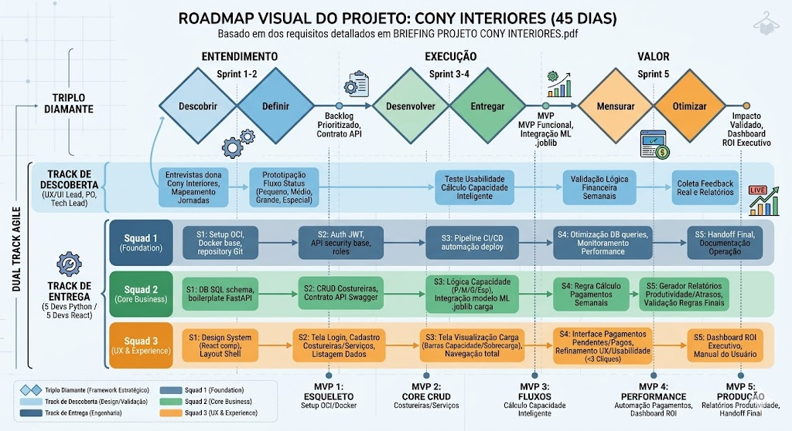
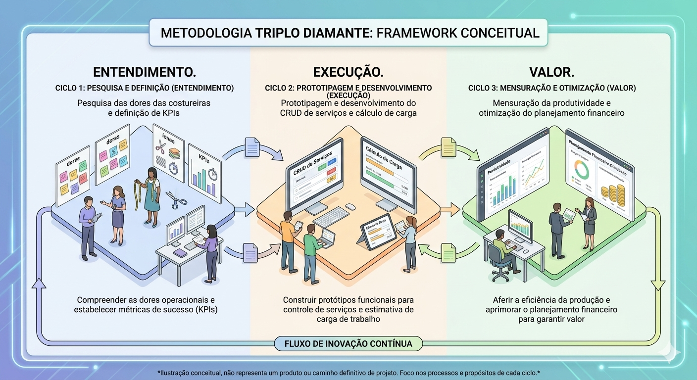
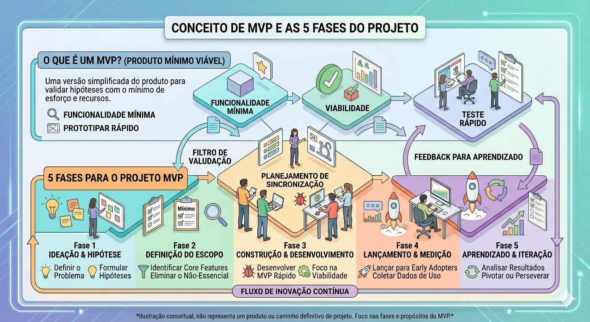
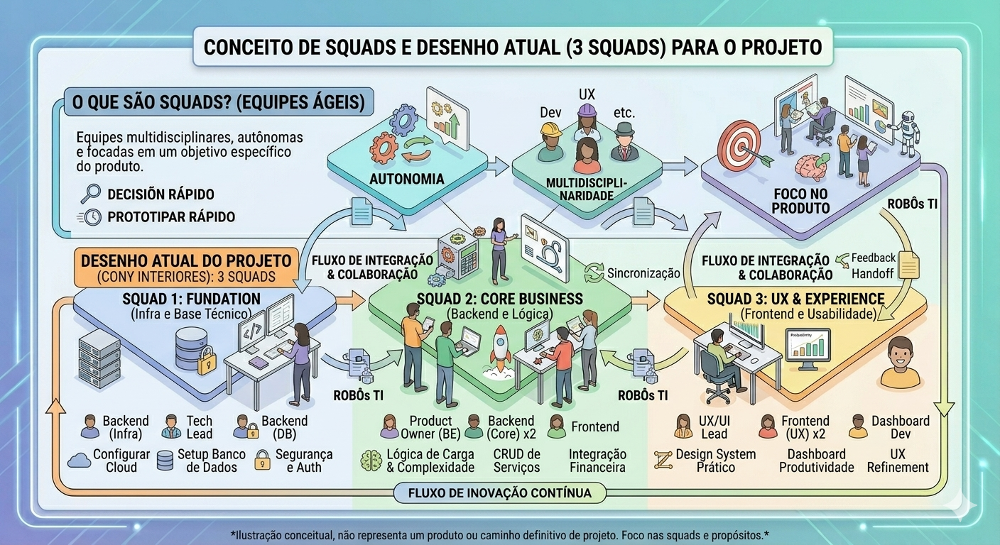

# 🛠 Projeto Cony Interiores: Sistema de Controle de Produção

Este repositório contém a documentação e o código para o sistema de controle de produção de costureiras da **Cony Interiores**. O projeto utiliza um framework híbrido que combina **Triplo Diamante** (estratégia), **Dual Track Agile** (ritmo) e **Scrum** (gestão) para entregar uma solução web escalável e centrada no usuário.



---

## 💎 Metodologia Triplo Diamante

O processo é estruturado em três ciclos que garantem que o produto resolva problemas reais de produtividade e planejamento financeiro:

1. **Entendimento:** Pesquisa das dores das costureiras, mapeamento do fluxo operacional atual e definição de KPIs de negócio.
2. **Execução:** Prototipagem e desenvolvimento do CRUD de serviços, cálculo de carga e índice de complexidade.
3. **Valor:** Mensuração da produtividade, otimização do planejamento financeiro e geração de relatórios gerenciais.



---

## 🏃 Filosofia Ágil (Scrum/Kanban)

A gestão de tarefas é fundamentada em práticas ágeis, focadas em manter o ritmo constante de entrega e total transparência sobre o progresso do sistema:

- **Sprints:** Ciclos de trabalho com duração entre 1 e 2 semanas, cada um com um *Sprint Goal* (objetivo) claro e mensurável.
- **Sprint Planning:** Reuniões de alinhamento para priorização do backlog, garantindo que a capacidade da equipe seja respeitada (aplicamos 20% de *buffer* para contingências).
- **Estimativa Fibonacci:** Utilizamos a sequência (1, 2, 3, 5, 8, 13) para medir o esforço relativo de cada *User Story*, evitando estimativas baseadas em horas diretas.
- **Cerimônias:** Dailies rápidas para alinhamento diário e *Peer Reviews* rigorosos em todos os Pull Requests para assegurar a qualidade e o conhecimento compartilhado entre os devs.
- **Ferramenta de Gestão:** Uso do **GitHub Projects** para controle do backlog, acompanhamento das Sprints e visualização do progresso.

---

## 🔄 Dual Track Agile (Discovery + Delivery)

Para evitar o desperdício de construir funcionalidades que não resolvem as dores da Cony Interiores, dividimos o trabalho em dois trilhos que rodam em paralelo e se sincronizam:

- **Track de Descoberta (Discovery):** Focada no **"O quê e porquê"**. É onde validamos hipóteses, realizamos pesquisas com a operação da Cony e prototipamos soluções. O objetivo é garantir que só enviamos para desenvolvimento algo que realmente resolverá o problema.
- **Track de Entrega (Delivery):** Focada no **"Como"**. É a esteira de engenharia que recebe as descobertas validadas, codifica, testa (QA) e realiza o deploy. Aqui, o foco é em qualidade de código, estabilidade e performance.
- **Sincronização:** O "Backlog Validado" é o ponto de encontro. A Discovery alimenta a Delivery com itens prontos para construir, enquanto a Delivery alimenta a Discovery com aprendizados técnicos e feedbacks reais do software em uso.


---

## 📅 Roadmap de Entregas (5 MVPs)

O projeto é entregue em incrementos (MVPs) focados nas dores do briefing, em um cronograma de aproximadamente 45 dias:

| Sprint | Foco | Entregável Principal |
|--------|------|----------------------|
| **Sprint 1: Base Digital** | Setup e infraestrutura | Docker configurado, ambiente de desenvolvimento padronizado, cadastro de costureiras. |
| **Sprint 2: Fluxo Operacional** | CRUD e status | Registro de serviços enviados, atualização de status (enviado, em produção, pronto, entregue, pago). |
| **Sprint 3: Inteligência de Capacidade** | Cálculo de carga | Índice de complexidade (Pequena, Média, Grande, Especial) e visualização da carga de trabalho por costureira. |
| **Sprint 4: Previsão Financeira** | Controle financeiro | Soma automática de valores pendentes, planejamento de pagamentos semanais/mensais. |
| **Sprint 5: Gestão Visual** | Dashboards e relatórios | Relatórios de produtividade, serviços em atraso, ROI e comparação entre costureiras. |



---
## 👥 Squad e Membros do Time

O time é composto por 9 profissionais distribuídos em 3 Squads especializados, garantindo autonomia e entregas de alta qualidade.

### Squad 1: Foundation (Infraestrutura e Estabilidade)
*Foco: Docker, CI/CD, Segurança e Setup Base.*

| Nome | Papel/Função |
|------|--------------|
| Ruan Felipe | **Tech Lead (BE):** Arquiteto de software, responsável por CI/CD, revisão de código e definição da arquitetura cloud. |
| Marcus Vinicius | **Backend Developer:** Focado em autenticação, segurança e configuração do ambiente Django. |
| Maria Gabrielle | **Frontend Developer:** Focado na performance da aplicação e otimização de assets. |

**Carga de Trabalho:** 66% da capacidade total, com disponibilidade para auxiliar os Squads Core Business e UX & Experience em momentos de pico.

**MVP 2 - Previsão Financeira (Sprint 4):**
- Otimização de queries financeiras
- Implementação de cache para dashboards
- Configuração de monitoramento de performance
- Reforço de segurança para dados sensíveis
- Documentação de endpoints financeiros

**MVP 3 - Gestão Visual (Sprint 5):**
- Otimização de assets e minificação
- Configuração de CDN para assets estáticos
- Implementação de logging estruturado
- Rate limiting para APIs de dashboard

**MVP 4 - Relatórios Avançados (Sprint 6):**
- Otimização de exportação em lote
- Implementação de jobs assíncronos
- Compressão de dados para exportação
- Backup de relatórios gerados

---

### Squad 2: Core Business (Regras de Negócio)
*Foco: Lógica de capacidade, API, Banco de Dados e Cálculo Financeiro.*

| Nome | Papel/Função |
|------|--------------|
| Karine Eduarda | **Product Owner (BE):** Responsável pela lógica de negócio, definição das métricas de capacidade (índice de complexidade) e requisitos do sistema. |
| Matheus Gonçalves | **Backend Developer:** Focado nos endpoints de CRUD, cálculo de carga e integração financeira. |
| Bianca | **Front End Developer:** Ponte entre API e interface, focado em formulários complexos e integração de dados. |

**Carga de Trabalho:** 100% da capacidade, com foco em regras de negócio e integrações.

---

### Squad 3: UX & Experience (Interface e Visualização)
*Foco: Design System, Dashboards, Usabilidade e Relatórios.*

| Nome | Papel/Função |
|------|--------------|
| Ananda Matos | **UX/UI Lead (FE):** Focado na jornada do usuário, garantindo que o sistema seja "prático, visual e fácil de usar". |
| Gabriel Augusto | **Frontend Developer:** Focado em componentes reutilizáveis e implementação do Design System com Tailwind CSS. |
| Isabella Barros | **Backend Developer:** Focado em Dashboards de produtividade, gráficos e visualização da carga de trabalho. |

**Carga de Trabalho:** 100% da capacidade, com foco em interface e experiência do usuário.




---

## 🧰 Stack Tecnológica

As tecnologias foram selecionadas para equilibrar performance com a familiaridade do time, garantindo a entrega do MVP:

| Camada | Tecnologia | Justificativa |
|--------|------------|---------------|
| **Backend** | Python 3.12 + Django + Django REST Framework | Alta familiaridade do time, acelerando a construção da lógica de negócio e da API. |
| **Frontend** | React + React Router + Axios | Componentização reativa para interfaces dinâmicas e responsivas. |
| **Estilização** | Tailwind CSS | Design System consistente e desenvolvimento rápido de interfaces. |
| **Banco de Dados** | PostgreSQL (OCI Autonomous ou container local) | Robustez e compatibilidade com Django ORM. |
| **Infraestrutura** | Docker + Docker Compose | Padronização de ambiente, eliminando incompatibilidades entre SOs. |
| **Orquestração** | Cloud Agnostic (OCI, AWS, Azure) | Containerização permite deploy em qualquer provedor. |
| **Gestão de Tarefas** | GitHub Projects | Integração nativa com o repositório e transparência para o time. |
| **Comunicação** | Discord | Canais por squad e gerais para alinhamento em tempo real. |

---

## 📂 Estrutura de Pastas

```text
cony-interiores/
├── backend/                    # API Python (Django + DRF)
│   ├── app/                    # Lógica de negócio
│   │   ├── api/                # Endpoints (viewsets, serializers)
│   │   ├── core/               # Configurações globais (settings, urls)
│   │   ├── models/             # Modelos de dados (Costureira, Servico, Pagamento)
│   │   ├── services/           # Regras de negócio (cálculo de capacidade)
│   │   └── admin/              # Configuração do painel administrativo
│   ├── requirements.txt        # Dependências do backend
│   ├── Dockerfile              # Containerização do backend
│   └── manage.py               # Ponto de entrada do Django
│
├── frontend/                   # Aplicação React.js
│   ├── public/                 # Assets estáticos
│   ├── src/
│   │   ├── components/         # Componentes reutilizáveis (Cards, Tabelas, Gráficos)
│   │   ├── hooks/              # Lógica de estado e chamadas de API (Axios)
│   │   ├── pages/              # Telas (Dashboard, Operações, Financeiro)
│   │   ├── services/           # Integração com o backend
│   │   ├── styles/             # Configuração do Tailwind CSS
│   │   └── App.js              # Componente principal
│   ├── package.json            # Dependências do frontend
│   └── Dockerfile              # Containerização do frontend
│
├── infra/                      # Orquestração e Infraestrutura
│   ├── docker-compose.yml      # Orquestração local (Front, Back, DB)
│   └── .env.example            # Variáveis de ambiente (template)
│
├── docs/
│   ├── 1-discovery/          # Personas, Journey Maps, Benchmarks, Problem Statements
│   ├── 2-planning/           # Planejamento de MVPs, Épicos, Sprints
│   ├── 3-measurement/        # KPIs, Baselines, Relatórios de Resultados
│   ├── 4-delivery/           # Materiais de apoio (guias, tutoriais, checklists)
│   ├── 5-decisions/          # ADRs e decisões arquiteturais
└── assets/               # Imagens, diagramas, protótipos
│       ├── img/
│       ├── diagrams/
│       └── prototypes/               # Imagens utilizadas no README
│
└── README.md                   # Documentação principal do projeto

```

🚀 Infraestrutura e Produção
----------------------------

O projeto foi desenhado para ser **Cloud Agnostic**, garantindo flexibilidade e portabilidade:

-   **Containerização:** Uso obrigatório de **Docker** para resolver incompatibilidades entre SOs (Mac/Windows/Linux), garantindo que o ambiente seja idêntico para todos os desenvolvedores e em produção.

-   **Orquestração:** Docker Compose para ambiente local; em produção, pode ser utilizado Kubernetes ou serviços gerenciados (OCI Container Engine, ECS, AKS).

-   **Monitoramento:** Logs estruturados para monitoramento da saúde da API e tempos de resposta, com ferramentas como Sentry ou ELK Stack (a definir).

-   **CI/CD:** Pipeline automatizado com GitHub Actions para testes e deploy contínuo.

* * * *

🌿 Workflow do Git
------------------

Para garantir a integridade do código e a colaboração organizada:

-   **Feature Branches:** Todo trabalho em `feat/` ou `fix/`, a partir da branch `main`.

-   **Commits Atômicos:** Cada tarefa concluída gera um commit separado, facilitando o rastreio e possíveis rollbacks.

-   **Pull Requests:** Revisão obrigatória pelos líderes técnicos (Tech Lead ou PO) antes do merge na `main`.

-   **Política de Merge:** Uso de squash merge para manter o histórico limpo e rastreável.

* * * *

📚 Referências & Leituras Recomendadas
--------------------------------------

-   **Design Thinking: O Triplo Diamante**

    Descrição: Artigo base sobre a evolução do framework de design, focando na integração de métricas de negócio e impacto após a entrega da solução.

     Link: <https://www.zendesk.com.br/blog/design-thinking/>

-   **Dual Track Agile (Marty Cagan)**

    Descrição: Conceito fundamental do Silicon Valley Product Group que explica como sincronizar as faixas de descoberta e entrega para evitar desperdícios.

    Link: <https://www.svpg.com/dual-track-agile/>

-   **Scrum Guide (Guia Oficial)**

    Descrição: Documentação oficial que define as regras do jogo para cerimônias, papéis e responsabilidades do framework Scrum.

    Link: <https://scrumguides.org/>

-   **Django REST Framework: Documentação Oficial**

    Descrição: Guia essencial para construção de APIs robustas e padronizadas com Django.

    Link: <https://www.django-rest-framework.org/>

-   **React: Documentação Oficial ([React.dev](https://react.dev/))**

    Descrição: Documentação completa para o desenvolvimento de interfaces reativas e baseadas em componentes.

    Link: <https://react.dev/>

-   **Tailwind CSS: Documentação Oficial**

    Descrição: Framework utility-first para estilização rápida e consistente.

    Link: <https://tailwindcss.com/>

-   **Docker: Get Started**

    Descrição: Referência técnica para a containerização da aplicação, garantindo ambientes idênticos em qualquer cloud.

    Link: <https://docs.docker.com/get-started/>

-   **Git Flow: Workflow de Branching**

    Descrição: Guia prático sobre estratégias de ramificação para manter o histórico de código organizado.

    Link: <https://nvie.com/posts/a-successful-git-branching-model/>

* * * *

**Última atualização:** Junho de 2026
**Status do Projeto:** Em desenvolvimento (Fase 2 - Formação Avançada e Aplicação Prática)
**Parceria:** CEPEDI / SOFTEX / MCTI    