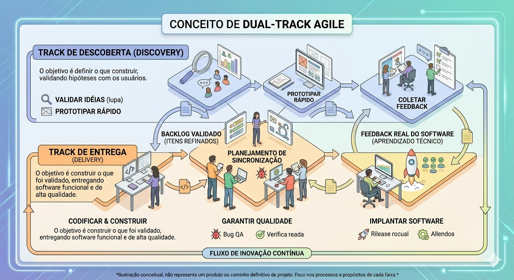

# 🛠 Projeto Cony Interiores: Sistema de Controle de Produção

Este repositório contém a documentação e o código para o sistema de controle de produção de costureiras da **Cony Interiores**. O projeto utiliza um framework híbrido que combina **Triplo Diamante** (estratégia), **Dual Track Agile** (ritmo) e **Scrum** (gestão) para entregar uma solução web escalável.


## 💎 Metodologia Triplo Diamante

O processo é estruturado em três ciclos:

1. **Entendimento:** Pesquisa das dores das costureiras e definição de KPIs.


2. **Execução:** Prototipagem e desenvolvimento do CRUD de serviços e cálculo de carga.


3. **Valor:** Mensuração da produtividade e otimização do planejamento financeiro.


## 🏃 Filosofia Ágil (Scrum/Kanban)

A nossa gestão de tarefas é fundamentada em práticas ágeis, focadas em manter o ritmo constante de entrega e total transparência sobre o progresso do sistema:

-   **Sprints:** Ciclos de trabalho com duração entre 1 e 2 semanas, cada um com um *Sprint Goal* (objetivo) claro e mensurável.

-   **Sprint Planning:** Reuniões de alinhamento para priorização do backlog, garantindo que a capacidade da equipe seja respeitada (aplicamos 20% de *buffer* para contingências).

-   **Estimativa Fibonacci:** Utilizamos a sequência (1, 2, 3, 5, 8, 13) para medir o esforço relativo de cada *User Story*, evitando estimativas baseadas em horas diretas.

-   **Cerimônias:** Dailies rápidas para alinhamento diário e *Peer Reviews* rigorosos em todos os Pull Requests para assegurar a qualidade e o conhecimento compartilhado entre os devs.

## 🔄 Dual Track Agile (Discovery + Delivery)

Para evitar o desperdício de construir funcionalidades que não resolvem as dores da Cony Interiores, dividimos o trabalho em dois trilhos que rodam em paralelo e se sincronizam:

-   **Track de Descoberta (Discovery):** Focada no **"O quê e porquê"**. É onde validamos hipóteses, realizamos pesquisas com a operação da Cony e prototipamos soluções. O objetivo é garantir que só enviamos para desenvolvimento algo que realmente resolverá o problema.

-   **Track de Entrega (Delivery):** Focada no **"Como"**. É a esteira de engenharia que recebe as descobertas validadas, codifica, testa (QA) e realiza o deploy. Aqui, o foco é em qualidade de código, estabilidade e performance.

-   **Sincronização:** O "Backlog Validado" é o ponto de encontro. A Discovery alimenta a Delivery com itens prontos para construir, enquanto a Delivery alimenta a Discovery com aprendizados técnicos e feedbacks reais do software em uso.



## 📅 Planejamento em 5 Sprints (Roadmap de 45 dias)

O projeto é entregue em incrementos (MVPs) focados nas dores do briefing:

* **Sprint 1: Base Digital** (Setup, Docker, Cadastro de Costureiras).
* **Sprint 2: Fluxo Operacional** (CRUD de serviços, status de produção).
* **Sprint 3: Inteligência de Capacidade** (Cálculo de carga com Índice de Complexidade: P/M/G/Esp).
* **Sprint 4: Previsão Financeira** (Soma de valores pendentes, planejamento de pagamentos).
* **Sprint 5: Gestão Visual** (Dashboards de ROI, Relatórios de produtividade/atrasos).


## 👥 Estrutura de Squads e Papéis

Para os 10 desenvolvedores, adotamos o modelo de 3 Squads com responsabilidades claras:

### Squad 1: Foundation (3 membros)

*Foco: Estabilidade, Infraestrutura e Deploy.*

* **Tech Lead (BE):** Arquiteto de software, responsável por CI/CD e revisão de código.
* **Backend Developer:** Focado em autenticação e segurança.
* **Frontend Developer:** Focado na performance da aplicação.

### Squad 2: Core Business (4 membros)

*Foco: Regras de negócio, API e Banco de Dados.*

* **Product Owner (BE):** Responsável pela lógica de negócio, definição das métricas de capacidade e requisitos do sistema.
* **2x Backend Developers:** Focados nos endpoints de CRUD, lógica de cálculo de capacidade e integração financeira.
* **Frontend Developer:** Focado na integração de dados e formulários complexos.

### Squad 3: UX & Experience (3 membros)

*Foco: Usabilidade (interface prática), Design System e Visualização de Dados.*

* **UX/UI Lead (FE):** Focado na jornada do usuário, garantindo que o sistema seja "fácil e prático".


* **2x Frontend Developers:** Focados em componentes, Dashboards de produtividade e visualização da carga de trabalho.


## 📂 Estrutura de Pastas

```text
cony-interiores/
├── backend/                # API Python (FastAPI/Flask)
│   ├── app/                # Lógica de negócio, endpoints e serviços
│   ├── requirements.txt
│   └── Dockerfile
├── frontend/               # Aplicação React.js
│   ├── src/                # Components, hooks, pages, services
│   └── package.json
├── infra/                  # Orquestração (Cloud Agnostic)
│   └── docker-compose.yml
└── README.md

```

## 🚀 Infraestrutura e Produção

* **Cloud Agnostic:** A arquitetura é conteinerizada via Docker, permitindo deploy em qualquer provedor (AWS, Azure, GCP).
* **Monitoramento:** Logs estruturados para monitoramento da saúde da API e tempos de resposta.

## 🌿 Workflow do Git

* **Feature Branches:** Todo trabalho em `feat/` ou `fix/`.
* **Commits Atômicos:** Histórico limpo e rastreável.
* **Pull Requests:** Revisão obrigatória pelos líderes técnicos (Tech Lead ou PO) antes do merge na `main`.

-----

### 📚 Referências & Leituras Recomendadas 


-   **Design Thinking: O Triplo Diamante**

    - **Descrição:** Artigo base sobre a evolução do framework de design, focando na integração de métricas de negócio e impacto após a fase de entrega da solução.

    - **Link:** [https://www.zendesk.com.br/blog/design-thinking/](https://www.google.com/search?q=https://www.zendesk.com.br/blog/design-thinking/)

-   **Dual Track Agile (Marty Cagan)**

    - **Descrição:** Conceito fundamental do Silicon Valley Product Group que explica como sincronizar as faixas de descoberta (Discovery) e entrega (Delivery) para evitar desperdícios.

    - **Link:** <https://www.svpg.com/dual-track-agile/>

-   **Scrum Guide (Guia Oficial)**

    - **Descrição:** Documentação oficial que define as regras do jogo para cerimônias, papéis e responsabilidades do framework Scrum.

    - **Link:** <https://scrumguides.org/>

-   **FastAPI: Documentação Oficial**

     -   **Descrição:** Guia essencial para construção de APIs modernas, performáticas e assíncronas com Python, base para o backend da Cony Interiores.

    -   **Link:** <https://fastapi.tiangolo.com/>

-   **React: Documentação Oficial (React.dev)**

    -   **Descrição:** Documentação completa para o desenvolvimento de interfaces reativas e baseadas em componentes, utilizado no nosso Frontend.

    -   **Link:** <https://react.dev/>

-   **Docker: Get Started**

    -   **Descrição:** Referência técnica para a containerização da aplicação, garantindo que o ambiente seja idêntico em qualquer cloud (AWS, Azure, GCP).

    -   **Link:** [https://docs.docker.com/get-started/](https://www.google.com/search?q=https%3A%2F%2Fdocs.docker.com%2Fget-started%2F)

-   **Git Flow: Workflow de Branching**

     -   **Descrição:** Guia prático sobre estratégias de ramificação (*branching*) para manter o histórico de código organizado e facilitar o processo de Pull Requests.

    -   **Link:** [https://nvie.com/posts/a-successful-git-branching-model/](https://www.google.com/search?q=https%3A%2F%2Fnvie.com%2Fposts%2Fa-successful-git-branching-model%2F)