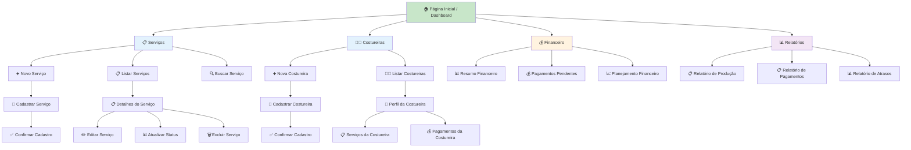
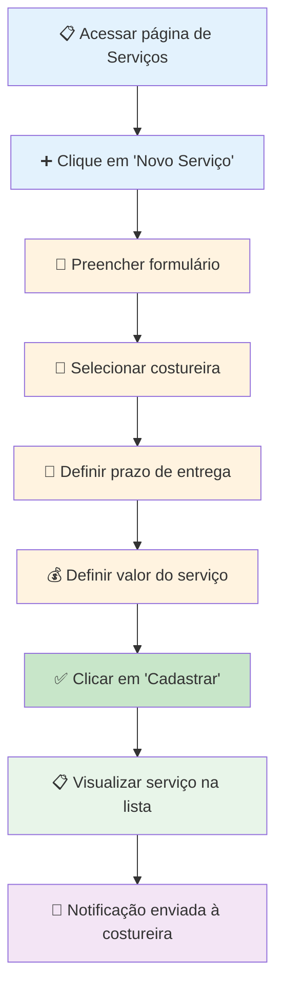
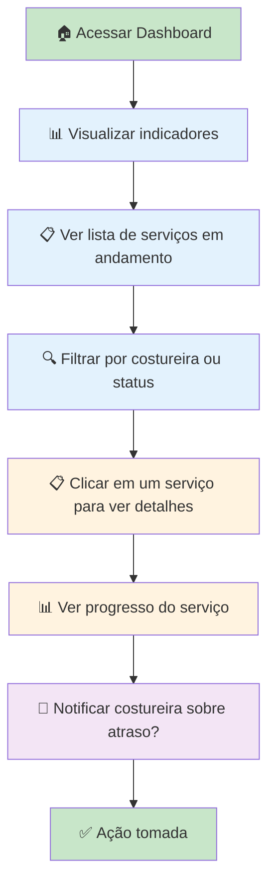
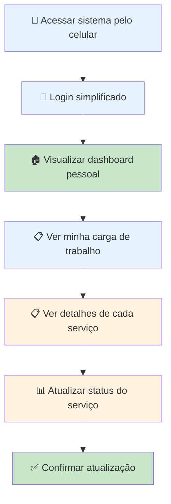
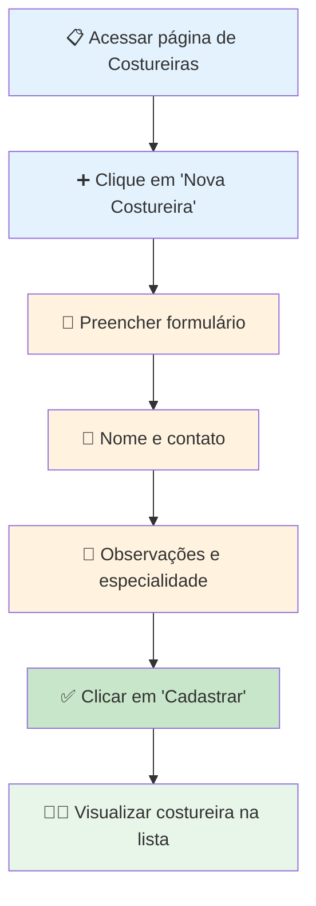
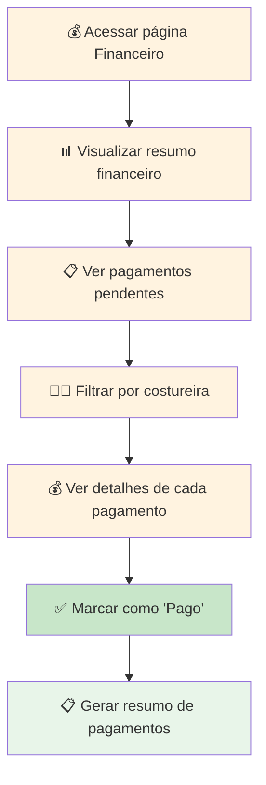
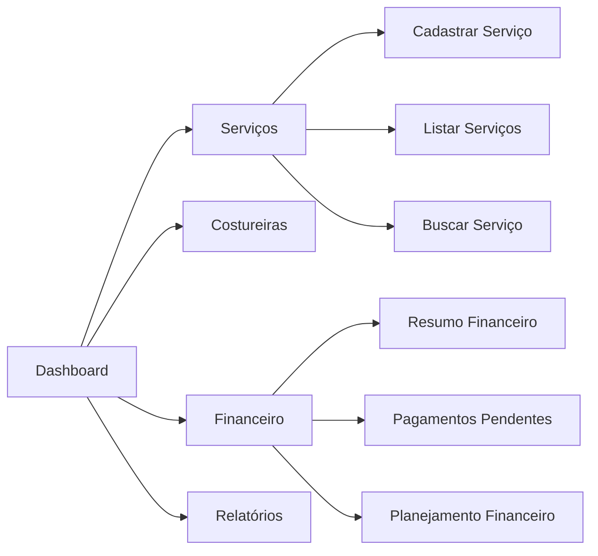
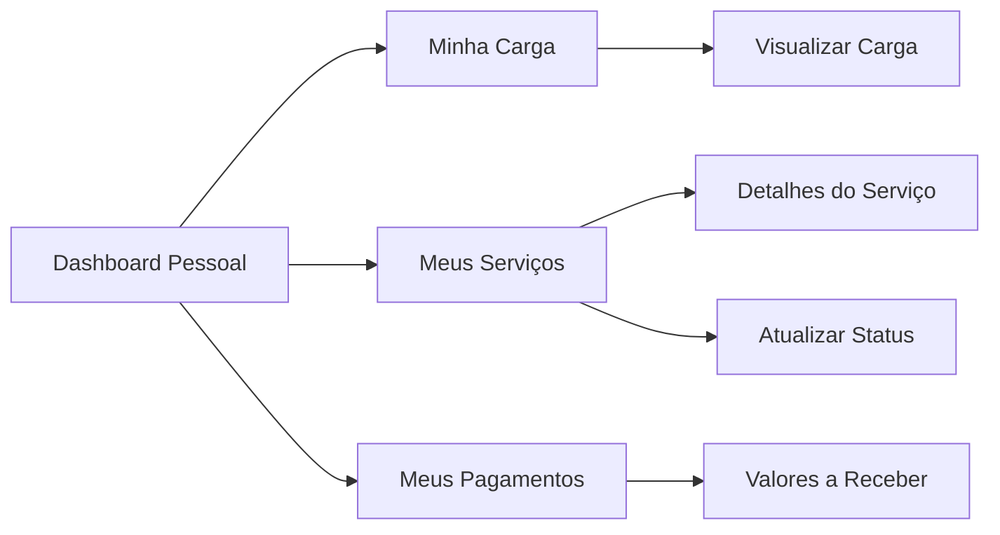
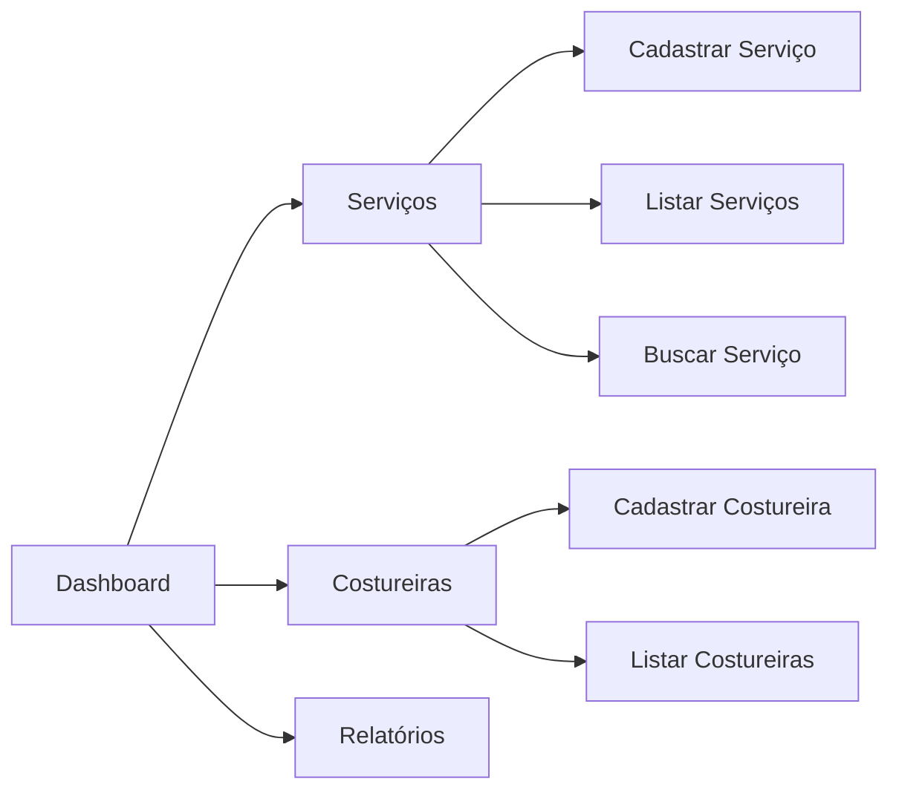
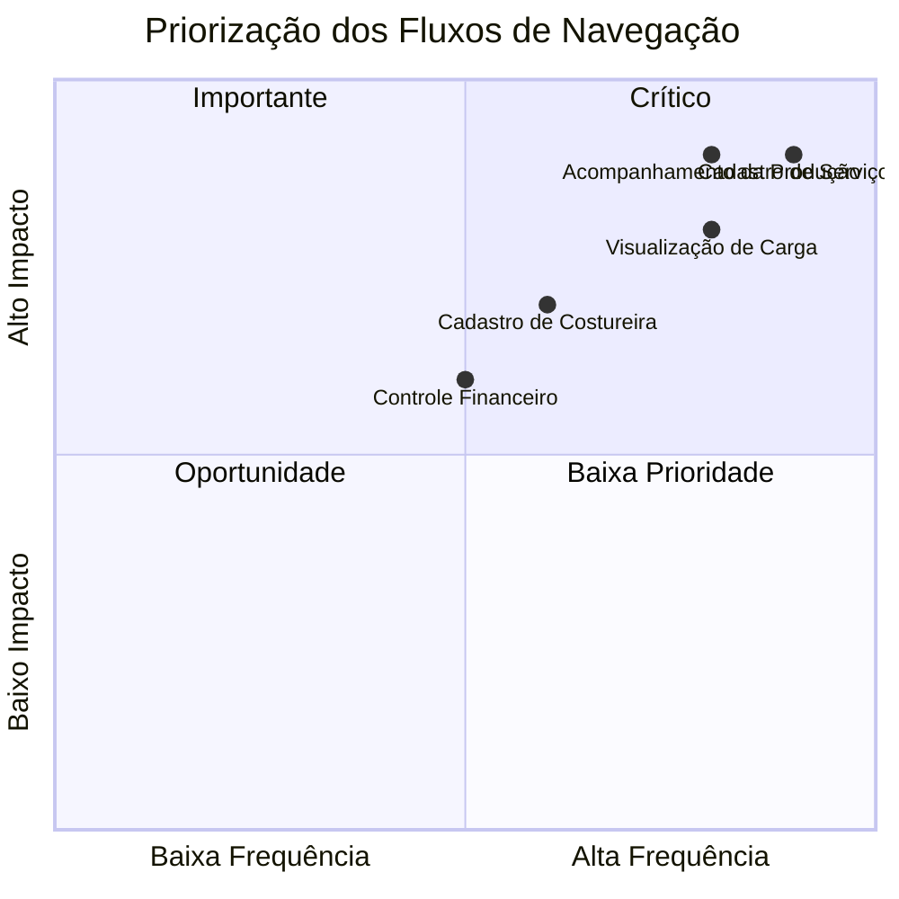

# Fluxos de Navegação - Cony Interiores

**Épico:** EPIC-M1-UX-001 - Interface e Jornada do Usuário  
**Story:** STORY-M1-UX-001 - Layout Base e Design System  
**Data de Criação:** 30/06/2026  
**Versão:** 1.0  
**Responsável:** @anandamatos

---

## 🎯 Objetivo deste Artefato

Este documento define os fluxos de navegação do sistema da Cony Interiores, mapeando como as usuárias irão interagir com o sistema para realizar suas tarefas principais. Os fluxos guiarão as decisões de design de interface e a arquitetura de navegação.

---

## 📊 Matriz CSD - Fluxos de Navegação

### Certezas (C) - O que já sabemos sobre os fluxos
| # | Certeza | Fonte |
|---|---------|-------|
| C1 | A gestora precisa acessar rapidamente a carga de trabalho | Entrevista com gestora |
| C2 | A gestora precisa cadastrar novos serviços | Entrevista com gestora |
| C3 | A costureira precisa visualizar sua carga de trabalho | Relato das costureiras |
| C4 | A auxiliar precisa cadastrar e manter dados | Entrevista com auxiliar |
| C5 | O sistema deve ser simples e intuitivo | Perfil das usuárias |

### Suposições (S) - O que acreditamos sobre os fluxos
| # | Suposição | Impacto se estiver errada |
|---|-----------|---------------------------|
| S1 | A gestora quer um dashboard como primeira tela | Pode preferir acesso direto a outras funcionalidades |
| S2 | As costureiras querem uma visão simplificada da carga | Pode ser muito simplificada ou complexa |
| S3 | O cadastro de serviços deve ser rápido | Pode faltar informações importantes |
| S4 | A navegação deve ser por menus laterais | Pode não ser intuitiva para todos |
| S5 | As costureiras usarão o sistema no celular | Pode não ser otimizado para mobile |

### Dúvidas (D) - O que precisamos validar
| # | Dúvida | Como validar |
|---|--------|--------------|
| D1 | A gestora prefere dashboard ou acesso direto às funcionalidades? | Protótipo e teste de usabilidade |
| D2 | As costureiras querem ver apenas a carga ou também detalhes dos serviços? | Pesquisa com costureiras |
| D3 | Qual a profundidade ideal da navegação (telas até a informação)? | Teste de usabilidade |
| D4 | As costureiras vão acessar o sistema pelo celular ou computador? | Pesquisa com costureiras |
| D5 | A gestora quer aprovar os pagamentos antes de gerar o resumo? | Entrevista com gestora |

---

## 🗺️ Mapa de Navegação Geral



---

## 📋 Fluxo 1: Cadastro de Serviço

### Persona: Gestora (Ana) e Auxiliar (Carla)

### Fluxograma



### Decisões de UX

| Decisão | Justificativa |
|---------|---------------|
| **Formulário em etapas** | Reduz a sobrecarga cognitiva, facilita o preenchimento |
| **Seleção de costureira com indicador de carga** | Ajuda a gestora a escolher a costureira com menor carga |
| **Campos obrigatórios destacados** | Reduz erros de preenchimento |
| **Feedback visual ao cadastrar** | Confirmação imediata para o usuário |

### Protótipo do Formulário (Esboço)

```text
+--------------------------------------------------+
|  📋 NOVO SERVIÇO                                 |
+--------------------------------------------------+
|  Cliente: [_____________________________]          |
|  Produto: [Dropdown ▼]                            |
|  Quantidade: [____]                               |
|  Complexidade: [Pequena ▼]                        |
|  Data de Envio: [📅 DD/MM/YYYY]                   |
|  Prazo de Entrega: [📅 DD/MM/YYYY]                |
|  Valor: [R$ ______]                              |
|  Costureira: [Selecionar ▼]                      |
|  Observações: [_____________________________]     |
|                                                    |
|  [  ❌ Cancelar  ]  [  ✅ Cadastrar  ]            |
+--------------------------------------------------+
```

---

## 📋 Fluxo 2: Acompanhamento da Produção

### Persona: Gestora (Ana)

### Fluxograma



### Decisões de UX

| Decisão | Justificativa |
|---------|---------------|
| **Dashboard como primeira tela** | Gestora precisa de visão geral imediata |
| **Cards com carga de trabalho** | Visualização rápida da situação de cada costureira |
| **Alertas visuais para serviços atrasados** | Chama a atenção para problemas críticos |
| **Filtros rápidos** | Permite focar em informações específicas |

### Protótipo do Dashboard (Esboço)

```text
+--------------------------------------------------+
|  🏠 CONY INTERIORES - DASHBOARD                   |
+--------------------------------------------------+
|  🔍 Buscar...                        | 👤 Ana    |
+--------------------------------------------------+
|  📊 VISÃO GERAL                                   |
|  +------------+  +------------+  +------------+   |
|  | 📋 Serviços |  | 👩‍🔧 Costureiras|  | 💰 Pagamentos|   |
|  | Ativos: 12  |  | Ativas: 4  |  | Pendentes: 3|   |
|  +------------+  +------------+  +------------+   |
|                                                    |
|  👩‍🔧 CARGA DE TRABALHO                             |
|  +----------+  +----------+  +----------+         |
|  | Sirlene  |  | Maria    |  | Joana    |         |
|  | ████████  |  | ██████   |  | ████     |         |
|  | 8/10     |  | 6/10     |  | 4/10     |         |
|  +----------+  +----------+  +----------+         |
|                                                    |
|  ⚠️ SERVIÇOS EM ATRASO                             |
|  • Cliente: João - Prazo: 25/06 - Atraso: 2d     |
|  • Cliente: Maria - Prazo: 26/06 - Atraso: 1d    |
+--------------------------------------------------+
```

---

## 📋 Fluxo 3: Visualização de Carga pela Costureira

### Persona: Costureira (Sirlene)

### Fluxograma



### Decisões de UX

| Decisão | Justificativa |
|---------|---------------|
| **Interface otimizada para mobile** | Costureiras usam principalmente o celular |
| **Login simplificado** | Reduz barreiras de acesso |
| **Cards com carga de trabalho** | Visualização clara e rápida |
| **Status com ícones** | Facilita a compreensão |

### Protótipo Mobile (Esboço)

```text
+------------------+
|  👩‍🔧 Olá, Sirlene  |
+------------------+
|  📋 MINHA CARGA   |
|  ██████████░░░░░  |
|  6/10 serviços    |
+------------------+
|  📋 SERVIÇOS      |
|  +----------------+ |
|  | 📦 Cliente: João | |
|  | Cortina Ilhós   | |
|  | ⏳ Em produção  | |
|  | 📅 Entrega: 30/06| |
|  +----------------+ |
|  +----------------+ |
|  | 📦 Cliente: Ana  | |
|  | Forro           | |
|  | 🔄 Aguardando   | |
|  | 📅 Entrega: 02/07| |
|  +----------------+ |
|                    |
|  [  ➕ Atualizar Status  ] |
+------------------+
```

---

## 📋 Fluxo 4: Cadastro de Costureira

### Persona: Auxiliar (Carla) e Gestora (Ana)

### Fluxograma



### Decisões de UX

| Decisão | Justificativa |
|---------|---------------|
| **Campos mínimos obrigatórios** | Agiliza o cadastro |
| **Campo de observações** | Flexibilidade para informações adicionais |
| **Validação de dados** | Garante a integridade dos dados |

---

## 📋 Fluxo 5: Controle Financeiro (MVP 2)

### Persona: Gestora (Ana)

### Fluxograma



### Decisões de UX

| Decisão | Justificativa |
|---------|---------------|
| **Resumo financeiro como primeira tela** | Gestora precisa de visão rápida dos valores |
| **Filtros por costureira** | Facilita a gestão individual |
| **Indicadores visuais** | Facilita a identificação de pendências |

---

## 🗺️ Mapa de Navegação por Persona

### Gestora (Ana)


### Costureira (Sirlene)


### Auxiliar (Carla)


---

## 📊 Matriz de Priorização dos Fluxos



**Legenda:**
- **🟢 Crítico:** Cadastro de Serviço, Acompanhamento da Produção, Visualização de Carga
- **🟡 Importante:** Cadastro de Costureira
- **🔵 Oportunidade:** Controle Financeiro (MVP 2)

---

## 📋 Matriz de Rastreabilidade (Fluxo ↔ Story)

| Fluxo | Story Relacionada | MVP |
|-------|-------------------|-----|
| Cadastro de Serviço | STORY-M1-CORE-002 | MVP 1 |
| Acompanhamento da Produção | STORY-M1-UX-001 | MVP 1 |
| Visualização de Carga | STORY-M1-UX-003 | MVP 1 |
| Cadastro de Costureira | STORY-M1-CORE-001 | MVP 1 |
| Controle Financeiro | STORY-M2-CORE-001, STORY-M2-UX-001 | MVP 2 |

---

## ✅ Próximos Passos

| Ordem | Atividade | Responsável | Data |
|-------|-----------|-------------|------|
| 1 | Validar Fluxos de Navegação com o cliente | @anandamatos | 30/06 |
| 2 | Refinar com base no feedback | @anandamatos | 01/07 |
| 3 | Criar protótipos de baixa fidelidade | @anandamatos | 02/07 |
| 4 | Iniciar prototipação de alta fidelidade | @anandamatos | 03/07 |

---

## 📎 Anexos

- **Entrevistas realizadas:** [link para notas]
- **Benchmark de sistemas:** [link para benchmark]
- **Protótipos iniciais:** [link para Figma]

---

**Status:** Aguardando validação com o cliente  
**Próxima Reunião:** 30/06/2026 - 14h

---

## 🎯 Resumo Executivo

| Fluxo | Persona | Prioridade | Story |
|-------|---------|------------|-------|
| **Cadastro de Serviço** | Gestora/Auxiliar | 🔴 Crítico | STORY-M1-CORE-002 |
| **Acompanhamento da Produção** | Gestora | 🔴 Crítico | STORY-M1-UX-001 |
| **Visualização de Carga** | Costureira | 🔴 Crítico | STORY-M1-UX-003 |
| **Cadastro de Costureira** | Auxiliar | 🟡 Importante | STORY-M1-CORE-001 |
| **Controle Financeiro** | Gestora | 🔵 Oportunidade | STORY-M2-CORE-001 |
