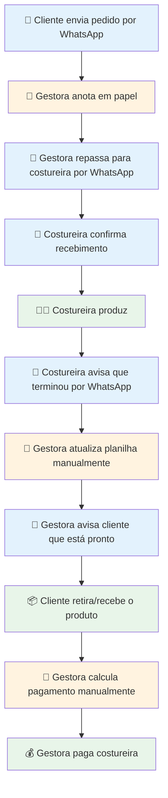
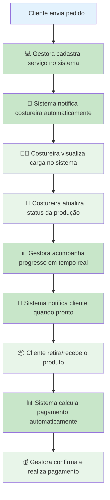
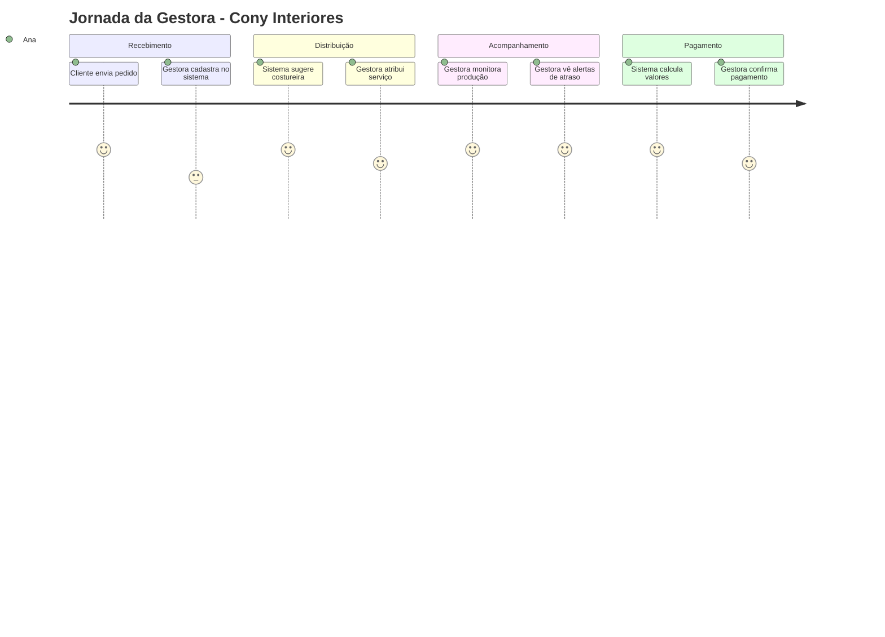
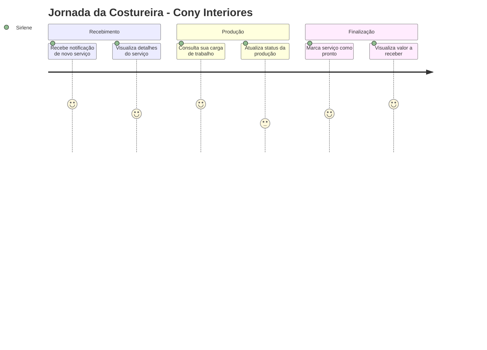
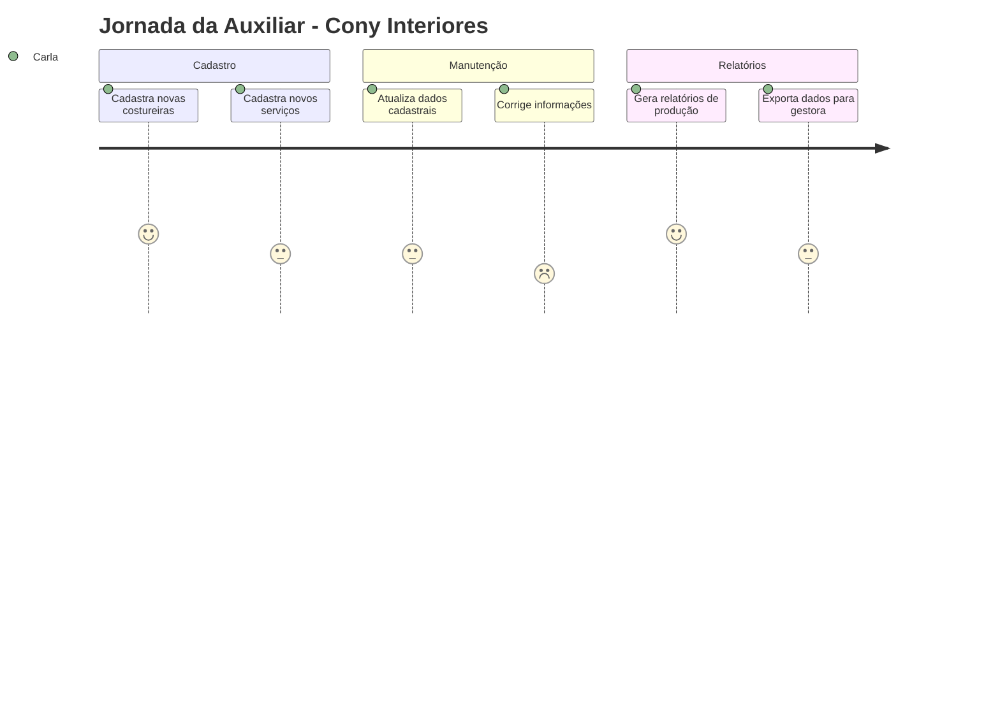
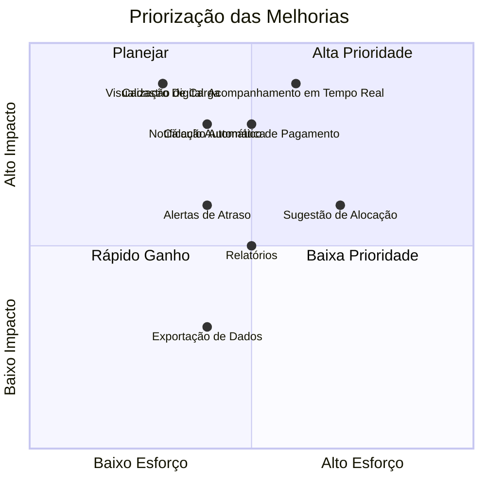

# Mapa da Jornada do Usuário - Cony Interiores

**Épico:** EPIC-M1-UX-001 - Interface e Jornada do Usuário  
**Story:** STORY-M1-UX-001 - Layout Base e Design System  
**Data de Criação:** 30/06/2026  
**Versão:** 1.0  
**Responsável:** @anandamatos

---

## 🎯 Objetivo deste Artefato

Este documento mapeia a jornada atual e a jornada ideal das usuárias do sistema da Cony Interiores. O objetivo é identificar pontos de atrito, oportunidades de melhoria e validar com o cliente os fluxos que serão suportados pelo sistema.

---

## 📊 Matriz CSD - Jornada do Usuário

### Certezas (C) - O que já sabemos sobre a jornada atual
| # | Certeza | Fonte |
|---|---------|-------|
| C1 | O pedido chega por telefone/WhatsApp | Entrevista com gestora |
| C2 | A gestora anota o pedido em papel | Observação do processo |
| C3 | A gestora repassa o serviço para a costureira por WhatsApp | Entrevista |
| C4 | A costureira confirma o recebimento por WhatsApp | Entrevista com costureira |
| C5 | O controle de status é feito em planilha | Análise do processo |
| C6 | O pagamento é calculado manualmente no fim do mês | Entrevista com gestora |

### Suposições (S) - O que acreditamos sobre a jornada ideal
| # | Suposição | Impacto se estiver errada |
|---|-----------|---------------------------|
| S1 | A gestora quer digitalizar o recebimento de pedidos | Processo pode continuar manual |
| S2 | As costureiras querem ver os serviços em uma interface | Podem preferir WhatsApp |
| S3 | O sistema deve notificar automaticamente sobre novos serviços | Costureiras podem ignorar notificações |
| S4 | A gestora quer um dashboard para acompanhar a produção | Pode preferir relatórios semanais |
| S5 | O pagamento automático reduz erros | Pode não ser confiável para a gestora |

### Dúvidas (D) - O que precisamos validar
| # | Dúvida | Como validar |
|---|--------|--------------|
| D1 | A gestora quer digitalizar todo o processo ou apenas parte? | Entrevista com gestora |
| D2 | As costureiras têm acesso a internet para usar o sistema? | Pesquisa com costureiras |
| D3 | Qual a frequência ideal de atualização do status? | Entrevista com gestora |
| D4 | A gestora quer aprovar os pagamentos antes de gerar o resumo? | Entrevista com gestora |
| D5 | As costureiras querem ver os valores a receber em tempo real? | Pesquisa com costureiras |

---

## 🗺️ Jornada Atual (Como funciona hoje)

### Fluxograma da Jornada Atual

### Pontos de Dor na Jornada Atual

| Fase | Ação | Dor | Impacto |
|------|------|-----|---------|
| 1 | Recebimento do pedido | Anotação manual em papel | Risco de perda de informação |
| 2 | Repasse para costureira | Comunicação por WhatsApp | Sem rastreabilidade |
| 3 | Confirmação da costureira | Confirmação por WhatsApp | Sem registro formal |
| 4 | Produção | Sem visibilidade do progresso | Gestora não sabe o status |
| 5 | Finalização | Aviso por WhatsApp | Sem confirmação formal |
| 6 | Atualização da planilha | Processo manual e sujeito a erros | Dados inconsistentes |
| 7 | Pagamento | Cálculo manual | Erros e atrasos |

---

## 🌟 Jornada Ideal (Com o Sistema)

### Fluxograma da Jornada Ideal

### Benefícios da Jornada Ideal

| Fase | Ação | Benefício |
|------|------|-----------|
| 1 | Cadastro do serviço | Registro digital, sem perda de informação |
| 2 | Notificação automática | Costureira sabe imediatamente |
| 3 | Visualização da carga | Costureira organiza seu trabalho |
| 4 | Atualização de status | Gestora tem visibilidade em tempo real |
| 5 | Acompanhamento | Decisões baseadas em dados |
| 6 | Notificação ao cliente | Experiência profissional |
| 7 | Cálculo automático | Sem erros, pagamentos precisos |

---

## 📊 Jornada Detalhada por Persona

### Jornada da Gestora (Ana)

### Jornada da Costureira (Sirlene)

### Jornada da Auxiliar (Carla)

---

## 🎯 Oportunidades de Melhoria por Fase

### Fase 1: Recebimento do Pedido

| Problema | Oportunidade | Prioridade |
|----------|--------------|------------|
| Anotação manual em papel | Cadastro digital via sistema | Alta |
| Sem registro formal | Histórico completo de pedidos | Alta |
| Risco de perda de informação | Dados centralizados e seguros | Alta |

### Fase 2: Distribuição do Serviço

| Problema | Oportunidade | Prioridade |
|----------|--------------|------------|
| Repasse por WhatsApp | Notificação automática | Alta |
| Sem visibilidade da carga | Visualização da carga de trabalho | Alta |
| Alocação manual | Sugestão automática de alocação | Média |

### Fase 3: Produção

| Problema | Oportunidade | Prioridade |
|----------|--------------|------------|
| Sem visibilidade do progresso | Acompanhamento em tempo real | Alta |
| Comunicação por WhatsApp | Atualização de status no sistema | Alta |
| Sem alertas de atraso | Notificações de prazos | Média |

### Fase 4: Finalização e Pagamento

| Problema | Oportunidade | Prioridade |
|----------|--------------|------------|
| Aviso por WhatsApp | Notificação automática ao cliente | Média |
| Cálculo manual | Cálculo automático | Alta |
| Sem histórico de pagamentos | Registro completo de pagamentos | Média |

---

## 📋 Matriz de Rastreabilidade (Jornada ↔ Funcionalidades)

| Fase da Jornada | Funcionalidade do Sistema | Story Relacionada |
|-----------------|---------------------------|-------------------|
| Recebimento do Pedido | Cadastro de Serviços | STORY-M1-CORE-002 |
| Distribuição do Serviço | Cálculo de Capacidade | STORY-M1-CORE-003 |
| Produção | Atualização de Status | STORY-M1-CORE-002 |
| Acompanhamento | Dashboard de Produção | STORY-M1-UX-001 |
| Finalização | Notificações | STORY-M1-UX-002 |
| Pagamento | Controle Financeiro | STORY-M2-CORE-001 |

---

## 🔍 Matriz de Priorização (Impacto vs. Esforço)

**Legenda:**
- **🟢 Alta Prioridade:** Cadastro Digital, Notificação Automática, Visualização de Carga, Acompanhamento em Tempo Real
- **🟡 Planejar:** Sugestão de Alocação, Alertas de Atraso, Relatórios
- **🔵 Rápido Ganho:** Exportação de Dados
- **🔴 Baixa Prioridade:** (nenhum item nesta região)

---

## 📊 Matriz de Oportunidades vs. Riscos

| Oportunidade | Risco | Mitigação |
|--------------|-------|-----------|
| **Cadastro Digital** | Resistência da gestora a mudar o processo manual | Treinamento e acompanhamento próximo |
| **Notificação Automática** | Costureiras podem ignorar as notificações | Enviar notificações por WhatsApp (canal preferido) |
| **Visualização de Carga** | Costureiras podem não usar o sistema | Interface otimizada para celular, fácil acesso |
| **Acompanhamento em Tempo Real** | Dependência de conexão com internet | Permitir atualizações offline |
| **Cálculo Automático de Pagamento** | Desconfiança da gestora nos cálculos | Transparência: mostrar detalhamento dos cálculos |

---

## ✅ Próximos Passos

| Ordem | Atividade | Responsável | Data |
|-------|-----------|-------------|------|
| 1 | Validar Jornada com o cliente (Cony Interiores) | @anandamatos | 30/06 |
| 2 | Refinar com base no feedback | @anandamatos | 01/07 |
| 3 | Criar Problem Statements | @anandamatos | 02/07 |
| 4 | Iniciar prototipação dos fluxos prioritários | @anandamatos | 03/07 |

---

## 📎 Anexos

- **Entrevistas realizadas:** [link para notas]
- **Fotos do processo atual:** [link para fotos]
- **Planilha de controle atual:** [link para planilha]

---

**Status:** Aguardando validação com o cliente  
**Próxima Reunião:** 30/06/2026 - 14h

---

## 🎯 Resumo Executivo

| Aspecto | Jornada Atual | Jornada Ideal |
|---------|---------------|---------------|
| **Recebimento** | Manual (papel) | Digital (sistema) |
| **Distribuição** | WhatsApp | Notificação automática |
| **Acompanhamento** | Planilha | Dashboard em tempo real |
| **Pagamento** | Manual | Cálculo automático |
| **Principais Dores** | Perda de informação, falta de visibilidade, erros manuais | - |
| **Principais Oportunidades** | Cadastro digital, notificações, dashboard, cálculo automático | - |
