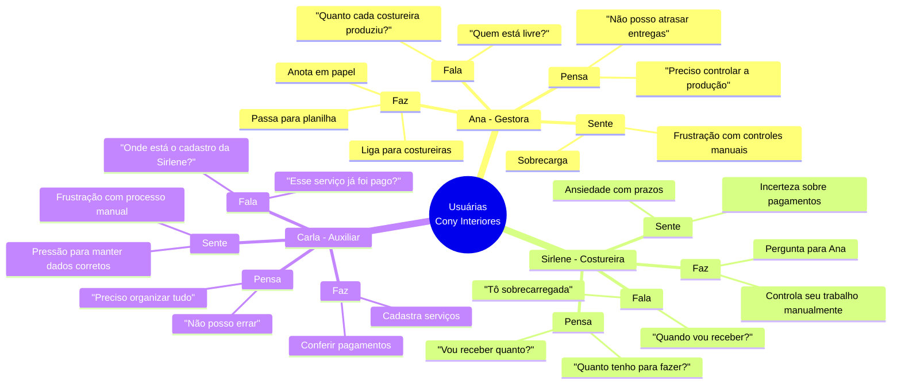
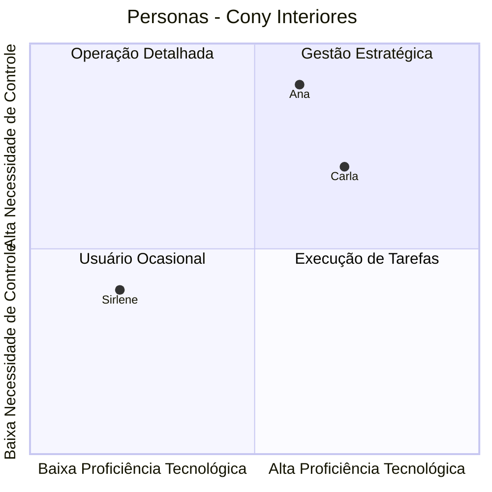

# Personas - Cony Interiores

**Épico:** EPIC-M1-UX-001 - Interface e Jornada do Usuário  
**Story:** STORY-M1-UX-001 - Layout Base e Design System  
**Data de Criação:** 30/06/2026  
**Versão:** 1.0  
**Responsável:** @anandamatos

---

## 🎯 Objetivo deste Artefato

Este documento define as personas das usuárias do sistema da Cony Interiores, com base em pesquisas, entrevistas e observações do processo atual. As personas guiarão todas as decisões de design e desenvolvimento, garantindo que o sistema atenda às reais necessidades das usuárias.

---

## 👤 Persona 1: Ana - A Gestora

### Perfil
| Atributo | Descrição |
|----------|-----------|
| **Nome** | Ana Silva |
| **Idade** | 42 anos |
| **Cargo** | Gestora da Cony Interiores |
| **Experiência** | 15 anos no setor de decoração e interiores |
| **Escolaridade** | Ensino Superior Completo (Administração) |
| **Perfil Tecnológico** | Usuária intermediária, usa WhatsApp e planilhas no dia a dia |

### Objetivos
- Ter visibilidade clara da produção de cada costureira
- Distribuir os serviços de forma equilibrada entre as costureiras
- Planejar pagamentos com antecedência
- Reduzir o tempo gasto com controles manuais

### Frustrações
- "Não sei quem está sobrecarregada e quem pode receber mais serviço"
- "Perco muito tempo anotando tudo no papel e passando para a planilha"
- "Só descubro que um serviço está atrasado quando a cliente reclama"
- "Não tenho uma previsão clara de quanto vou pagar cada costureira no fim do mês"

### Necessidades
- Uma visão consolidada da produção em tempo real
- Alertas sobre serviços em atraso ou próximos do prazo
- Interface simples e intuitiva, que não exija treinamento extenso
- Acesso rápido às informações mais importantes (carga de trabalho, prazos, valores)

### Citação
> "Eu preciso de um sistema que me mostre, de forma simples e rápida, quem está livre para receber mais serviço e quanto eu vou precisar pagar no fim do mês."

---

## 👩‍🔧 Persona 2: Sirlene - A Costureira

### Perfil
| Atributo | Descrição |
|----------|-----------|
| **Nome** | Sirlene Santos |
| **Idade** | 38 anos |
| **Cargo** | Costureira Terceirizada |
| **Experiência** | 10 anos como costureira |
| **Escolaridade** | Ensino Médio Completo |
| **Perfil Tecnológico** | Usuária básica, usa WhatsApp e redes sociais |

### Objetivos
- Saber quantos serviços estão na sua fila de trabalho
- Ter clareza sobre os prazos de entrega
- Saber quanto vai receber por cada serviço
- Organizar seu tempo de trabalho de forma eficiente

### Frustrações
- "Às vezes a Ana me manda mais serviço do que eu consigo fazer e fico sobrecarregada"
- "Não sei exatamente quando vou receber, isso dificulta meu planejamento"
- "Tenho que ficar perguntando para a Ana se já chegou algum serviço novo"

### Necessidades
- Visualizar sua carga de trabalho atual
- Receber notificações sobre novos serviços
- Ter transparência sobre os valores a receber
- Interface simples, otimizada para uso no celular

### Citação
> "Quero poder abrir o sistema e ver rapidinho o que eu tenho para fazer e quanto vou ganhar. Não quero ter que ficar perguntando para a Ana toda hora."

---

## 👩‍💼 Persona 3: Carla - A Auxiliar Administrativa

### Perfil
| Atributo | Descrição |
|----------|-----------|
| **Nome** | Carla Oliveira |
| **Idade** | 29 anos |
| **Cargo** | Auxiliar Administrativa |
| **Experiência** | 5 anos em gestão de produção |
| **Escolaridade** | Ensino Superior Incompleto (Gestão) |
| **Perfil Tecnológico** | Usuária avançada, usa sistemas de gestão |

### Objetivos
- Manter o cadastro de costureiras e serviços atualizado
- Gerar relatórios para a gestora
- Acompanhar o status de cada serviço
- Organizar os pagamentos das costureiras

### Frustrações
- "O processo manual gera muitos erros de digitação"
- "Perco muito tempo conferindo se todos os serviços foram registrados"
- "Não tenho um histórico confiável da produção"

### Necessidades
- Cadastro rápido e eficiente de serviços
- Filtros para encontrar informações facilmente
- Exportação de dados para relatórios
- Interface que agilize o trabalho administrativo

### Citação
> "Quero um sistema que me ajude a evitar erros e a encontrar as informações que preciso sem ter que ficar procurando em planilhas e papéis."

---

## 📊 Matriz CSD (Certezas, Suposições, Dúvidas)

### Certezas (C) - O que já sabemos
| # | Certeza | Fonte |
|---|---------|-------|
| C1 | A gestora (Ana) não tem visibilidade clara da produção | Entrevista inicial |
| C2 | O controle atual é manual (papel/planilha) | Observação do processo |
| C3 | As costureiras (Sirlene) não sabem sua carga de trabalho | Relato das costureiras |
| C4 | O controle de pagamentos é feito manualmente | Análise do processo |
| C5 | O sistema precisa ser simples e intuitivo | Perfil das usuárias |

### Suposições (S) - O que acreditamos ser verdade
| # | Suposição | Impacto se estiver errada |
|---|-----------|---------------------------|
| S1 | A gestora quer uma visão consolidada da produção | Interface pode não atender à necessidade |
| S2 | As costureiras querem visualizar sua carga de trabalho | Funcionalidade pode ser subutilizada |
| S3 | O sistema deve funcionar bem no celular | Costureiras podem não usar no celular |
| S4 | A interface deve priorizar as informações mais importantes | Usuárias podem se sentir perdidas |
| S5 | As costureiras estão dispostas a usar o sistema | Adoção pode ser baixa |

### Dúvidas (D) - O que precisamos validar
| # | Dúvida | Como validar |
|---|--------|--------------|
| D1 | Qual a frequência ideal de atualização da carga de trabalho? | Entrevista com gestora |
| D2 | As costureiras querem notificações de novos serviços? | Pesquisa com costureiras |
| D3 | Qual o formato mais útil para visualizar a carga de trabalho? | Protótipo e teste de usabilidade |
| D4 | A gestora quer relatórios semanais ou mensais? | Entrevista com gestora |
| D5 | As costureiras têm acesso a smartphone para usar o sistema? | Pesquisa com costureiras |

---

## 🗺️ Mapa de Empatia (Consolidado)

 ✅ Principais Aprendizados (Síntese)
-----------------------------------

### Dores Comuns

| Dor | Persona | Impacto |
| --- |  --- |  --- |
| Falta de visibilidade da produção | Ana | Decisões baseadas em achismo |
| --- |  --- |  --- |
| Sobrecarga de trabalho | Sirlene | Insatisfação, atrasos |
| Processo manual e sujeito a erros | Carla | Ineficiência, retrabalho |
| Incerteza sobre pagamentos | Sirlene | Dificuldade de planejamento financeiro |

### Oportunidades de Design

1.  **Dashboard consolidado** para a gestora (visão geral da produção)

2.  **Visão individual de carga** para cada costureira

3.  **Cadastro ágil e intuitivo** para a auxiliar administrativa

4.  **Transparência de valores** (quanto vai receber, quando)

5.  **Notificações** para novos serviços e prazos       

### 🎨 Diagrama das Personas (Visual)

Ana (Gestora): Alta necessidade de controle, média proficiência tecnológica → Foco em visão consolidada e dashboard

Sirlene (Costureira): Baixa necessidade de controle, baixa proficiência tecnológica → Foco em simplicidade e visualização de carga

Carla (Auxiliar): Média necessidade de controle, alta proficiência tecnológica → Foco em eficiência e cadastro ágil

## 🔗 Próximos Passos
Ordem	Atividade	Responsável	Data
1	Validar Personas com o cliente (Cony Interiores)	@anandamatos	30/06
2	Refinar com base no feedback	@anandamatos	01/07
3	Criar Mapa da Jornada do Usuário	@anandamatos	02/07
4	Definir Problem Statements	@anandamatos	03/07
5	Iniciar prototipação	@anandamatos	04/07

## 📎 Anexos
Entrevistas realizadas: [link para notas]

Pesquisas de mercado: [link para benchmark]

Fotos do processo atual: [link para fotos]

Status: Aguardando validação com o cliente
Próxima Reunião: 30/06/2026 - 14h