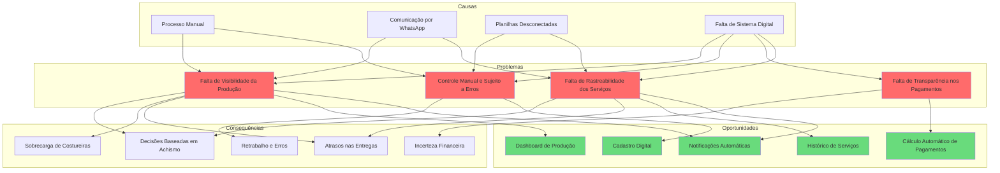
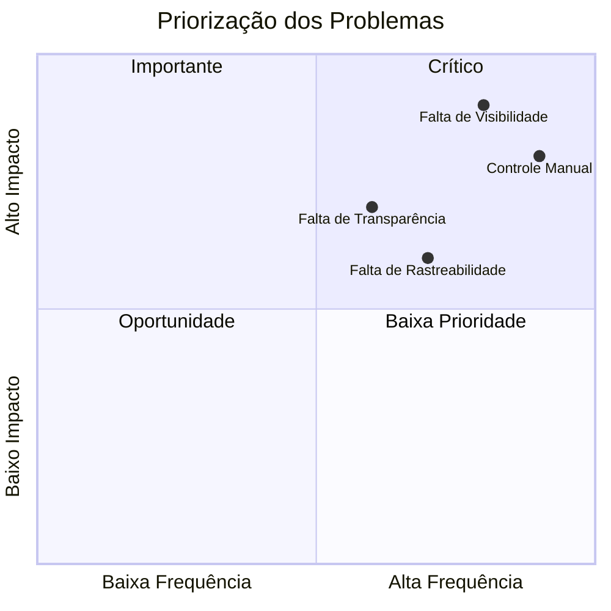

# Problem Statements - Cony Interiores

**Épico:** EPIC-M1-UX-001 - Interface e Jornada do Usuário  
**Story:** STORY-M1-UX-001 - Layout Base e Design System  
**Data de Criação:** 30/06/2026  
**Versão:** 1.0  
**Responsável:** @anandamatos

---

## 🎯 Objetivo deste Artefato

Este documento define os problemas centrais que o sistema da Cony Interiores precisa resolver, com base nas personas, jornadas e pesquisas realizadas. Os Problem Statements guiarão as decisões de design e desenvolvimento, garantindo que o sistema atenda às reais necessidades das usuárias.

---

## 📊 Matriz CSD - Problem Statements

### Certezas (C) - O que já sabemos sobre os problemas
| # | Certeza | Fonte |
|---|---------|-------|
| C1 | A gestora não tem visibilidade clara da produção | Entrevista com gestora |
| C2 | O controle atual é manual (papel/planilha) | Observação do processo |
| C3 | As costureiras não sabem sua carga de trabalho | Relato das costureiras |
| C4 | O controle de pagamentos é feito manualmente | Análise do processo |
| C5 | A comunicação entre gestora e costureiras é por WhatsApp | Entrevista |

### Suposições (S) - O que acreditamos ser verdade
| # | Suposição | Impacto se estiver errada |
|---|-----------|---------------------------|
| S1 | A gestora quer uma visão consolidada da produção | Interface pode não atender à necessidade |
| S2 | As costureiras querem visualizar sua carga de trabalho | Funcionalidade pode ser subutilizada |
| S3 | O sistema deve funcionar bem no celular | Costureiras podem não usar no celular |
| S4 | A interface deve priorizar as informações mais importantes | Usuárias podem se sentir perdidas |
| S5 | As costureiras estão dispostas a usar o sistema | Adoção pode ser baixa |

### Dúvidas (D) - O que precisamos validar
| # | Dúvida | Como validar |
|---|--------|--------------|
| D1 | Qual a frequência ideal de atualização da carga de trabalho? | Entrevista com gestora |
| D2 | As costureiras querem notificações de novos serviços? | Pesquisa com costureiras |
| D3 | Qual o formato mais útil para visualizar a carga de trabalho? | Protótipo e teste de usabilidade |
| D4 | A gestora quer relatórios semanais ou mensais? | Entrevista com gestora |
| D5 | As costureiras têm acesso a smartphone para usar o sistema? | Pesquisa com costureiras |

---

## 🎯 Problem Statement 1: Falta de Visibilidade da Produção

### Contexto
A gestora da Cony Interiores (Ana) não tem uma visão clara e consolidada da produção das costureiras. O controle atual é feito manualmente, com anotações em papel e planilhas, o que gera incertezas e dificulta a tomada de decisão.

### Problema
A gestora não consegue responder rapidamente a perguntas fundamentais para a gestão da produção:
- Quantas peças cada costureira está produzindo?
- Quem está com excesso de demanda?
- Quem ainda pode receber novos pedidos?
- Qual é a capacidade média de produção de cada costureira?

### Impacto
| Impacto | Descrição | Gravidade |
|---------|-----------|-----------|
| **Decisões baseadas em achismo** | A gestora distribui serviços sem dados concretos | Alta |
| **Sobrecarga de algumas costureiras** | Enquanto outras ficam ociosas | Alta |
| **Atrasos nas entregas** | Sem visibilidade clara dos prazos | Média |
| **Desgaste no relacionamento** | Costureiras frustradas com sobrecarga | Média |

### Oportunidade
Um sistema que consolide em tempo real a produção de cada costureira, permitindo que a gestora tome decisões informadas sobre a distribuição de serviços.

### Critérios de Sucesso
- [ ] Gestora consegue visualizar a carga de trabalho de todas as costureiras em uma única tela
- [ ] Gestora consegue identificar rapidamente quem está com menor carga
- [ ] Gestora consegue visualizar a capacidade média de produção de cada costureira

---

## 🎯 Problem Statement 2: Controle Manual e Sujeito a Erros

### Contexto
O processo atual de controle de produção é inteiramente manual, com anotações em papel, planilhas e comunicação via WhatsApp. Isso gera retrabalho, erros e perda de informações.

### Problema
A auxiliar administrativa (Carla) e a gestora (Ana) gastam tempo significativo com controles manuais que poderiam ser automatizados:
- Anotação de serviços em papel
- Digitação de dados em planilhas
- Conferência manual de valores
- Controle de pagamentos em planilhas separadas

### Impacto
| Impacto | Descrição | Gravidade |
|---------|-----------|-----------|
| **Retrabalho** | Mesma informação é registrada em múltiplos lugares | Alta |
| **Erros** | Digitação manual gera erros de dados | Alta |
| **Perda de informação** | Papéis podem ser perdidos ou rasurados | Média |
| **Ineficiência** | Tempo gasto com tarefas manuais | Alta |

### Oportunidade
Um sistema digital que centralize todas as informações, eliminando a necessidade de múltiplos registros manuais e reduzindo erros.

### Critérios de Sucesso
- [ ] Todas as informações são registradas digitalmente em um único lugar
- [ ] Não há necessidade de duplicação de dados
- [ ] Os dados são consistentes e confiáveis

---

## 🎯 Problem Statement 3: Falta de Transparência nos Pagamentos

### Contexto
As costureiras (Sirlene) não têm clareza sobre quanto vão receber e quando. O cálculo de pagamentos é feito manualmente pela gestora no fim do mês, sem que as costureiras tenham visibilidade durante o processo.

### Problema
As costureiras não conseguem planejar suas finanças porque:
- Não sabem o valor exato que receberão no fim do mês
- Não têm visibilidade do status dos pagamentos
- Precisam perguntar à gestora sobre valores

### Impacto
| Impacto | Descrição | Gravidade |
|---------|-----------|-----------|
| **Incerteza financeira** | Costureiras não conseguem planejar | Alta |
| **Desgaste no relacionamento** | Costureiras precisam cobrar informações | Média |
| **Desconfiança** | Sem transparência, pode haver dúvidas sobre os valores | Média |

### Oportunidade
Um sistema que calcule automaticamente os valores a receber e permita que as costureiras visualizem seus pagamentos em tempo real.

### Critérios de Sucesso
- [ ] Costureiras conseguem visualizar os valores a receber
- [ ] Costureiras conseguem ver o status dos pagamentos
- [ ] O cálculo de valores é automático e transparente

---

## 🎯 Problem Statement 4: Falta de Rastreabilidade dos Serviços

### Contexto
A gestora não tem um histórico confiável dos serviços enviados para cada costureira. A comunicação é feita por WhatsApp e o controle é manual, o que dificulta o acompanhamento.

### Problema
A gestora não consegue responder rapidamente a perguntas como:
- Quantos serviços cada costureira já entregou?
- Quantos serviços ainda estão em produção?
- Qual o histórico de serviços de cada costureira?

### Impacto
| Impacto | Descrição | Gravidade |
|---------|-----------|-----------|
| **Dificuldade de análise** | Não há dados históricos para análise de performance | Alta |
| **Perda de informações** | Comunicação por WhatsApp não é rastreável | Média |
| **Dificuldade de planejamento** | Sem histórico, fica difícil planejar o futuro | Média |

### Oportunidade
Um sistema que registre todo o histórico de serviços, permitindo consultas e análises sobre a produção.

### Critérios de Sucesso
- [ ] Gestora consegue consultar o histórico de serviços de cada costureira
- [ ] Gestora consegue visualizar a evolução da produção
- [ ] O histórico é completo e confiável

---

## 📊 Mapa de Problemas e Oportunidades

---

## 📊 Matriz de Priorização dos Problemas

**Legenda:**
- **🟢 Crítico:** Falta de Visibilidade, Controle Manual (resolver primeiro)
- **🟡 Importante:** Falta de Transparência (resolver em seguida)
- **🔵 Oportunidade:** Falta de Rastreabilidade (resolver depois)
- **🔴 Baixa Prioridade:** (nenhum item nesta região)

---

## 📋 Matriz de Rastreabilidade (Problema ↔ Story)

| Problema | Story Relacionada | Como a Story resolve |
|----------|-------------------|---------------------|
| Falta de Visibilidade da Produção | STORY-M1-UX-001 (Layout Base) | Dashboard com visão consolidada |
| Controle Manual | STORY-M1-UX-002 (Formulários) | Cadastro digital integrado |
| Falta de Transparência nos Pagamentos | STORY-M1-UX-003 (Visualização) | Visualização de valores a receber |
| Falta de Rastreabilidade | STORY-M1-CORE-002 (CRUD) | Histórico completo de serviços |

---

## 📊 Matriz de Soluções Propostas

| Problema | Solução | Esforço | Impacto | Prioridade |
|----------|---------|---------|---------|------------|
| **Falta de Visibilidade** | Dashboard com indicadores-chave (carga, produtividade) | Médio | Alto | 🔴 Crítico |
| **Controle Manual** | Cadastro digital de serviços e costureiras | Baixo | Alto | 🔴 Crítico |
| **Falta de Transparência** | Visualização de valores a receber por costureira | Médio | Médio | 🟡 Importante |
| **Falta de Rastreabilidade** | Histórico completo de serviços e status | Médio | Médio | 🔵 Oportunidade |

---

## ✅ Próximos Passos

| Ordem | Atividade | Responsável | Data |
|-------|-----------|-------------|------|
| 1 | Validar Problem Statements com o cliente (Cony Interiores) | @anandamatos | 30/06 |
| 2 | Refinar com base no feedback | @anandamatos | 01/07 |
| 3 | Criar Mapa da Jornada do Usuário | @anandamatos | 02/07 |
| 4 | Iniciar prototipação | @anandamatos | 03/07 |

---

## 📎 Anexos

- **Entrevistas realizadas:** [link para notas]
- **Pesquisas de mercado:** [link para benchmark]
- **Fotos do processo atual:** [link para fotos]

---

**Status:** Aguardando validação com o cliente  
**Próxima Reunião:** 30/06/2026 - 14h

---

## 🎯 Resumo Executivo

| Problema | Impacto | Solução Proposta | Prioridade |
|----------|---------|------------------|------------|
| **Falta de Visibilidade da Produção** | Decisões baseadas em achismo, sobrecarga de costureiras | Dashboard com indicadores-chave | 🔴 Crítico |
| **Controle Manual** | Retrabalho, erros, perda de informação | Cadastro digital integrado | 🔴 Crítico |
| **Falta de Transparência nos Pagamentos** | Incerteza financeira, desgaste no relacionamento | Visualização de valores a receber | 🟡 Importante |
| **Falta de Rastreabilidade** | Dificuldade de análise e planejamento | Histórico completo de serviços | 🔵 Oportunidade |
