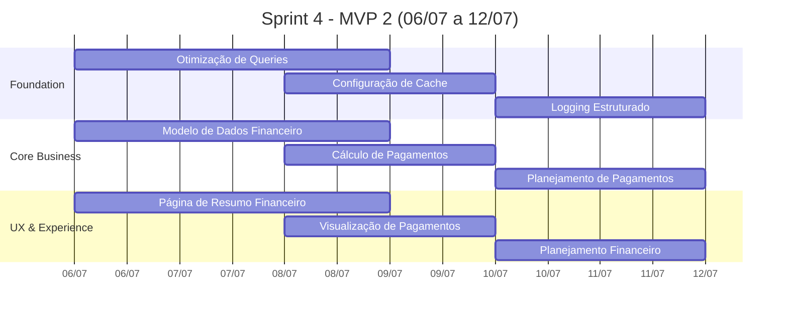

# 📋 Documento 2: Planejamento MVP 2 - Previsão Financeira

**Título:** `PLANNING-MVP2-PREVISAO-FINANCEIRA.md`

**Localização:** `docs/2-planning/PLANNING-MVP2-PREVISAO-FINANCEIRA.md`

---

# Planejamento MVP 2 - Previsão Financeira

**Versão:** 1.0  
**Data:** 09/07/2026  
**Responsável:** @anandamatos  
**Período:** 06/07 a 12/07/2026 (Sprint 4)

---

## 🎯 Objetivo do MVP 2

Implementar o controle financeiro e planejamento de pagamentos, permitindo sumarização automática de valores e gestão de pagamentos das costureiras.

---

## 📊 Escopo do MVP 2

### Sprint 4 - Previsão Financeira (06/07 a 12/07)

| Foco | Entregável Principal | Squads Envolvidos |
|------|----------------------|-------------------|
| **Previsão Financeira** | Controle de pagamentos, sumarização de valores, planejamento financeiro | Core Business, UX |

---

## 📋 Stories do MVP 2

### 🏗️ Squad Foundation

| ID | Título | Estimativa | Responsável |
|----|--------|------------|-------------|
| **EPIC-M2-FND-001** | **[Epic] Infraestrutura Financeira** | 8 SP | @lobaque29 |
| STORY-M2-FND-001 | Story: Otimização de Queries Financeiras | 5 SP | @Marcus1423 |
| STORY-M2-FND-002 | Story: Configuração de Cache para Dashboards | 3 SP | @mariagabrielle428-ship-it |
| STORY-M2-FND-003 | Story: Implementação de Logging Estruturado | 2 SP | @Marcus1423 |

**Total Foundation:** 18 SP

### 💼 Squad Core Business

| ID | Título | Estimativa | Responsável |
|----|--------|------------|-------------|
| **EPIC-M2-CORE-001** | **[Epic] Lógica Financeira** | 13 SP | @karinakaduda19-cyber |
| STORY-M2-CORE-001 | Story: Modelo de Dados Financeiro | 5 SP | @Matheus-G-R |
| STORY-M2-CORE-002 | Story: Cálculo de Pagamentos | 3 SP | @Matheus-G-R |
| STORY-M2-CORE-003 | Story: Planejamento de Pagamentos | 5 SP | @Bianca2703 |

**Total Core:** 13 SP

### 🎨 Squad UX & Experience

| ID | Título | Estimativa | Responsável |
|----|--------|------------|-------------|
| **EPIC-M2-UX-001** | **[Epic] Interface Financeira** | 13 SP | @anandamatos |
| STORY-M2-UX-001 | Story: Página de Resumo Financeiro | 5 SP | @gabrielaugusto872 |
| STORY-M2-UX-002 | Story: Visualização de Pagamentos | 5 SP | @isabarrs |
| STORY-M2-UX-003 | Story: Planejamento Financeiro | 3 SP | @gabrielaugusto872 |

**Total UX:** 13 SP

---

## 📊 Resumo da Sprint

| Squad | Stories | Total SP | % da Sprint |
|-------|---------|----------|-------------|
| **Foundation** | 3 | 18 | 41% |
| **Core Business** | 3 | 13 | 30% |
| **UX & Experience** | 3 | 13 | 30% |
| **TOTAL** | 9 | **44 SP** | 100% |

---

## 🔍 Tarefas de Discovery (MVP 2)

| ID | Tarefa | Responsável | Status |
|----|--------|-------------|--------|
| DISCOVERY-M2-FND-001 | Validar arquitetura de cache para dashboards financeiros | @lobaque29 | ✅ Concluida |
| DISCOVERY-M2-FND-002 | Definir estrategia de otimizacao de queries financeiras | @lobaque29 | ✅ Concluida |
| DISCOVERY-M2-FND-003 | Configurar ambiente de testes de performance | @lobaque29 | ✅ Concluida |
| DISCOVERY-M2-CORE-001 | Validar regras de cálculo de pagamentos | @karinakaduda19-cyber | ⏳ Pendente |
| DISCOVERY-M2-UX-001 | Validar protótipos do dashboard financeiro com cliente | @anandamatos | ⏳ Pendente |
| DISCOVERY-M2-UX-002 | Validar fluxo de planejamento financeiro | @anandamatos | ⏳ Pendente |

---

## 📊 Tarefas de Mensuração (MVP 2)

| ID | Tarefa | Responsável | Status |
|----|--------|-------------|--------|
| MEASUREMENT-M2-FND-001 | Definir KPIs de performance de queries financeiras | @lobaque29 | ✅ Concluida |
| MEASUREMENT-M2-FND-010 | Definir KPIs de tempo de resposta de dashboards financeiros | @lobaque29 | ✅ Concluida |
| MEASUREMENT-M2-CORE-001 | Definir KPIs de precisão de cálculos financeiros | @karinakaduda19-cyber | ⏳ Pendente |
| MEASUREMENT-M2-UX-001 | Definir KPIs de usabilidade do dashboard financeiro | @anandamatos | ⏳ Pendente |
| MEASUREMENT-M2-UX-002 | Definir métricas de eficiência do planejamento | @anandamatos | ⏳ Pendente |

---

## 📌 Dependências e Riscos

### Dependências

| Dependência | Impacto | Mitigação |
|-------------|---------|-----------|
| MVP 1 - CORE-003 (Cálculo de Capacidade) | Necessário para cálculos financeiros | Priorizar finalização |
| MVP 1 - FND-003 (Autenticação) | Necessário para controle de acesso | Priorizar finalização |
| Validação com cliente (MVP 1) | Pode impactar ajustes | Agendar reunião |

### Riscos

| Risco | Probabilidade | Impacto | Mitigação |
|-------|---------------|---------|-----------|
| Atraso na entrega do MVP 1 | Média | Alto | Buffer de 20% |
| Mudança de requisitos financeiros | Média | Alto | Validação prévia com cliente |
| Integração com cálculos de capacidade | Média | Médio | Testes de integração contínuos |

---

## 📋 Definition of Done (DoD) - MVP 2

### Critérios Gerais
- [ ] Modelo de dados financeiro implementado (STORY-M2-CORE-001)
- [ ] Cálculo automático de valores pendentes por costureira (STORY-M2-CORE-002)
- [ ] Planejamento de pagamentos semanais/mensais (STORY-M2-CORE-003)
- [ ] Página de resumo financeiro (STORY-M2-UX-001)
- [ ] Visualização de pagamentos (STORY-M2-UX-002)
- [ ] Planejamento financeiro (STORY-M2-UX-003)
- [ ] Performance otimizada (STORY-M2-FND-001, FND-002)
- [ ] Logging estruturado (STORY-M2-FND-003)

### Critérios Técnicos
- [ ] Otimização de queries financeiras
- [ ] Cache para dashboards
- [ ] Testes unitários e de integração
- [ ] Documentação atualizada

---

## 🎯 Milestones do MVP 2

| Marco | Data | Descrição |
|-------|------|-----------|
| **Fim Sprint 4** | 12/07/2026 | MVP 2 - Previsão Financeira Completo |
| **Sprint Review** | 12/07/2026 | Apresentação das entregas |
| **Deploy MVP 2** | 13/07/2026 | Atualização em produção |

---

## 📊 Cronograma da Sprint 4

---

## 🔧 Ferramentas da Sprint

| Ferramenta | Uso |
|------------|-----|
| **GitHub Projects** | Acompanhamento das tarefas |
| **Discord** | Comunicação e dailies |
| **Figma** | Protótipos do dashboard financeiro |
| **Django Admin** | Validação dos modelos de dados |
| **Postman** | Testes de API |

---

## ✅ Compromissos da Sprint

| Squad | Compromisso |
|-------|-------------|
| **Foundation** | Entregar otimização de queries, cache e logging estruturado |
| **Core Business** | Entregar modelo de dados, cálculo de pagamentos e planejamento financeiro |
| **UX & Experience** | Entregar página de resumo financeiro, visualização de pagamentos e planejamento financeiro |

---

## 🎯 Funcionalidades Esperadas

### Para a Gestora (Ana)
- [ ] Resumo financeiro consolidado
- [ ] Visualização de pagamentos pendentes
- [ ] Planejamento de pagamentos semanais/mensais
- [ ] Soma automática de valores por costureira

### Para a Costureira (Sirlene)
- [ ] Visualização de valores a receber
- [ ] Status de pagamentos

### Para a Auxiliar (Carla)
- [ ] Geração de relatórios financeiros
- [ ] Exportação de dados

---

## 📝 Próximos Passos

1. **Finalizar MVP 1:** Concluir tarefas pendentes
2. **Reunião com Cliente:** Validar requisitos financeiros
3. **Sprint Planning:** Alinhar entregas do MVP 2
4. **Iniciar Sprint 4:** Começar desenvolvimento em 06/07

---

## 🔗 Links Úteis

- **GitHub Project:** https://github.com/users/anandamatos/projects/7
- **Documentação:** https://github.com/anandamatos/cony-interiores/tree/main/docs
- **Design System:** https://github.com/anandamatos/cony-interiores/tree/main/docs/4-delivery

---

**MVP 2 - Previsão Financeira em andamento!** 🚀

---

## 📁 Resumo dos Documentos Criados

| Documento | Localização | Propósito |
|-----------|-------------|-----------|
| **Status do MVP 1** | `docs/4-delivery/STATUS-MVP1-ENTREGUE.md` | Apresentar entregas para o cliente |
| **Planejamento MVP 2** | `docs/2-planning/PLANNING-MVP2-PREVISAO-FINANCEIRA.md` | Definir escopo e entregas do MVP 2 |

---

**Deseja que eu ajuste algo nos documentos?** 🚀
