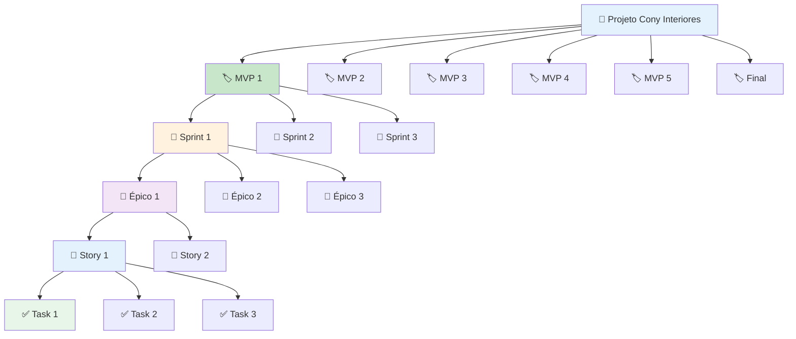
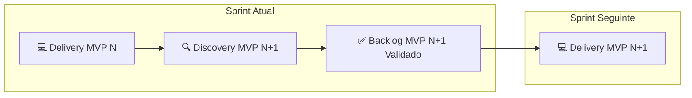

Com base na sua solicitação, incorporei as regras de criação de MVPs, Sprints, Épicos, Stories (Discovery, Delivery e Measurement) e Tasks ao guia existente, eliminando redundâncias e organizando o conteúdo de forma fluida e coesa. O resultado é um documento único e completo.

---

## 🗺️ Guia Completo: Configurando Roadmap, MVPs, Épicos, Stories e Tarefas no GitHub Projects (Plano Free)

Este guia descreve a estrutura de hierarquia e a nomenclatura padronizada para gerenciar o projeto, permitindo que você aplique este modelo a qualquer MVP ou etapa do desenvolvimento.

---

### 1. Criando o Projeto

1. Acesse sua organização ou perfil pessoal no GitHub.
2. Clique na aba **Projects** → **New project**.
3. Escolha o template **"Roadmap"** (recomendado) ou **"Table"** para começar do zero.
4. Nomeie o projeto: **"Cony Interiores - Sistema de Controle de Produção"**.
5. Clique em **Create project**.

> 💡 **Dica:** Mesmo no plano Free, você pode criar projetos públicos ou privados, adicionar custom fields ilimitados e usar todas as views.

---

### 2. Configurando os Campos Personalizados (Custom Fields)

Os custom fields são essenciais para capturar as informações do seu planejamento.

| Nome do Campo | Tipo | Valores/Configuração | Uso |
|---------------|------|---------------------|-----|
| **MVP** | Single select | MVP 1, MVP 2, MVP 3, MVP 4, MVP 5, Final | Identificar a qual MVP cada item pertence |
| **Squad** | Single select | Foundation, Core Business, UX & Experience | Filtrar por squad |
| **Tipo** | Single select | Epic, Story, Task, Bug | Classificar a hierarquia |
| **Prioridade** | Single select | P0 (Must-have), P1 (Should-have), P2 (Nice-to-have) | Priorizar entregas |
| **Story Points** | Number | 1, 2, 3, 5, 8, 13 | Estimativa Fibonacci |
| **Start Date** | Date | - | Início da tarefa |
| **Target Date** | Date | - | Data de entrega |
| **Status** | Single select | Backlog, Planned, In Progress, Review, Done | Acompanhamento do fluxo |

**Como criar:**
1. No canto direito do projeto, clique no **+** (ou no cabeçalho da última coluna).
2. Selecione **New field**.
3. Preencha o nome e tipo conforme a tabela acima.
4. Para campos `Single select`, adicione as opções uma a uma.

---

### 3. Hierarquia e Nomenclatura Padronizada

Para garantir rastreabilidade e organização, adotamos um sistema de IDs padronizados.

#### 3.1. Visão Geral da Hierarquia



#### 3.2. Estrutura do ID: `[TIPO]-[MVP]-[SQUAD]-[NNN]`

| Componente | Descrição | Exemplo |
|------------|-----------|---------|
| **TIPO** | Tipo de item | `EPIC`, `STORY`, `TASK`, `BUG` |
| **MVP** | MVP relacionado | `M1`, `M2`, `M3`, `M4`, `M5`, `FIN` |
| **SQUAD** | Squad responsável | `FND` (Foundation), `CORE` (Core Business), `UX` (UX & Experience) |
| **NNN** | Número sequencial (3 dígitos) | `001`, `002`, `003` |

#### 3.3. Exemplos de IDs

| ID | Significado |
|----|-------------|
| `EPIC-M1-FND-001` | Épico 1 do MVP 1, Squad Foundation |
| `STORY-M1-FND-001` | Story 1 do MVP 1, Squad Foundation |
| `TASK-M1-FND-001` | Task 1 do MVP 1, Squad Foundation |
| `EPIC-M1-CORE-001` | Épico 1 do MVP 1, Squad Core Business |
| `STORY-M1-UX-001` | Story 1 do MVP 1, Squad UX & Experience |

#### 3.4. Sequência Numérica por Tipo e Squad

| Squad | EPIC | STORY | TASK |
|-------|------|-------|------|
| **Foundation (FND)** | EPIC-M1-FND-001 a 003 | STORY-M1-FND-001 a 005 | TASK-M1-FND-001 a 015 |
| **Core Business (CORE)** | EPIC-M1-CORE-001 a 003 | STORY-M1-CORE-001 a 005 | TASK-M1-CORE-001 a 015 |
| **UX & Experience (UX)** | EPIC-M1-UX-001 a 003 | STORY-M1-UX-001 a 005 | TASK-M1-UX-001 a 015 |

---

### 4. Regras para Criação de Itens

#### 4.1. MVPs (Milestones)

**Definição:**
- MVP = Milestone no GitHub
- Representa uma entrega de valor ao cliente

**Regras de Criação:**

| Regra | Descrição |
|-------|-----------|
| **Título** | `MVP X - Sprint Y: [Nome do Foco]` |
| **Descrição** | Breve descrição do objetivo do MVP |
| **Data de Entrega** | Definida no cronograma do projeto |
| **Duração** | MVP 1: 3 Sprints; Demais MVPs: 1 Sprint cada |

**Exemplo:**
```markdown
Título: MVP 1 - Sprint 1: Base Digital
Descrição: Docker, Setup, Cadastro de Costureiras
Due date: 2026-06-21
```

#### 4.2. Sprints

**Definição:**
- Sprint = Período de trabalho dentro de um MVP
- Representado pelo Milestone correspondente

**Regras de Criação:**

| Regra | Descrição |
|-------|-----------|
| **Duração** | 1 semana (7 dias) |
| **Início** | Sempre em uma segunda-feira |
| **Término** | Sempre em um domingo |
| **MVP 1** | 3 Sprints (Semanas 25, 26, 27) |
| **Demais MVPs** | 1 Sprint cada (Semanas 28 a 32) |

**Estrutura de Sprints por MVP:**

| MVP | Sprints | Semanas | Período |
|-----|---------|---------|---------|
| **MVP 1** | Sprint 1, 2, 3 | 25, 26, 27 | 15/06 a 05/07 |
| **MVP 2** | Sprint 4 | 28 | 06/07 a 12/07 |
| **MVP 3** | Sprint 5 | 29 | 13/07 a 19/07 |
| **MVP 4** | Sprint 6 | 30 | 20/07 a 26/07 |
| **MVP 5** | Sprint 7 | 31 | 27/07 a 02/08 |
| **Final** | Sprint 8 | 32 | 03/08 a 09/08 |

#### 4.3. Épicos (Epics)

**Definição:**
- Épico = Issue com label `epic`
- Representa um grande bloco de trabalho que contém múltiplas Stories

**Regras de Criação:**

| Regra | Descrição |
|-------|-----------|
| **Título** | `[EPIC-MX-SQUAD-NNN] [Epic] Nome do Épico` |
| **Labels** | `epic`, `mvpX`, `squad` |
| **Associado a** | Um Milestone (MVP/Sprint) |
| **Descrição** | Deve conter: Objetivo, Squad Responsável, Definition of Done |
| **Stories** | Vinculadas via Sub-issues ou comentários |

**Template do Corpo:**
```markdown
## 🎯 Objetivo do Épico
[Descrição do objetivo principal]

## 👥 Squad Responsável
[Foundation / Core Business / UX & Experience]

## 📌 Definition of Done
- [ ] Critério 1
- [ ] Critério 2
- [ ] Critério 3

## 📊 Stories Relacionadas
- [ ] STORY-MX-SQUAD-NNN: Título da Story 1
- [ ] STORY-MX-SQUAD-NNN: Título da Story 2
```

#### 4.4. Stories

**Definição:**
- Story = Issue com label `story`
- Representa uma funcionalidade ou requisito do usuário

**Tipos de Stories:**

| Tipo | Descrição | Responsável |
|------|-----------|-------------|
| **Discovery** | Validação de requisitos, pesquisa, definição de escopo | Líderes de Squad |
| **Delivery** | Desenvolvimento, codificação, implementação | Membros operacionais |
| **Measurement** | Definição de KPIs, métricas de sucesso | Líderes de Squad |

**Regras de Criação:**

| Regra | Descrição |
|-------|-----------|
| **Título** | `[STORY-MX-SQUAD-NNN] Story: Nome da Story` |
| **Labels** | `story`, `mvpX`, `squad` |
| **Associado a** | Um Épico pai e um Milestone (MVP/Sprint) |
| **Assignee** | Responsável pela execução |
| **Estimativa** | Story Points (Fibonacci: 1, 2, 3, 5, 8, 13) |

**Template do Corpo (Delivery):**
```markdown
## 📖 User Story
Como [persona], quero [ação] para [benefício].

## ✅ Critérios de Aceite
- [ ] Critério 1
- [ ] Critério 2
- [ ] Critério 3

## 📋 Tarefas
- [ ] TASK-MX-SQUAD-NNN: Descrição da tarefa 1
- [ ] TASK-MX-SQUAD-NNN: Descrição da tarefa 2
- [ ] TASK-MX-SQUAD-NNN: Descrição da tarefa 3

## 🏷️ Metadados
**ID:** STORY-MX-SQUAD-NNN
**Squad:** [Foundation / Core Business / UX]
**MVP:** MVP X
**Tipo:** Story
**Estimativa:** N Story Points
**Épico:** EPIC-MX-SQUAD-NNN
```

**Template do Corpo (Discovery/Measurement):**
```markdown
## 🔍 Tarefas de Discovery
- [ ] Validar [requisito/regra]
- [ ] Definir [estrutura/arquitetura]
- [ ] Mapear [dependências/integrações]
- [ ] Prototipar [solução/interface]
- [ ] Validar com stakeholders

## 📊 Tarefas de Mensuração
- [ ] Definir KPIs de [área]
- [ ] Estabelecer baseline de performance
- [ ] Criar métricas de [indicador]
- [ ] Definir cobertura de testes
- [ ] Estabelecer critérios de sucesso

## 🏷️ Metadados
**ID:** STORY-MX-SQUAD-NNN
**Squad:** [Foundation / Core Business / UX]
**MVP:** MVP X
**Tipo:** Discovery/Measurement
**Épico:** EPIC-MX-SQUAD-NNN
```

#### 4.5. Tarefas (Tasks)

**Definição:**
- Task = Sub-issue ou item de checklist
- Representa uma unidade de trabalho individual

**Regras de Criação:**

| Regra | Descrição |
|-------|-----------|
| **Título** | `TASK-MX-SQUAD-NNN: Descrição da tarefa` |
| **Labels** | `task`, `mvpX`, `squad` |
| **Associado a** | Story pai (via Sub-issue) |
| **Estimativa** | Não estimada individualmente (parte da Story) |

**Template do Corpo:**
```markdown
## 📋 Tarefa
[Descrição detalhada da tarefa]

## 🔗 Pertence à Story
[STORY-MX-SQUAD-NNN] Story: Nome da Story

## 📌 Status
- [ ] Pendente

## 🏷️ Metadados
**ID:** TASK-MX-SQUAD-NNN
**Squad:** [Foundation / Core Business / UX]
**MVP:** MVP X
**Tipo:** Task
```

---

### 5. Configurando as Views

#### 5.1. View: Roadmap (Visão Estratégica)
1. **New view** → **Roadmap**.
2. Configure **Date fields**: `Start Date` e `Target Date`.
3. **Group by**: `Milestone`.
4. Filtre por `-status:Done` para ver apenas itens ativos.

#### 5.2. View: Board (Kanban)
1. **New view** → **Board**.
2. Agrupe por `Status`.
3. Adicione filtros por `Squad`.
4. **Field sum**: `Story Points` para ver o total de esforço.

#### 5.3. View: Table (Backlog Detalhado)
1. **New view** → **Table**.
2. Mostre colunas: `Title`, `Status`, `MVP`, `Squad`, `Tipo`, `Priority`, `Story Points`, `Assignee`.
3. **Group by**: `MVP`.

#### 5.4. View por Squad
Crie views filtradas por `Squad:Foundation`, `Squad:Core Business` e `Squad:UX & Experience`.

---

### 6. Distribuição de Carga

#### 6.1. Por Tipo de Ator

| Ator | Tipo de Story | Carga por Sprint |
|------|---------------|------------------|
| **Líder (Cross-Squad)** | Discovery + Measurement | 2 Stories (4 tarefas cada) |
| **Membro Operacional** | Delivery | 1 Story (5 tarefas) |

#### 6.2. Por Squad (Exemplo MVP 1)

| Squad | Líder | Membro 1 | Membro 2 | Total Stories | Total Tarefas |
|-------|-------|----------|----------|---------------|---------------|
| **Foundation** | 2 Stories (4 tarefas) | 1 Story (5 tarefas) | 1 Story (5 tarefas) | 4 | 14 |
| **Core Business** | 2 Stories (4 tarefas) | 1 Story (5 tarefas) | 1 Story (5 tarefas) | 4 | 14 |
| **UX & Experience** | 2 Stories (4 tarefas) | 1 Story (5 tarefas) | 1 Story (5 tarefas) | 4 | 14 |
| **TOTAL** | 6 Stories (12 tarefas) | 3 Stories (15 tarefas) | 3 Stories (15 tarefas) | **12 Stories** | **42 Tarefas** |

---

### 7. Fluxo de Discovery e Delivery Contínuo



**Regras:**
- A liderança (Cross-Squad) deve estar **sempre 1 MVP à frente**
- Discovery do MVP N+1 acontece em paralelo com a execução do MVP N
- O Backlog do MVP N+1 deve estar **100% refinado e estimado** antes do início da sprint

---

### 8. Automações Básicas (Workflows)

1. Clique nos três pontos (⋮) no canto superior direito do projeto.
2. Selecione **Workflows**.
3. Ative os workflows desejados:

| Workflow | Ação | Quando |
|----------|------|--------|
| **Item closed** | Move para "Done" | Issue é fechada |
| **Item reopened** | Move para "In Progress" | Issue é reaberta |
| **Item added** | Define status como "Backlog" | Issue é adicionada ao projeto |

> **Atenção:** Recomenda-se desabilitar o workflow "Item closed" para Stories que devem permanecer no Sprint Backlog até o fim da iteração.

---

### 9. Fluxo de Trabalho no Dia a Dia

#### Semana de Sprint Planning:
1. **Líderes (Cross-Squad):** Adicionam Issues de Discovery do MVP seguinte.
2. **Product Owner:** Prioriza as Stories no Backlog.
3. **Time:** Estima as Stories (campo `Story Points`).

#### Durante a Sprint:
1. **Membros Operacionais:** Movem suas Stories/Tasks de `Backlog` → `In Progress`.
2. **Dailies:** Visualizam o Kanban Board filtrado por Squad.
3. **Peer Review:** Movem para `Review` quando concluído.

#### Final da Sprint:
1. **Sprint Review:** Stories concluídas são movidas para `Done`.
2. **Milestone:** Fechar o milestone correspondente.
3. **Retrospectiva:** Analisar métricas (burndown, velocity).

---

### 10. Dicas para o Plano Free

| Recurso | Limite Free | Dica |
|---------|-------------|------|
| **Projetos** | Ilimitados | Crie projetos separados por fase se necessário |
| **Custom Fields** | Ilimitados | Use sem preocupação |
| **Issues** | Ilimitadas | Crie quantas épicos, stories e tasks precisar |
| **Milestones** | Ilimitados | Use para cada Sprint/MVP |
| **GitHub Actions** | 2.000 min/mês (privado) | Use com moderação |
| **Colaboradores** | Ilimitados | GitHub não limita por usuário |

---

### 11. Compartilhamento com Stakeholders

Para não técnicos da Cony Interiores:
1. **Exportar como PNG:** Use a opção de screenshot do Roadmap view.
2. **Compartilhar URL:** O projeto pode ser compartilhado com membros da organização.
3. **Criar uma view simplificada:** Filtre apenas por `Status:Done` e `MVP` para mostrar progresso.

---

### 12. Resumo Rápido da Nomenclatura

| Item | Estrutura | Exemplo |
|------|-----------|---------|
| **MVP** | `MVP X - Sprint Y: Nome` | MVP 1 - Sprint 1: Base Digital |
| **Épico** | `[EPIC-MX-SQUAD-NNN] [Epic] Nome` | [EPIC-M1-FND-001] [Epic] Infraestrutura |
| **Story (Delivery)** | `[STORY-MX-SQUAD-NNN] Story: Nome` | [STORY-M1-FND-001] Story: Configuração Django |
| **Story (Discovery)** | `[STORY-MX-SQUAD-NNN] Discovery: Nome` | [STORY-M1-FND-001] Discovery: Validar Setup |
| **Task** | `TASK-MX-SQUAD-NNN: Descrição` | TASK-M1-FND-001: Inicializar projeto Django |

**Squads:**
- `FND` = Foundation
- `CORE` = Core Business
- `UX` = UX & Experience

**MVPs:**
- `M1`, `M2`, `M3`, `M4`, `M5`, `FIN`

---

*Documento atualizado em junho de 2026 para o projeto Cony Interiores - Parceria CEPEDI / SOFTEX / MCTI*