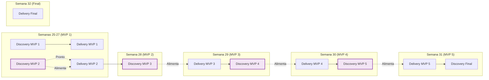

Com base na estrutura já validada para o MVP 1, apresento o **Planejamento Global de Alto Nível** para todo o projeto. Este documento serve como um mapa estratégico, definindo o escopo macro de cada MVP, seus objetivos de negócio e as squads envolvidas, sem o detalhamento de stories e tarefas individuais.

---

# 🗺️ Planejamento Global de Alto Nível
## Projeto Cony Interiores: Sistema de Controle de Produção

**Versão:** 1.0
**Data:** Junho de 2026
**Período:** Semanas 25 a 32 (15/06 a 09/08/2026)
**Parceria:** CEPEDI / SOFTEX / MCTI

---

## 1. Visão Geral do Projeto

### 1.1. Objetivo Estratégico
Desenvolver um sistema web para controle de produção de costureiras da Cony Interiores, permitindo:
- Gestão de cadastro de costureiras e serviços
- Cálculo de capacidade produtiva com índice de complexidade
- Controle financeiro e planejamento de pagamentos
- Dashboards de produtividade e relatórios gerenciais

### 1.2. Cronograma Macro

```mermaid
gantt
    title Cronograma Geral do Projeto (Semanas 25-32)
    dateFormat  YYYY-WW
    axisFormat Semana %W
    
    section MVP 1 (3 Sprints)
    Sprint 1 - Base Digital          :s1, 2026-W25, 7d
    Sprint 2 - Fluxo Operacional     :s2, 2026-W26, 7d
    Sprint 3 - Inteligência          :s3, 2026-W27, 7d
    
    section MVP 2 (1 Sprint)
    Sprint 4 - Financeiro            :s4, 2026-W28, 7d
    
    section MVP 3 (1 Sprint)
    Sprint 5 - Gestão Visual         :s5, 2026-W29, 7d
    
    section MVP 4 (1 Sprint)
    Sprint 6 - Relatórios            :s6, 2026-W30, 7d
    
    section MVP 5 (1 Sprint)
    Sprint 7 - Otimização            :s7, 2026-W31, 7d
    
    section Finalização
    Sprint 8 - Deploy e Handover     :s8, 2026-W32, 7d
```

| MVP | Sprints | Semanas | Período | Foco Principal |
|-----|---------|---------|---------|----------------|
| **MVP 1** | Sprint 1, 2, 3 | Semanas 25, 26, 27 | 15/06 a 05/07 | Base Digital, Fluxo Operacional, Inteligência de Capacidade |
| **MVP 2** | Sprint 4 | Semana 28 | 06/07 a 12/07 | Previsão Financeira |
| **MVP 3** | Sprint 5 | Semana 29 | 13/07 a 19/07 | Gestão Visual e Dashboards |
| **MVP 4** | Sprint 6 | Semana 30 | 20/07 a 26/07 | Relatórios Avançados |
| **MVP 5** | Sprint 7 | Semana 31 | 27/07 a 02/08 | Otimização e Ajustes Finais |
| **Final** | Sprint 8 | Semana 32 | 03/08 a 09/08 | Deploy, Handover e Documentação |

---

## 2. Estrutura dos Squads (Constante em Todos os MVPs)

| Squad | Líder | Membros | Responsabilidades Macro |
|-------|-------|---------|------------------------|
| **Foundation** | @lobaque29 | @Marcus1423, @mariagabrielle428-ship-it | Infraestrutura, Docker, CI/CD, Segurança, Performance |
| **Core Business** | @karinakaduda19-cyber | @Matheus-G-R, @Bianca2703 | Regras de negócio, API, Banco de Dados, Cálculos Financeiros |
| **UX & Experience** | @anandamatos | @gabrielaugusto872, @isabarrs | Design System, Dashboards, Usabilidade, Visualização de Dados |

---

## 3. Roadmap dos MVPs

### 3.1. MVP 1 - Base Digital, Fluxo Operacional e Inteligência de Capacidade (Semanas 25-27)

**Objetivo:** Estabelecer a base técnica e operacional do sistema.

| Sprint | Foco | Entregável Principal | Squads Envolvidos |
|--------|------|----------------------|-------------------|
| **Sprint 1 (W25)** | Base Digital | Docker configurado, ambiente padronizado, cadastro de costureiras | Foundation, Core Business, UX |
| **Sprint 2 (W26)** | Fluxo Operacional | CRUD de serviços, status de produção, autenticação | Foundation, Core Business, UX |
| **Sprint 3 (W27)** | Inteligência de Capacidade | Cálculo de carga com índice de complexidade, visualização inicial | Core Business, UX |

**Critérios de Aceite Macro:**
- ✅ Ambiente Docker funcional (backend, frontend, banco de dados)
- ✅ Cadastro de costureiras e CRUD de serviços via API e interface
- ✅ Cálculo de capacidade com índice de complexidade (P/M/G/Esp)
- ✅ Visualização inicial de carga com gráficos comparativos
- ✅ Design System aplicado e navegação funcional

---

### 3.2. MVP 2 - Previsão Financeira (Semana 28)

**Objetivo:** Implementar controle financeiro e planejamento de pagamentos.

| Sprint | Foco | Entregável Principal | Squads Envolvidos |
|--------|------|----------------------|-------------------|
| **Sprint 4 (W28)** | Previsão Financeira | Controle de pagamentos, sumarização de valores, planejamento financeiro | Core Business, UX |

**Critérios de Aceite Macro:**
- ✅ Modelo de dados financeiro implementado
- ✅ Soma automática de valores pendentes por costureira
- ✅ Planejamento de pagamentos semanais/mensais
- ✅ Interface de resumo financeiro
- ✅ Integração com status de serviços

---

### 3.3. MVP 3 - Gestão Visual e Dashboards (Semana 29)

**Objetivo:** Fornecer visão consolidada da produção e métricas de ROI.

| Sprint | Foco | Entregável Principal | Squads Envolvidos |
|--------|------|----------------------|-------------------|
| **Sprint 5 (W29)** | Gestão Visual | Dashboards de produtividade, comparação entre costureiras, métricas de ROI | UX, Core Business, Foundation |

**Critérios de Aceite Macro:**
- ✅ Dashboard com KPIs de produção (quantidade, complexidade, tempo)
- ✅ Comparativo de produtividade entre costureiras
- ✅ Métricas de ROI e eficiência
- ✅ Gráficos interativos e filtros por período
- ✅ Performance otimizada para carregamento rápido

---

### 3.4. MVP 4 - Relatórios Avançados (Semana 30)

**Objetivo:** Gerar relatórios gerenciais detalhados e exportáveis.

| Sprint | Foco | Entregável Principal | Squads Envolvidos |
|--------|------|----------------------|-------------------|
| **Sprint 6 (W30)** | Relatórios Avançados | Relatórios de produtividade, atrasos, exportação de dados | Core Business, UX, Foundation |

**Critérios de Aceite Macro:**
- ✅ Relatórios mensais de produção por costureira
- ✅ Relatórios de serviços em atraso
- ✅ Exportação em PDF/CSV
- ✅ Filtros avançados (período, costureira, tipo de serviço)
- ✅ Histórico de produção e pagamentos

---

### 3.5. MVP 5 - Otimização e Ajustes Finais (Semana 31)

**Objetivo:** Refinar a experiência do usuário e otimizar performance.

| Sprint | Foco | Entregável Principal | Squads Envolvidos |
|--------|------|----------------------|-------------------|
| **Sprint 7 (W31)** | Otimização e Ajustes | Melhorias de UX, performance, acessibilidade, ajustes finos | Todos os Squads |

**Critérios de Aceite Macro:**
- ✅ Melhorias de usabilidade baseadas em feedback dos usuários
- ✅ Otimização de performance (backend e frontend)
- ✅ Acessibilidade (WCAG 2.1 AA)
- ✅ Correção de bugs identificados
- ✅ Documentação de usuário atualizada

---

### 3.6. Final - Deploy e Handover (Semana 32)

**Objetivo:** Entregar o sistema finalizado e documentado para a Cony Interiores.

| Sprint | Foco | Entregável Principal | Squads Envolvidos |
|--------|------|----------------------|-------------------|
| **Sprint 8 (W32)** | Deploy e Handover | Deploy em produção, documentação técnica, treinamento de usuários | Todos os Squads |

**Critérios de Aceite Macro:**
- ✅ Deploy em ambiente de produção
- ✅ Documentação técnica completa (API, arquitetura, manutenção)
- ✅ Manual do usuário e vídeo tutorial
- ✅ Treinamento realizado com a equipe da Cony Interiores
- ✅ Plano de suporte pós-entrega

---

## 4. Fluxo de Discovery e Delivery Contínuo



### Princípio do Fluxo:
- **Liderança (Cross-Squad):** Trabalha com 2 MVPs de antecedência (Discovery do MVP N+1 enquanto o time executa o MVP N)
- **Time Operacional:** Focado na entrega do MVP atual, com backlog sempre validado e pronto para a próxima sprint

---

## 5. Distribuição de Carga por MVP (Alto Nível)

| MVP | Sprints | Squads Envolvidos | Esforço Relativo |
|-----|---------|-------------------|------------------|
| **MVP 1** | 3 | Todos | ⭐⭐⭐⭐⭐ (45% do projeto) |
| **MVP 2** | 1 | Core Business, UX | ⭐⭐⭐ (15% do projeto) |
| **MVP 3** | 1 | UX, Core Business, Foundation | ⭐⭐⭐ (15% do projeto) |
| **MVP 4** | 1 | Core Business, UX, Foundation | ⭐⭐⭐ (15% do projeto) |
| **MVP 5** | 1 | Todos | ⭐⭐ (10% do projeto) |
| **Final** | 1 | Todos | ⭐ (5% do projeto) |

---

## 6. Marcos e Entregas-Chave

| Data | Marco | Entregável |
|------|-------|------------|
| **21/06/2026** | Fim Sprint 1 | Base Digital e Cadastro de Costureiras |
| **28/06/2026** | Fim Sprint 2 | Fluxo Operacional e CRUD de Serviços |
| **05/07/2026** | Fim Sprint 3 | Inteligência de Capacidade e MVP 1 Completo |
| **12/07/2026** | Fim Sprint 4 | Previsão Financeira e MVP 2 Completo |
| **19/07/2026** | Fim Sprint 5 | Gestão Visual e MVP 3 Completo |
| **26/07/2026** | Fim Sprint 6 | Relatórios Avançados e MVP 4 Completo |
| **02/08/2026** | Fim Sprint 7 | Otimização e MVP 5 Completo |
| **09/08/2026** | Fim Sprint 8 | Deploy, Handover e Projeto Finalizado |

---

## 7. Ferramentas e Infraestrutura

| Categoria | Ferramenta | Uso |
|-----------|------------|-----|
| **Gestão** | GitHub Projects | Backlog, Sprints, Kanban |
| **Comunicação** | Discord | Canais por squad e gerais |
| **Documentação** | Mermaid, Markdown | Diagramas, README, documentação técnica |
| **Design** | Figma | Prototipagem, Design System |
| **Desenvolvimento** | Python (Django/DRF), React, Tailwind CSS | Backend, Frontend, Estilização |
| **Infraestrutura** | Docker, Docker Compose | Containerização, padronização de ambiente |
| **CI/CD** | GitHub Actions | Automação de testes e deploy |
| **Banco de Dados** | PostgreSQL | Dados do sistema |

---

## 8. Riscos e Mitigações

| Risco | Probabilidade | Impacto | Mitigação |
|-------|---------------|---------|-----------|
| **Atraso no MVP 1** | Média | Alto | Buffer de 20% nas estimativas, priorização rigorosa |
| **Mudança de requisitos** | Alta | Médio | Dual Track Agile com validação contínua com stakeholders |
| **Problemas de integração** | Média | Alto | Integração contínua desde a Sprint 1, testes automatizados |
| **Falta de disponibilidade do time** | Baixa | Alto | Documentação clara, pareamento, código revisado |
| **Dependência de terceiros (SOFTEX)** | Baixa | Médio | Planejamento antecipado, comunicação proativa |

---

## 9. Próximos Passos

1. **Detalhamento do MVP 2:** Criar documento de planejamento detalhado (stories e tasks) para a Sprint 4
2. **Sprint Planning Global:** Alinhar com o time as entregas de cada MVP
3. **Iniciar MVP 1:** Executar conforme planejado (já em andamento)
4. **Revisão Contínua:** Ajustar planejamento com base em feedbacks e aprendizados

---

## 10. Anexos

### 10.1. Nomenclatura Padronizada (Resumo)

| Elemento | Formato | Exemplo |
|----------|---------|---------|
| **Épico** | `EPIC-M{SQUAD}-{NNN}` | `EPIC-M1-FND-001` |
| **Story** | `STORY-M{SQUAD}-{NNN}` | `STORY-M1-FND-001` |
| **Task** | `TASK-M{SQUAD}-{NNN}` | `TASK-M1-FND-001` |

**Squads:** `FND` (Foundation), `CORE` (Core Business), `UX` (UX & Experience)
**MVPs:** `M1`, `M2`, `M3`, `M4`, `M5`, `FIN`

### 10.2. Links Úteis

- **Repositório:** https://github.com/anandamatos/cony-interiores
- **Issues:** https://github.com/anandamatos/cony-interiores/issues
- **Project Board:** https://github.com/users/anandamatos/projects/4

---

*Documento base para planejamento estratégico do projeto Cony Interiores. Os MVPs 2 a 5 terão seus próprios documentos de planejamento detalhado (stories e tasks) a serem criados antes do início de cada sprint.*

**Próximo Documento a ser Criado:** Planejamento Detalhado do MVP 2 (Sprint 4 - Previsão Financeira)