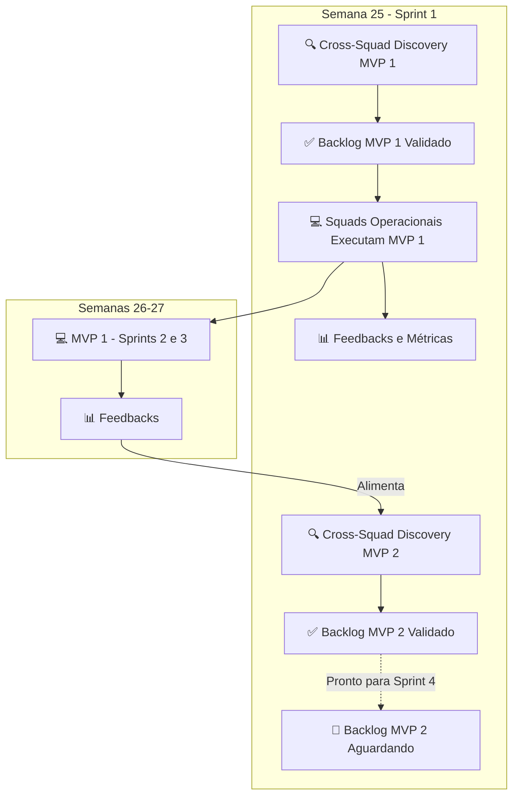

# 📋 Documento de Planejamento - MVP 1
## Projeto Cony Interiores: Sistema de Controle de Produção

**Versão:** 1.0
**Data:** Junho de 2026
**Período:** Semanas 25 a 27 (15/06 a 05/07/2026)
**Foco:** Base Digital, Fluxo Operacional e Inteligência de Capacidade

---

## 1. Visão Geral do MVP 1

### 1.1. Objetivo Estratégico
Estabelecer a base técnica e operacional do sistema, permitindo o cadastro de costureiras e serviços, além do cálculo inicial de capacidade produtiva com índice de complexidade.

### 1.2. Escopo do MVP 1

| Sprint | Semana | Período | Foco Principal | Entregável Chave |
|--------|--------|---------|----------------|------------------|
| **Sprint 1** | Semana 25 | 15/06 a 21/06 | Base Digital | Docker, Setup, Cadastro de Costureiras |
| **Sprint 2** | Semana 26 | 22/06 a 28/06 | Fluxo Operacional | CRUD de Serviços e Status |
| **Sprint 3** | Semana 27 | 29/06 a 05/07 | Inteligência de Capacidade | Cálculo de Carga e Complexidade |

### 1.3. Critérios de Aceite do MVP 1

- ✅ Ambiente Docker funcional com backend, frontend e banco de dados
- ✅ Cadastro de costureiras via API e interface
- ✅ CRUD de serviços via API e interface
- ✅ Cálculo de capacidade com índice de complexidade (P/M/G/Esp)
- ✅ Visualização de carga com gráficos comparativos
- ✅ Design System aplicado e navegação funcional

---

## 2. Épicos e Stories com Nomenclatura Padronizada

A nomenclatura segue o padrão: `[TIPO]-[MVP]-[SQUAD]-[NNN]`

| Código | Squad | Descrição |
|--------|-------|-----------|
| `FND` | Foundation | Infraestrutura, Docker, CI/CD, Segurança |
| `CORE` | Core Business | Regras de Negócio, API, Cálculo de Capacidade |
| `UX` | UX & Experience | Design System, Dashboards, Usabilidade |

### 2.1. Épicos do MVP 1

| ID | Título | Squad | Sprint |
|----|--------|-------|--------|
| **EPIC-M1-FND-001** | [Epic] Infraestrutura e Base Técnica | Foundation | Sprint 1 |
| **EPIC-M1-CORE-001** | [Epic] Lógica de Carga e CRUD | Core Business | Sprint 1 |
| **EPIC-M1-UX-001** | [Epic] Interface e Jornada do Usuário | UX & Experience | Sprint 1 |

### 2.2. Stories por Sprint

#### Sprint 1 (Semana 25) - Base Digital

| ID | Título | Épico | Responsável |
|----|--------|-------|-------------|
| **STORY-M1-FND-001** | Story: Configuração do Backend Django | EPIC-M1-FND-001 | @Marcus1423 |
| **STORY-M1-FND-002** | Story: Configuração do Frontend React | EPIC-M1-FND-001 | @mariagabrielle428-ship-it |
| **STORY-M1-CORE-001** | Story: Cadastro de Costureiras | EPIC-M1-CORE-001 | @Matheus-G-R |
| **STORY-M1-UX-001** | Story: Layout Base e Design System | EPIC-M1-UX-001 | @gabrielaugusto872 |

#### Sprint 2 (Semana 26) - Fluxo Operacional

| ID | Título | Épico | Responsável |
|----|--------|-------|-------------|
| **STORY-M1-FND-003** | Story: Autenticação e Segurança | EPIC-M1-FND-001 | @Marcus1423 |
| **STORY-M1-CORE-002** | Story: CRUD de Serviços | EPIC-M1-CORE-001 | @Matheus-G-R |
| **STORY-M1-UX-002** | Story: Formulários e Integração API | EPIC-M1-UX-001 | @Bianca2703 |

#### Sprint 3 (Semana 27) - Inteligência de Capacidade

| ID | Título | Épico | Responsável |
|----|--------|-------|-------------|
| **STORY-M1-CORE-003** | Story: Cálculo de Capacidade | EPIC-M1-CORE-001 | @Matheus-G-R |
| **STORY-M1-UX-003** | Story: Visualização de Carga | EPIC-M1-UX-001 | @isabarrs |

---

## 3. Detalhamento das Stories e Tarefas

### 3.1. Squad Foundation

#### STORY-M1-FND-001: Configuração do Backend Django
**Épico:** EPIC-M1-FND-001 | **Sprint:** 1 | **Responsável:** @Marcus1423

**Tarefas:**
| ID | Descrição |
|----|-----------|
| TASK-M1-FND-001 | Inicializar projeto Django |
| TASK-M1-FND-002 | Configurar DRF |
| TASK-M1-FND-003 | Configurar PostgreSQL no docker-compose |
| TASK-M1-FND-004 | Configurar CORS |
| TASK-M1-FND-005 | Implementar logging estruturado |

#### STORY-M1-FND-002: Configuração do Frontend React
**Épico:** EPIC-M1-FND-001 | **Sprint:** 1 | **Responsável:** @mariagabrielle428-ship-it

**Tarefas:**
| ID | Descrição |
|----|-----------|
| TASK-M1-FND-006 | Inicializar projeto React com Vite |
| TASK-M1-FND-007 | Configurar React Router |
| TASK-M1-FND-008 | Configurar Axios |
| TASK-M1-FND-009 | Configurar ESLint e Prettier |
| TASK-M1-FND-010 | Configurar Husky |

#### STORY-M1-FND-003: Autenticação e Segurança
**Épico:** EPIC-M1-FND-001 | **Sprint:** 2 | **Responsável:** @Marcus1423

**Tarefas:**
| ID | Descrição |
|----|-----------|
| TASK-M1-FND-011 | Implementar autenticação JWT |
| TASK-M1-FND-012 | Configurar middleware de segurança |
| TASK-M1-FND-013 | Implementar permissões |
| TASK-M1-FND-014 | Implementar refresh token |
| TASK-M1-FND-015 | Escrever testes de segurança |

---

### 3.2. Squad Core Business

#### STORY-M1-CORE-001: Cadastro de Costureiras
**Épico:** EPIC-M1-CORE-001 | **Sprint:** 1 | **Responsável:** @Matheus-G-R

**Tarefas:**
| ID | Descrição |
|----|-----------|
| TASK-M1-CORE-001 | Criar model Costureira |
| TASK-M1-CORE-002 | Implementar serializers |
| TASK-M1-CORE-003 | Implementar endpoints CRUD |
| TASK-M1-CORE-004 | Adicionar validações |
| TASK-M1-CORE-005 | Escrever testes unitários |

#### STORY-M1-CORE-002: CRUD de Serviços
**Épico:** EPIC-M1-CORE-001 | **Sprint:** 2 | **Responsável:** @Matheus-G-R

**Tarefas:**
| ID | Descrição |
|----|-----------|
| TASK-M1-CORE-006 | Criar model Servico |
| TASK-M1-CORE-007 | Implementar serializers |
| TASK-M1-CORE-008 | Implementar endpoints CRUD |
| TASK-M1-CORE-009 | Adicionar filtros |
| TASK-M1-CORE-010 | Escrever testes unitários |

#### STORY-M1-CORE-003: Cálculo de Capacidade
**Épico:** EPIC-M1-CORE-001 | **Sprint:** 3 | **Responsável:** @Matheus-G-R

**Tarefas:**
| ID | Descrição |
|----|-----------|
| TASK-M1-CORE-011 | Implementar função de cálculo de carga |
| TASK-M1-CORE-012 | Integrar índice de complexidade |
| TASK-M1-CORE-013 | Criar endpoint de consulta de carga |
| TASK-M1-CORE-014 | Implementar lógica de sugestão de alocação |
| TASK-M1-CORE-015 | Escrever testes |

---

### 3.3. Squad UX & Experience

#### STORY-M1-UX-001: Layout Base e Design System
**Épico:** EPIC-M1-UX-001 | **Sprint:** 1 | **Responsável:** @gabrielaugusto872

**Tarefas:**
| ID | Descrição |
|----|-----------|
| TASK-M1-UX-001 | Configurar Tailwind CSS |
| TASK-M1-UX-002 | Criar componentes base |
| TASK-M1-UX-003 | Implementar layout principal |
| TASK-M1-UX-004 | Criar página Home |
| TASK-M1-UX-005 | Garantir responsividade |

#### STORY-M1-UX-002: Formulários e Integração API
**Épico:** EPIC-M1-UX-001 | **Sprint:** 2 | **Responsável:** @Bianca2703

**Tarefas:**
| ID | Descrição |
|----|-----------|
| TASK-M1-UX-006 | Criar página de listagem de costureiras |
| TASK-M1-UX-007 | Implementar formulário de cadastro/edição |
| TASK-M1-UX-008 | Integrar com API |
| TASK-M1-UX-009 | Adicionar validações e feedback |
| TASK-M1-UX-010 | Implementar roteamento |

#### STORY-M1-UX-003: Visualização de Carga
**Épico:** EPIC-M1-UX-001 | **Sprint:** 3 | **Responsável:** @isabarrs

**Tarefas:**
| ID | Descrição |
|----|-----------|
| TASK-M1-UX-011 | Criar página de visualização de capacidade |
| TASK-M1-UX-012 | Implementar cards de carga |
| TASK-M1-UX-013 | Criar gráfico comparativo |
| TASK-M1-UX-014 | Implementar filtros |
| TASK-M1-UX-015 | Integrar com API |

---

## 4. Tarefas de Discovery e Mensuração

### 4.1. Squad Foundation
**Líder:** @lobaque29

| Story ID | Tarefas Discovery | Tarefas Mensuração |
|----------|-------------------|-------------------|
| **STORY-M1-FND-001** | Validar versões Python/Django, arquitetura containers, segurança | KPIs infraestrutura, baseline performance, tempo setup |
| **STORY-M1-FND-002** | Validar versão React/Vite, estrutura componentes, padrões código | KPIs performance frontend, bundle size, acessibilidade |
| **STORY-M1-FND-003** | Validar estratégia JWT, permissões, política refresh token | KPIs segurança, tempo resposta com JWT, cobertura testes |

### 4.2. Squad Core Business
**Líder:** @karinakaduda19-cyber

| Story ID | Tarefas Discovery | Tarefas Mensuração |
|----------|-------------------|-------------------|
| **STORY-M1-CORE-001** | Validar campos Costureira, regras unicidade, padrão API REST | KPIs cadastro, tempo resposta CRUD, cobertura testes |
| **STORY-M1-CORE-002** | Validar modelo Servico, status, regras complexidade | KPIs fluxo operacional, tempo resposta endpoints |
| **STORY-M1-CORE-003** | Validar fórmula cálculo carga, pesos complexidade, distribuição | KPIs capacidade, precisão cálculo, acurácia alocação |

### 4.3. Squad UX & Experience
**Líder:** @anandamatos

| Story ID | Tarefas Discovery | Tarefas Mensuração |
|----------|-------------------|-------------------|
| **STORY-M1-UX-001** | Validar cores/tema Cony, estrutura navegação, protótipo layout | KPIs usabilidade, padrões design, testes UX |
| **STORY-M1-UX-002** | Validar fluxo cadastro, feedbacks visuais, protótipo listagem | KPIs eficiência formulário, taxa erro, tempo preenchimento |
| **STORY-M1-UX-003** | Validar tipos gráficos, estrutura cards, filtros | KPIs visualização dados, tempo renderização gráficos |

---

## 5. Estrutura de Squads e Distribuição de Carga

### 5.1. Composição dos Squads

| Squad | Líder (Cross-Squad) | Membro 1 | Membro 2 |
|-------|---------------------|----------|----------|
| **Foundation** | @lobaque29 (Tech Lead) | @Marcus1423 (Backend) | @mariagabrielle428-ship-it (Frontend) |
| **Core Business** | @karinakaduda19-cyber (PO) | @Matheus-G-R (Backend) | @Bianca2703 (Frontend) |
| **UX & Experience** | @anandamatos (UX/UI Lead) | @gabrielaugusto872 (Frontend) | @isabarrs (Backend) |

### 5.2. Distribuição de Carga por Sprint

#### Sprint 1 (Semana 25)

| Squad | Líder | Membro 1 | Membro 2 | Total |
|-------|-------|----------|----------|-------|
| **Foundation** | 2 Stories (4 tarefas) | 1 Story (5 tarefas) | 1 Story (5 tarefas) | 14 tarefas |
| **Core Business** | 2 Stories (4 tarefas) | 1 Story (5 tarefas) | 1 Story (5 tarefas) | 14 tarefas |
| **UX & Experience** | 2 Stories (4 tarefas) | 1 Story (5 tarefas) | 1 Story (5 tarefas) | 14 tarefas |
| **TOTAL** | 6 Stories (12 tarefas) | 3 Stories (15 tarefas) | 3 Stories (15 tarefas) | **42 tarefas** |

#### Sprint 2 (Semana 26)

| Squad | Líder | Membro 1 | Membro 2 | Total |
|-------|-------|----------|----------|-------|
| **Foundation** | 1 Story (2 tarefas) | 1 Story (5 tarefas) | - | 7 tarefas |
| **Core Business** | 1 Story (2 tarefas) | 1 Story (5 tarefas) | 1 Story (5 tarefas) | 12 tarefas |
| **UX & Experience** | 1 Story (2 tarefas) | - | 1 Story (5 tarefas) | 7 tarefas |
| **TOTAL** | 3 Stories (6 tarefas) | 2 Stories (10 tarefas) | 2 Stories (10 tarefas) | **26 tarefas** |

#### Sprint 3 (Semana 27)

| Squad | Líder | Membro 1 | Membro 2 | Total |
|-------|-------|----------|----------|-------|
| **Foundation** | - | - | - | 0 tarefas |
| **Core Business** | 1 Story (2 tarefas) | 1 Story (5 tarefas) | - | 7 tarefas |
| **UX & Experience** | 1 Story (2 tarefas) | - | 1 Story (5 tarefas) | 7 tarefas |
| **TOTAL** | 2 Stories (4 tarefas) | 1 Story (5 tarefas) | 1 Story (5 tarefas) | **14 tarefas** |

---

## 6. Cronograma e Marcos do MVP 1

### 6.1. Cronograma Detalhado

```mermaid
gantt
    title MVP 1 - Cronograma Detalhado (Semanas 25-27)
    dateFormat  YYYY-WW
    axisFormat Semana %W
    
    section Cross-Squad
    Discovery MVP 1 + MVP 2       :d1, 2026-W25, 7d
    Mensuração MVP 1              :d2, 2026-W26, 7d
    Discovery MVP 3               :d3, 2026-W27, 7d
    
    section Foundation
    Configuração Django/React     :f1, 2026-W25, 7d
    Autenticação e Segurança      :f2, 2026-W26, 7d
    
    section Core Business
    Cadastro Costureiras          :c1, 2026-W25, 7d
    CRUD Serviços                 :c2, 2026-W26, 7d
    Cálculo Capacidade            :c3, 2026-W27, 7d
    
    section UX & Experience
    Layout Base + Design System   :u1, 2026-W25, 7d
    Formulários + Integração      :u2, 2026-W26, 7d
    Visualização de Carga         :u3, 2026-W27, 7d
```

### 6.2. Milestones do MVP 1

| Milestone | Data | Descrição |
|-----------|------|-----------|
| **MVP 1 - Sprint 1** | 21/06/2026 | Docker, Setup, Cadastro de Costureiras |
| **MVP 1 - Sprint 2** | 28/06/2026 | CRUD de Serviços e Status |
| **MVP 1 - Sprint 3** | 05/07/2026 | Cálculo de Carga e Complexidade |

---

## 7. Fluxo de Trabalho Integrado

### 7.1. Discovery + Delivery em Paralelo



### 7.2. Cerimônias e Rituais

| Evento | Frequência | Participantes | Objetivo |
|--------|------------|---------------|----------|
| **Sprint Planning** | Início de cada Sprint | Todos | Validar backlog e planejar entregas |
| **Daily Standup** | Diário (15 min) | Todos | Alinhar progresso e remover bloqueios |
| **Peer Review** | Contínuo | Desenvolvedores | Garantir qualidade de código |
| **Sprint Review** | Final de cada Sprint | Todos + Stakeholders | Apresentar entregas e coletar feedback |
| **Retrospectiva** | Final de cada Sprint | Todos | Melhorar processos internos |

---

## 8. Ferramentas e Canais de Comunicação

| Ferramenta | Uso | Responsável |
|------------|-----|-------------|
| **GitHub Projects** | Backlog, Sprints, Kanban board | Todos |
| **Discord** | Canais por squad e geral | Todos |
| **Mermaid** | Diagramas e documentação visual | @anandamatos |
| **D4Sign** | Assinatura de recibos e termos | @lobaque29 |
| **Google Sheets** | Planilha de acompanhamento de KPIs | @karinakaduda19-cyber |
| **Figma** | Prototipagem e Design System | @anandamatos |
| **GitHub Actions** | CI/CD e automação | @lobaque29 |

---

## 9. Resumo Executivo do MVP 1

### 9.1. Métricas do MVP 1

| Métrica | Valor |
|---------|-------|
| **Sprints** | 3 |
| **Semanas** | 3 (15/06 a 05/07) |
| **Épicos** | 3 |
| **Stories** | 9 |
| **Tarefas** | 45 |
| **Membros** | 9 |
| **Total de Tarefas** | 54 (incluindo Discovery) |

### 9.2. Critérios de Sucesso

- ✅ Todos os critérios de aceite do MVP 1 atendidos
- ✅ Backlog do MVP 2 refinado e pronto para execução
- ✅ Ambiente de desenvolvimento padronizado e funcional
- ✅ Primeira versão do sistema disponível para feedback dos stakeholders

---

**Próximos Passos:**
1. Validar este planejamento com o time em Sprint Planning
2. Iniciar desenvolvimento na Semana 25
3. Realizar Dailies e acompanhamento contínuo
4. Concluir MVP 1 e preparar para MVP 2 na Semana 28

---

*Documento gerado em junho de 2026 para o projeto Cony Interiores - Parceria CEPEDI / SOFTEX / MCTI*