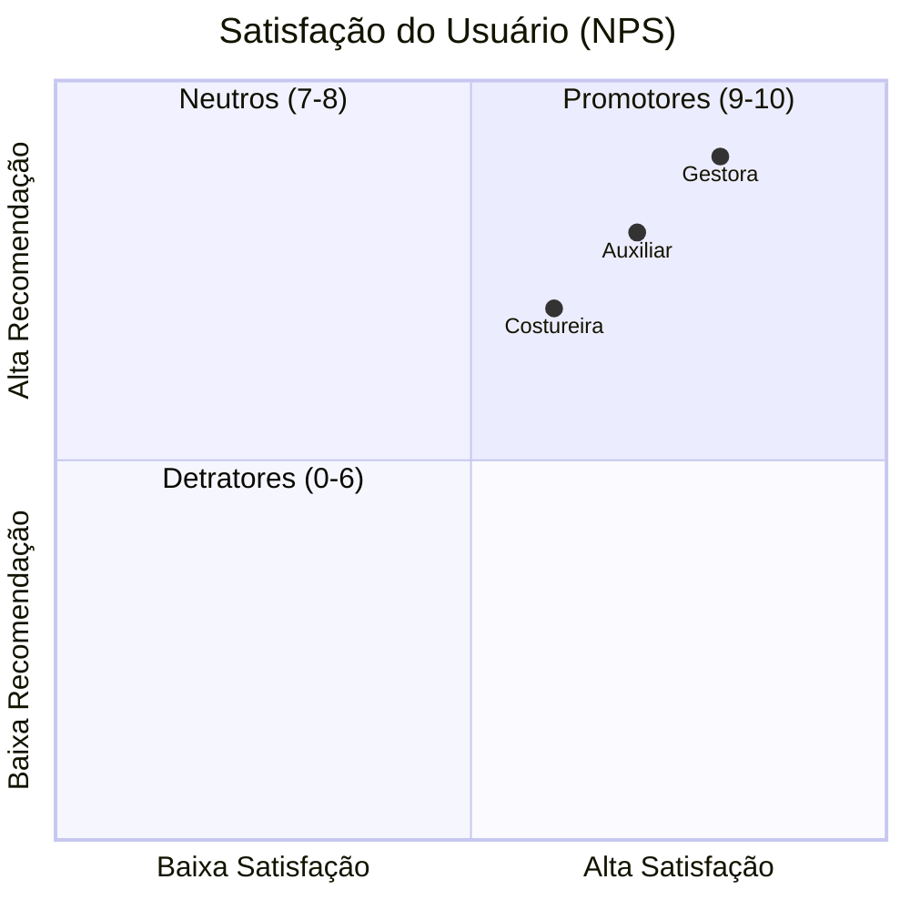
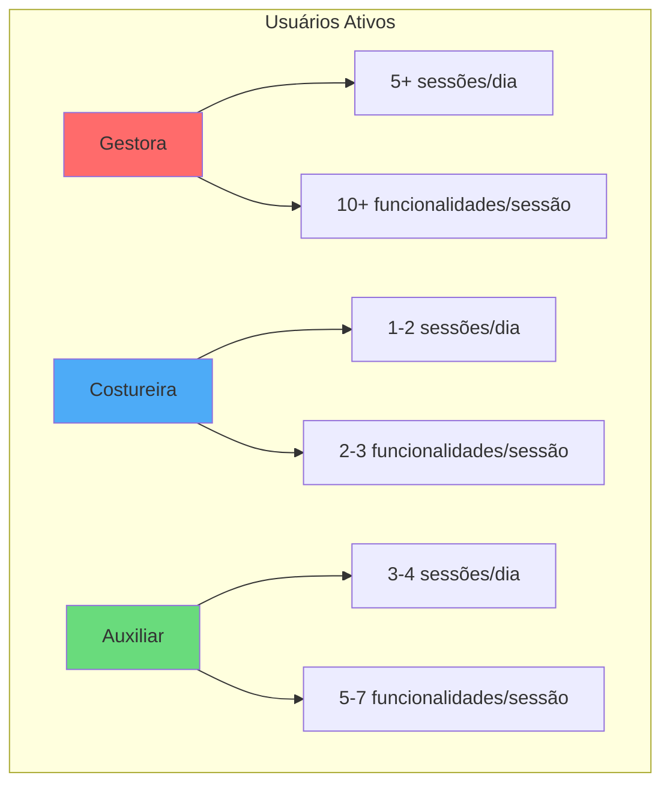
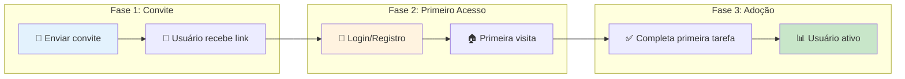
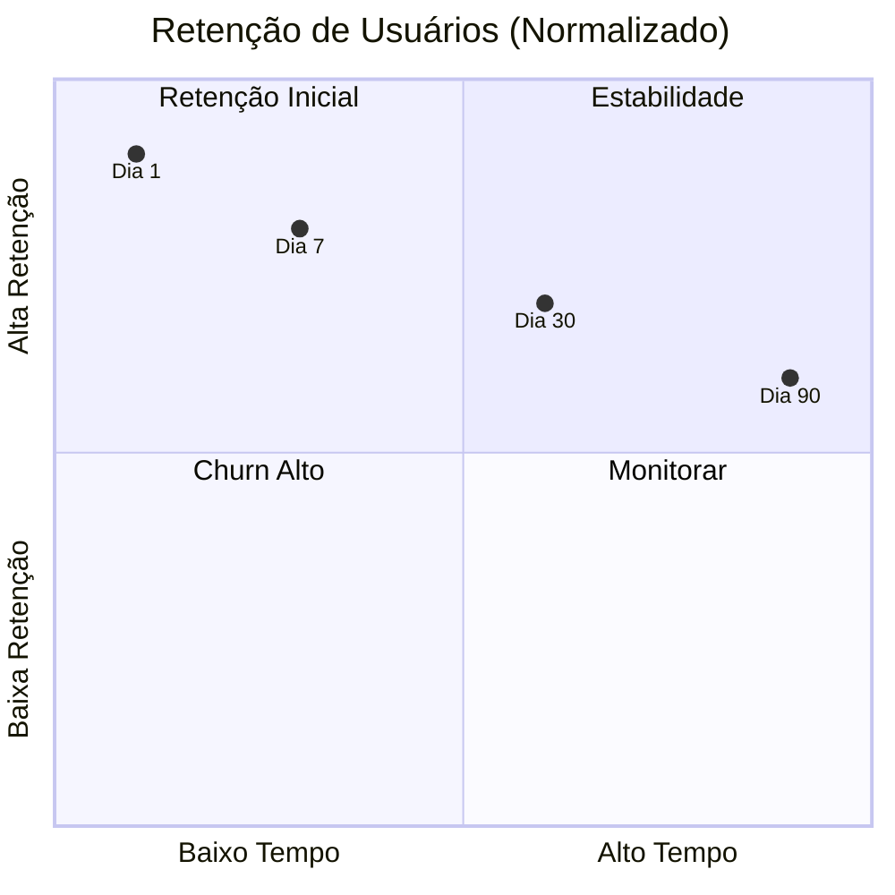
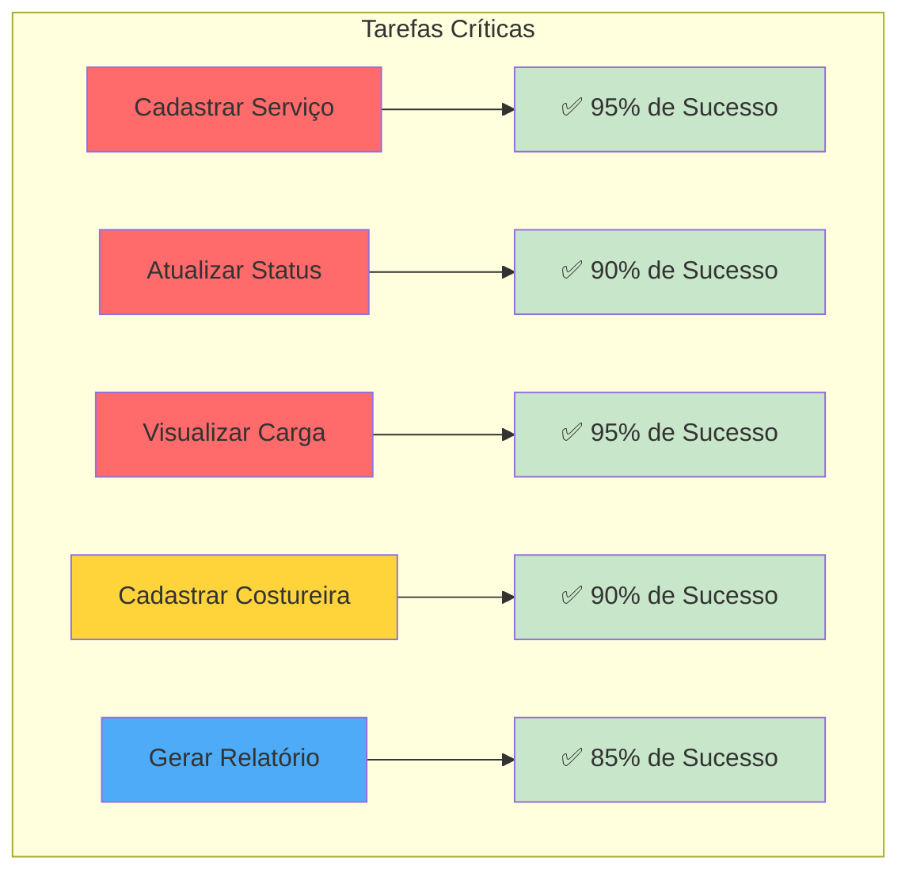
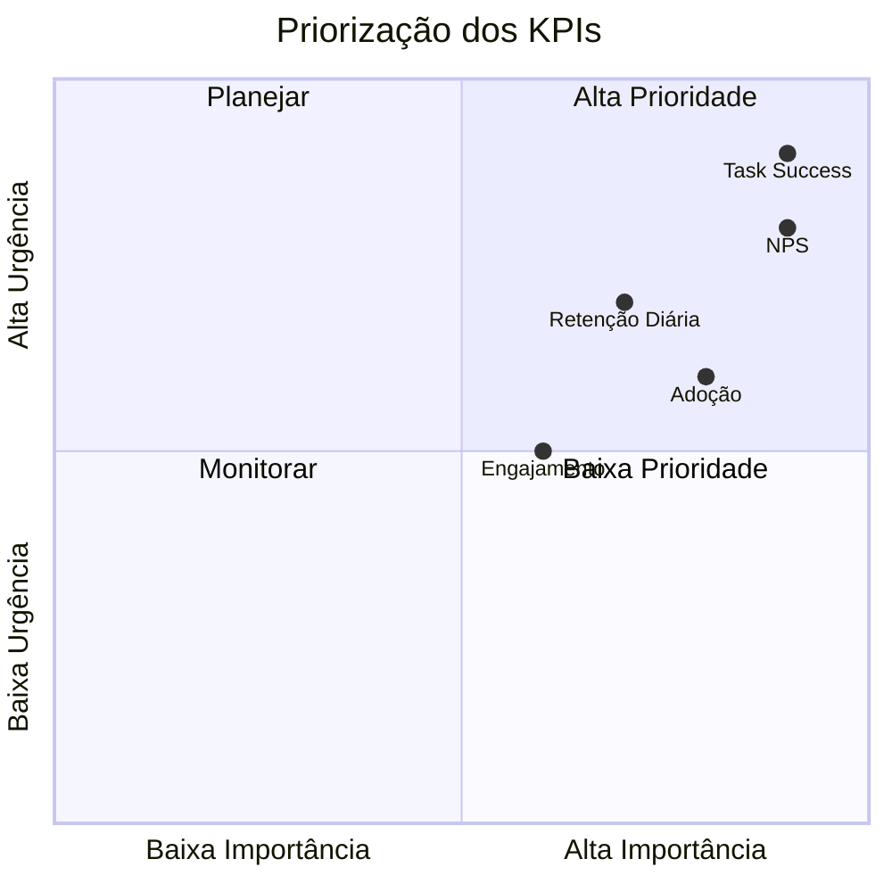
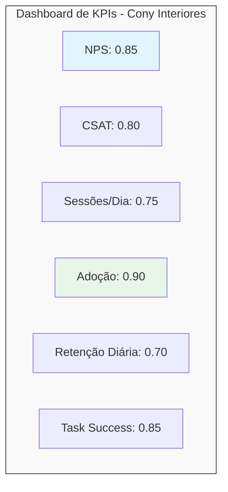

# KPIs de Usabilidade - Cony Interiores

**Épico:** EPIC-M1-UX-001 - Interface e Jornada do Usuário  
**Story:** STORY-M1-UX-001 - Layout Base e Design System  
**Data de Criação:** 30/06/2026  
**Versão:** 1.0  
**Responsável:** @anandamatos

---

## 🎯 Objetivo deste Artefato

Este documento define os KPIs de usabilidade do sistema da Cony Interiores, utilizando a metodologia **HEART** do Google. Os KPIs guiarão as decisões de design, a avaliação do sucesso do sistema e a melhoria contínua da experiência do usuário.

---

## 📊 Matriz CSD - KPIs de Usabilidade

### Certezas (C) - O que já sabemos
| # | Certeza | Fonte |
|---|---------|-------|
| C1 | A gestora precisa de visibilidade rápida da produção | Entrevista com gestora |
| C2 | As costureiras têm baixa proficiência tecnológica | Perfil das costureiras |
| C3 | O controle atual é manual e sujeito a erros | Observação do processo |
| C4 | A comunicação com as costureiras é feita por WhatsApp | Entrevista |
| C5 | A gestora precisa de dados confiáveis para decisões | Entrevista com gestora |

### Suposições (S) - O que acreditamos
| # | Suposição | Impacto se estiver errada |
|---|-----------|---------------------------|
| S1 | A gestora vai usar o sistema diariamente | Pode não ser adotado |
| S2 | As costureiras vão usar o sistema pelo celular | Pode não ser otimizado para mobile |
| S3 | A interface simples reduz erros | Pode ser simplificada demais |
| S4 | O sistema vai melhorar a eficiência da gestora | Pode não gerar ganhos reais |
| S5 | A gestora vai confiar nos dados do sistema | Pode continuar usando planilhas |

### Dúvidas (D) - O que precisamos validar
| # | Dúvida | Como validar |
|---|--------|--------------|
| D1 | Qual a frequência ideal de uso do sistema? | Analytics |
| D2 | As costureiras vão adotar o sistema voluntariamente? | Pesquisa de adoção |
| D3 | Qual o tempo máximo aceitável para cada tarefa? | Teste de usabilidade |
| D4 | A gestora vai confiar nos dados do sistema? | Entrevista pós-uso |
| D5 | As costureiras vão usar o sistema no celular? | Pesquisa com costureiras |

---

## 🎯 Metodologia HEART (Google)

### Dimensões HEART

| Dimensão | Definição | Por que é importante |
|----------|-----------|---------------------|
| **H** - Happiness (Satisfação) | Quão satisfeitos os usuários estão com o sistema | Alta satisfação → maior adoção e retenção |
| **E** - Engagement (Engajamento) | Com que frequência e intensidade os usuários usam o sistema | Alto engajamento → valor percebido |
| **A** - Adoption (Adoção) | Quantos novos usuários começam a usar o sistema | Alta adoção → sucesso do lançamento |
| **R** - Retention (Retenção) | Quantos usuários continuam usando o sistema ao longo do tempo | Alta retenção → valor sustentável |
| **T** - Task Success (Sucesso de Tarefa) | Quão bem os usuários conseguem completar suas tarefas | Alto sucesso → eficiência do sistema |

---

## 📊 KPI 1: Happiness (Satisfação) - NPS e CSAT

### NPS (Net Promoter Score)
| Atributo | Detalhe |
|----------|---------|
| **Objetivo** | Medir a satisfação geral e a disposição em recomendar o sistema |
| **Pergunta** | "Em uma escala de 0 a 10, qual a chance de você recomendar este sistema para outra empresa do ramo?" |
| **Metodologia** | Pesquisa pós-uso (após 30 dias de uso) |
| **Meta** | NPS ≥ 70 (Excelente) |
| **Cálculo** | % de Promotores (9-10) - % de Detratores (0-6) |

### CSAT (Customer Satisfaction Score)
| Atributo | Detalhe |
|----------|---------|
| **Objetivo** | Medir a satisfação com funcionalidades específicas |
| **Pergunta** | "Quão satisfeito você está com [funcionalidade]?" (escala 1-5) |
| **Metodologia** | Pesquisa após uso de cada funcionalidade principal |
| **Meta** | CSAT ≥ 4.0 (em escala de 1-5) |

### Mapa de Satisfação

---

## 📊 KPI 2: Engagement (Engajamento)

### Métricas de Engajamento
| Métrica | Definição | Meta | Método de Medição |
|---------|-----------|------|-------------------|
| **Sessões por Dia** | Número médio de acessos por dia | ≥ 2 sessões/dia | Analytics |
| **Tempo por Sessão** | Tempo médio de uso por sessão | 5-10 minutos | Analytics |
| **Funcionalidades Usadas** | Número médio de funcionalidades usadas por sessão | ≥ 3 funcionalidades | Analytics |
| **Tarefas Iniciadas vs. Concluídas** | Taxa de conclusão de tarefas | ≥ 80% | Analytics |

### Mapa de Engajamento

---

## 📊 KPI 3: Adoption (Adoção)

### Métricas de Adoção
| Métrica | Definição | Meta | Método de Medição |
|---------|-----------|------|-------------------|
| **Novos Usuários** | Número de usuários que se cadastraram pela primeira vez | 100% das costureiras e gestora | Analytics |
| **Taxa de Adoção** | % de usuários que usaram o sistema pela primeira vez | ≥ 80% | Analytics |
| **Tempo até o Primeiro Uso** | Tempo médio entre convite e primeiro uso | ≤ 3 dias | Analytics |

### Mapa de Adoção

---

## 📊 KPI 4: Retention (Retenção)

### Métricas de Retenção
| Métrica | Definição | Meta | Método de Medição |
|---------|-----------|------|-------------------|
| **Retenção Diária** | % de usuários que retornam no dia seguinte | ≥ 60% | Analytics |
| **Retenção Semanal** | % de usuários que retornam na semana seguinte | ≥ 75% | Analytics |
| **Retenção Mensal** | % de usuários que retornam no mês seguinte | ≥ 85% | Analytics |
| **Churn Rate** | % de usuários que param de usar o sistema | ≤ 5% | Analytics |

### Mapa de Retenção

---

## 📊 KPI 5: Task Success (Sucesso de Tarefa)

### Tarefas-Chave e Métricas
| Tarefa | Taxa de Sucesso | Tempo Médio | Meta de Tempo | Método de Medição |
|--------|-----------------|-------------|---------------|-------------------|
| **Cadastrar um Serviço** | ≥ 95% | 3 min | ≤ 5 min | Teste de usabilidade + Analytics |
| **Atualizar Status do Serviço** | ≥ 90% | 1 min | ≤ 2 min | Teste de usabilidade + Analytics |
| **Visualizar Carga da Costureira** | ≥ 95% | 30s | ≤ 1 min | Teste de usabilidade |
| **Cadastrar uma Costureira** | ≥ 90% | 2 min | ≤ 3 min | Teste de usabilidade |
| **Gerar Relatório de Produção** | ≥ 85% | 2 min | ≤ 3 min | Teste de usabilidade |

### Mapa de Task Success

---

## 📊 Matriz de Priorização dos KPIs

---

## 📊 Matriz de Rastreabilidade (KPI ↔ Story)

| KPI | Story Relacionada | Métrica Principal |
|-----|-------------------|-------------------|
| **NPS (Happiness)** | STORY-M1-UX-001 | Satisfação geral |
| **CSAT (Happiness)** | STORY-M1-UX-001 | Satisfação por funcionalidade |
| **Sessões por Dia (Engagement)** | STORY-M1-UX-001 | Frequência de uso |
| **Adoção (Adoption)** | STORY-M1-UX-002 | Novos usuários |
| **Retenção (Retention)** | STORY-M1-UX-001 | Usuários ativos |
| **Task Success (Task)** | STORY-M1-CORE-001, STORY-M1-CORE-002 | Taxa de sucesso |

---

## 📊 Dashboard de KPIs (Visão Geral)

### Legenda das Cores

| Cor | Significado |
|-----|-------------|
| 🟢 | Meta atingida ou acima |
| 🟡 | Próximo da meta |
| 🔴 | Abaixo da meta |

---

## 📋 Plano de Coleta de Dados

| KPI | Fonte de Dados | Frequência de Coleta | Ferramenta |
|-----|----------------|----------------------|------------|
| **NPS** | Pesquisa pós-uso | Mensal | Google Forms / SurveyMonkey |
| **CSAT** | Pesquisa por funcionalidade | Contínuo | Google Forms / SurveyMonkey |
| **Sessões/Dia** | Analytics | Diário | Google Analytics / Hotjar |
| **Tempo/Sessão** | Analytics | Diário | Google Analytics / Hotjar |
| **Adoção** | Analytics | Semanal | Google Analytics |
| **Retenção** | Analytics | Diário | Google Analytics |
| **Task Success** | Teste de usabilidade | Mensal | Teste manual + Analytics |

---

## 📋 Plano de Testes de Usabilidade

### Teste 1: Teste de Usabilidade Moderado
| Atributo | Detalhe |
|----------|---------|
| **Objetivo** | Validar a eficiência e satisfação do usuário |
| **Metodologia** | Teste moderado com 5 usuários |
| **Tarefas** | Cadastrar serviço, atualizar status, visualizar carga, cadastrar costureira, gerar relatório |
| **Métricas** | Taxa de sucesso, tempo de tarefa, satisfação |
| **Ferramenta** | Figma + Maze ou usuários reais |

### Teste 2: Entrevistas Pós-Uso
| Atributo | Detalhe |
|----------|---------|
| **Objetivo** | Coletar feedback qualitativo sobre o sistema |
| **Metodologia** | Entrevista semi-estruturada |
| **Participantes** | Gestora, costureira, auxiliar (uma de cada) |
| **Perguntas** | "O que você achou mais fácil?", "O que foi difícil?", "O que você mudaria?" |
| **Ferramenta** | Discord / Google Meet |

### Teste 3: Teste A/B (MVP 2)
| Atributo | Detalhe |
|----------|---------|
| **Objetivo** | Validar duas versões de uma tela |
| **Metodologia** | Teste com 2 grupos de usuários |
| **Variantes** | Versão A (cards) vs Versão B (tabela) |
| **Métrica** | Taxa de conclusão, tempo de tarefa |

---

## ✅ Próximos Passos

| Ordem | Atividade | Responsável | Data |
|-------|-----------|-------------|------|
| 1 | Validar KPIs com o cliente | @anandamatos | 30/06 |
| 2 | Refinar com base no feedback | @anandamatos | 01/07 |
| 3 | Definir baseline de performance atual | @anandamatos | 02/07 |
| 4 | Preparar plano de testes de usabilidade | @anandamatos | 03/07 |

---

## 📎 Anexos

- **Questionário NPS:** [link para questionário]
- **Questionário CSAT:** [link para questionário]
- **Plano de testes detalhado:** [link para plano]

---

**Status:** Aguardando validação com o cliente  
**Próxima Reunião:** 30/06/2026 - 14h

---

## 🎯 Resumo Executivo

| KPI | Meta | Status Atual | Próximo Passo |
|-----|------|--------------|---------------|
| **NPS** | ≥ 70 | A definir | Validar com cliente |
| **CSAT** | ≥ 4.0 | A definir | Validar com cliente |
| **Sessões/Dia** | ≥ 2 | A definir | Validar com cliente |
| **Adoção** | ≥ 80% | A definir | Validar com cliente |
| **Retenção Diária** | ≥ 60% | A definir | Validar com cliente |
| **Task Success** | ≥ 85% | A definir | Validar com cliente |