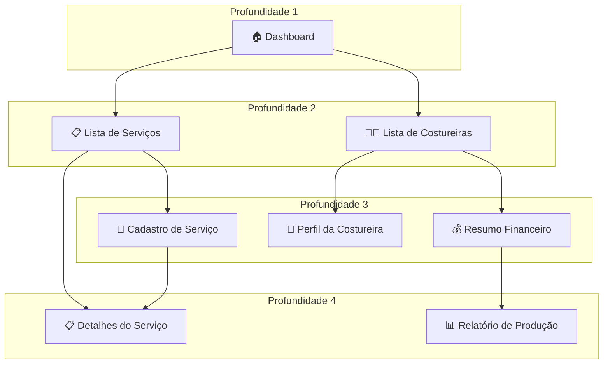
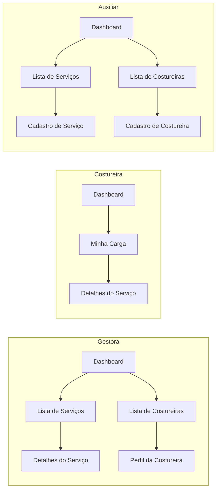
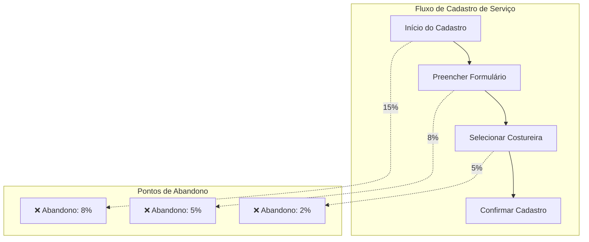
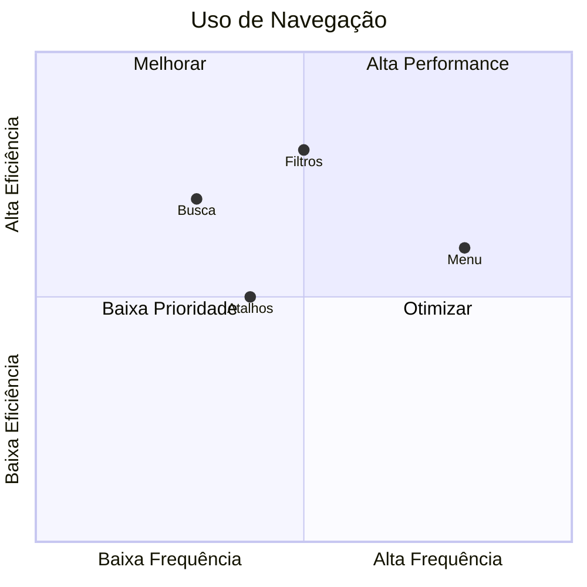
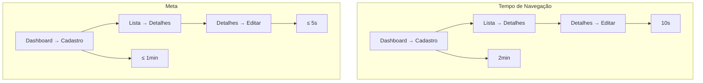
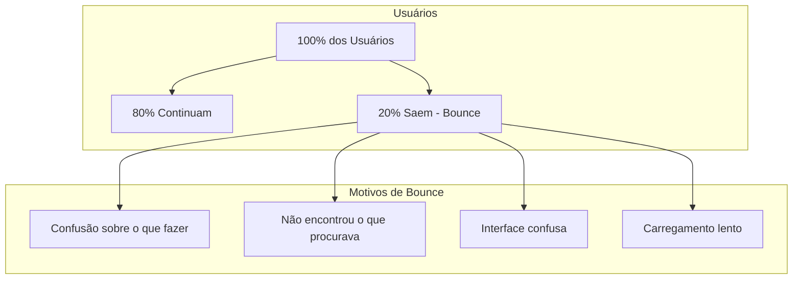
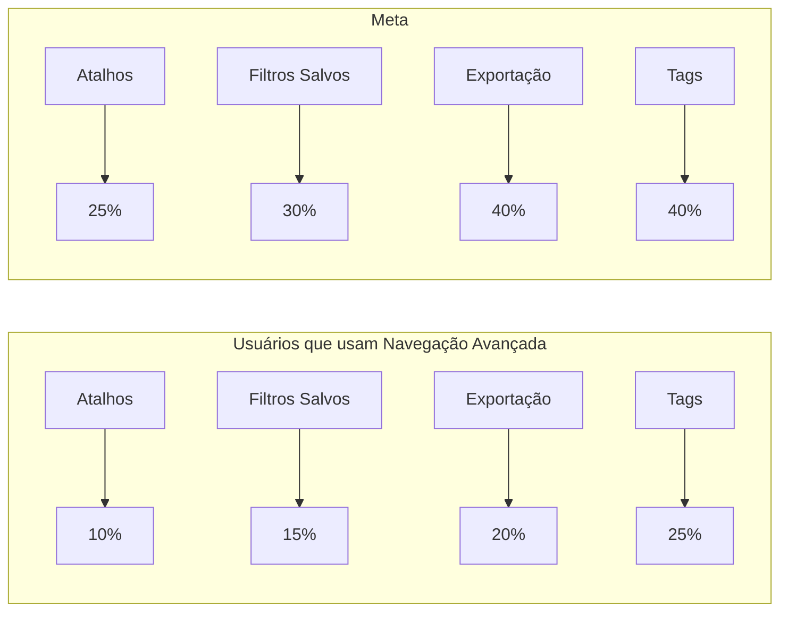
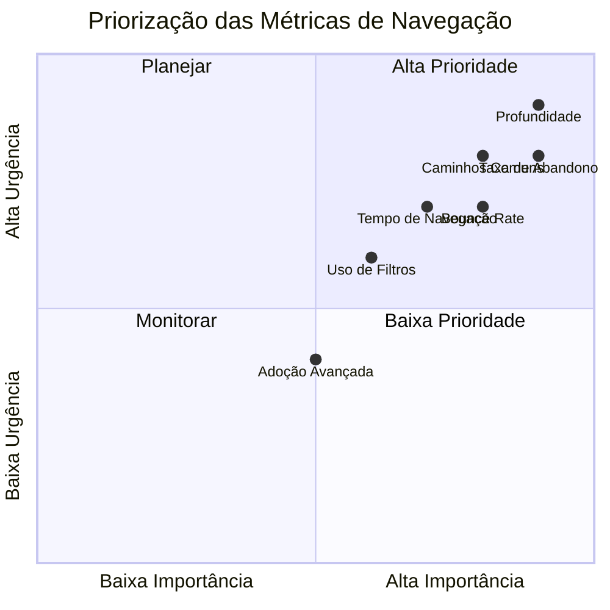
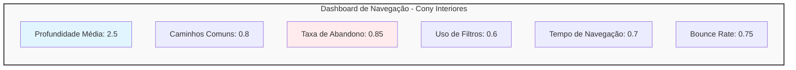

# Métricas de Navegação - Cony Interiores

**Épico:** EPIC-M1-UX-001 - Interface e Jornada do Usuário  
**Story:** STORY-M1-UX-001 - Layout Base e Design System  
**Data de Criação:** 30/06/2026  
**Versão:** 1.0  
**Responsável:** @anandamatos

---

## 🎯 Objetivo deste Artefato

Este documento define as métricas de navegação do sistema da Cony Interiores, utilizando a metodologia **HEART** do Google com foco em como os usuários se movem pelo sistema. As métricas guiarão decisões de arquitetura de informação, design de navegação e otimização da experiência do usuário.

---

## 📊 Matriz CSD - Métricas de Navegação

### Certezas (C) - O que já sabemos
| # | Certeza | Fonte |
|---|---------|-------|
| C1 | A gestora precisa acessar informações rapidamente | Entrevista com gestora |
| C2 | As costureiras têm baixa proficiência tecnológica | Perfil das costureiras |
| C3 | A navegação deve ser simples e intuitiva | Perfil das usuárias |
| C4 | O sistema será usado em diferentes dispositivos | Pesquisa inicial |
| C5 | A gestora quer visualizar dados consolidados | Entrevista com gestora |

### Suposições (S) - O que acreditamos
| # | Suposição | Impacto se estiver errada |
|---|-----------|---------------------------|
| S1 | A navegação principal será por menu lateral | Pode não ser intuitiva para todos |
| S2 | As costureiras usarão o sistema no celular | Pode não ser otimizado para mobile |
| S3 | A gestora usará o sistema no computador | Pode não ser otimizado para desktop |
| S4 | Os usuários querem atalhos para ações frequentes | Pode ser ignorado |
| S5 | A navegação deve ter no máximo 3 níveis de profundidade | Pode ser muito raso ou profundo |

### Dúvidas (D) - O que precisamos validar
| # | Dúvida | Como validar |
|---|--------|--------------|
| D1 | Qual o fluxo de navegação mais comum? | Analytics |
| D2 | As costureiras preferem navegação por cards ou lista? | Teste de usabilidade |
| D3 | Qual a profundidade ideal de navegação? | Analytics + Teste de usabilidade |
| D4 | Os usuários usam busca ou navegação por menus? | Analytics |
| D5 | Qual o tempo máximo aceitável entre telas? | Teste de usabilidade |

---

## 🎯 Metodologia HEART - Navegação

### Dimensões HEART para Navegação

| Dimensão | Aplicação na Navegação | Por que é importante |
|----------|------------------------|---------------------|
| **H** - Happiness | Satisfação com a facilidade de encontrar informações | Navegação frustrante → abandono |
| **E** - Engagement | Frequência de uso da navegação (menus, busca) | Navegação engajadora → mais uso |
| **A** - Adoption | % de usuários que usam navegação avançada (filtros, busca) | Maior adoção → usuários mais eficientes |
| **R** - Retention | Retorno de usuários que encontraram o que procuravam | Navegação eficiente → retenção |
| **T** - Task Success | Taxa de sucesso em encontrar informações | Navegação clara → tarefas concluídas |

---

## 📊 Métrica 1: Profundidade de Navegação

### Definição
Número médio de telas visitadas entre a página inicial e a conclusão de uma tarefa.

### Objetivo
Garantir que os usuários encontrem as informações com o mínimo de cliques possível.

### Metas
| Perfil | Profundidade Ideal | Profundidade Máxima |
|--------|-------------------|-------------------|
| **Gestora** | 2-3 telas | ≤ 4 telas |
| **Costureira** | 1-2 telas | ≤ 3 telas |
| **Auxiliar** | 2-3 telas | ≤ 4 telas |

### Mapa de Profundidade

---

## 📊 Métrica 2: Caminhos Mais Comuns

### Definição
Sequência mais frequente de telas visitadas durante uma sessão.

### Objetivo
Identificar os fluxos mais utilizados para otimizá-los e criar atalhos.

### Caminhos Esperados

| Perfil | Caminho Mais Comum | Frequência Esperada |
|--------|-------------------|---------------------|
| **Gestora** | Dashboard → Lista de Serviços → Detalhes do Serviço | 60% |
| **Costureira** | Dashboard → Minha Carga → Detalhes do Serviço | 80% |
| **Auxiliar** | Dashboard → Lista de Serviços → Cadastro de Serviço | 50% |

### Mapa de Caminhos

---

## 📊 Métrica 3: Taxa de Abandono de Navegação

### Definição
% de usuários que iniciam um fluxo de navegação mas não o concluem.

### Objetivo
Identificar pontos de atrito onde os usuários desistem.

### Metas
| Fluxo | Taxa de Abandono Ideal | Taxa de Abandono Máxima |
|-------|----------------------|------------------------|
| **Cadastro de Serviço** | ≤ 10% | ≤ 20% |
| **Visualização de Carga** | ≤ 5% | ≤ 10% |
| **Cadastro de Costureira** | ≤ 10% | ≤ 20% |
| **Gerar Relatório** | ≤ 15% | ≤ 25% |

### Mapa de Abandono

---

## 📊 Métrica 4: Uso de Filtros e Busca

### Definição
% de usuários que utilizam filtros ou busca para encontrar informações.

### Objetivo
Entender se a navegação por menu é suficiente ou se os usuários precisam de ferramentas adicionais.

### Metas
| Funcionalidade | % de Uso Esperado | % de Uso Ideal |
|----------------|-------------------|----------------|
| **Filtros** | 40% | 60% |
| **Busca** | 20% | 30% |
| **Navegação por Menu** | 80% | 90% |
| **Atalhos** | 30% | 50% |

### Mapa de Uso

---

## 📊 Métrica 5: Tempo de Navegação por Tarefa

### Definição
Tempo médio gasto em cada etapa do fluxo de navegação.

### Objetivo
Identificar etapas que consomem mais tempo do que o esperado.

### Metas
| Tarefa | Tempo Esperado | Tempo Ideal | Ação se Exceder |
|--------|----------------|-------------|-----------------|
| **Dashboard → Lista de Serviços** | 5s | ≤ 3s | Otimizar carregamento |
| **Lista de Serviços → Detalhes** | 5s | ≤ 3s | Melhorar links |
| **Cadastro de Serviço** | 3min | ≤ 2min | Simplificar formulário |
| **Visualização de Carga** | 30s | ≤ 20s | Otimizar layout |

### Mapa de Tempo

---

## 📊 Métrica 6: Retorno à Navegação (Bounce Rate)

### Definição
% de usuários que saem do sistema após visualizar apenas a primeira tela.

### Objetivo
Entender se a página inicial é atraente e direciona os usuários para as próximas etapas.

### Meta
- **Bounce Rate Ideal:** ≤ 20%
- **Bounce Rate Máximo:** ≤ 35%

### Mapa de Bounce Rate

---

## 📊 Métrica 7: Adoção de Navegação Avançada

### Definição
% de usuários que utilizam recursos avançados de navegação.

### Objetivo
Entender se os usuários estão explorando todo o potencial do sistema.

### Metas
| Recurso Avançado | % de Adoção Esperada | % de Adoção Ideal |
|------------------|---------------------|-------------------|
| **Atalhos do Teclado** | 10% | 25% |
| **Filtros Salvos** | 15% | 30% |
| **Exportação de Dados** | 20% | 40% |
| **Navegação por Tags** | 25% | 40% |

### Mapa de Adoção

---

## 📊 Matriz de Priorização das Métricas

---

## 📊 Matriz de Rastreabilidade (Métrica ↔ Story)

| Métrica | Story Relacionada | Como a Story Impacta a Métrica |
|---------|-------------------|-------------------------------|
| **Profundidade de Navegação** | STORY-M1-UX-001 | Layout e estrutura de navegação |
| **Caminhos Comuns** | STORY-M1-UX-002 | Formulários e integração |
| **Taxa de Abandono** | STORY-M1-UX-002 | Simplificação de formulários |
| **Uso de Filtros** | STORY-M1-UX-003 | Visualização de dados |
| **Tempo de Navegação** | STORY-M1-UX-001 | Performance e usabilidade |
| **Bounce Rate** | STORY-M1-UX-001 | Primeira impressão |
| **Adoção Avançada** | STORY-M1-UX-003 | Ferramentas avançadas |

---

## 📊 Dashboard de Métricas de Navegação

---

## 📋 Plano de Coleta de Dados

| Métrica | Fonte de Dados | Frequência | Ferramenta |
|---------|----------------|------------|------------|
| **Profundidade de Navegação** | Analytics | Diário | Google Analytics / Hotjar |
| **Caminhos Comuns** | Analytics | Diário | Google Analytics / Hotjar |
| **Taxa de Abandono** | Analytics + Testes | Semanal | Google Analytics / Hotjar |
| **Uso de Filtros** | Analytics | Diário | Google Analytics / Hotjar |
| **Tempo de Navegação** | Analytics + Testes | Diário | Google Analytics / Hotjar |
| **Bounce Rate** | Analytics | Diário | Google Analytics / Hotjar |
| **Adoção Avançada** | Analytics | Semanal | Google Analytics / Hotjar |

---

## ✅ Próximos Passos

| Ordem | Atividade | Responsável | Data |
|-------|-----------|-------------|------|
| 1 | Validar métricas com o cliente | @anandamatos | 30/06 |
| 2 | Refinar com base no feedback | @anandamatos | 01/07 |
| 3 | Definir baseline de navegação atual | @anandamatos | 02/07 |
| 4 | Planejar otimizações de navegação | @anandamatos | 03/07 |

---

## 📎 Anexos

- **Mapa de navegação completo:** [link]
- **Benchmark de navegação:** [link]
- **Testes de usabilidade realizados:** [link]

---

**Status:** Aguardando validação com o cliente  
**Próxima Reunião:** 30/06/2026 - 14h

---

## 🎯 Resumo Executivo

| Métrica | Meta | Status | Próximo Passo |
|---------|------|--------|---------------|
| **Profundidade de Navegação** | 2-3 telas | A definir | Validar com cliente |
| **Caminhos Mais Comuns** | 60% nos fluxos principais | A definir | Validar com cliente |
| **Taxa de Abandono** | ≤ 10% | A definir | Validar com cliente |
| **Uso de Filtros** | 40-60% | A definir | Validar com cliente |
| **Tempo de Navegação** | ≤ 3s por etapa | A definir | Validar com cliente |
| **Bounce Rate** | ≤ 20% | A definir | Validar com cliente |
