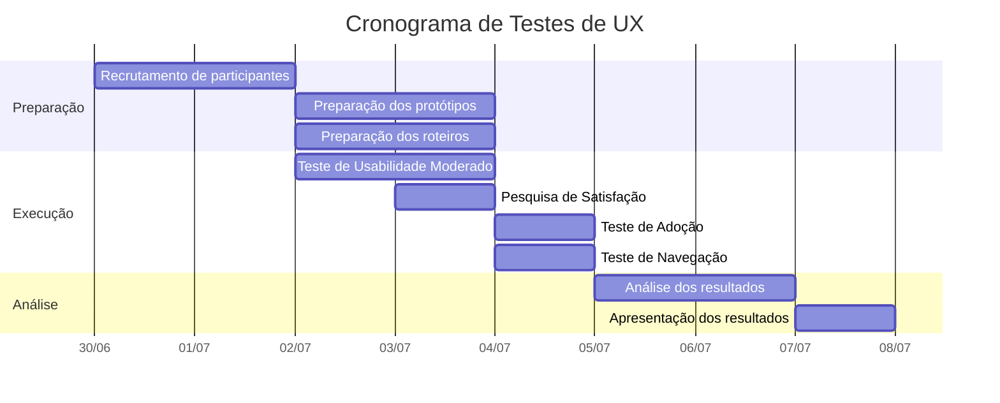
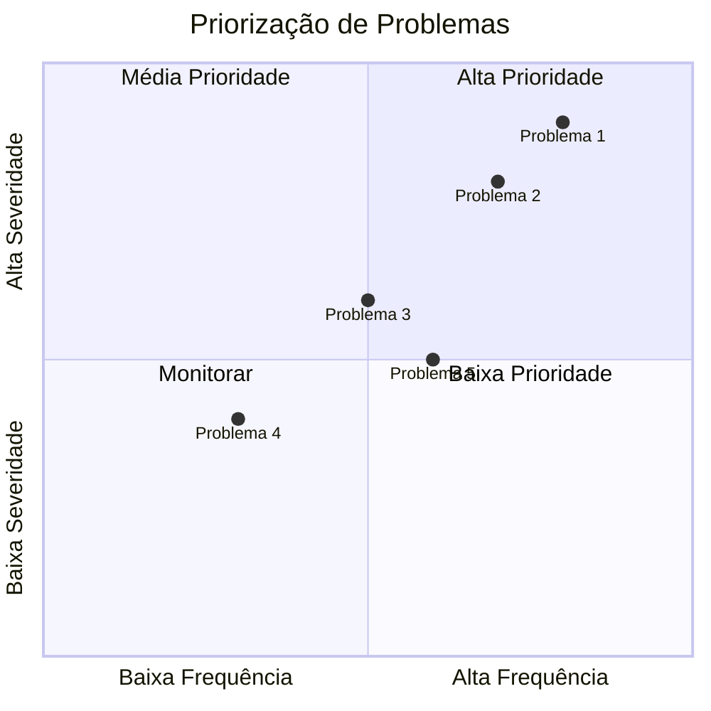

# Plano de Testes de UX - Cony Interiores

**Épico:** EPIC-M1-UX-001 - Interface e Jornada do Usuário  
**Story:** STORY-M1-UX-001 - Layout Base e Design System  
**Data de Criação:** 30/06/2026  
**Versão:** 1.0  
**Responsável:** @anandamatos

---

## 🎯 Objetivo deste Artefato

Este documento define o plano de testes de UX para o sistema da Cony Interiores, utilizando a metodologia **HEART** do Google como estrutura para validar a experiência do usuário. Os testes garantirão que o sistema atenda às necessidades das usuárias antes do lançamento.

---

## 📊 Matriz CSD - Plano de Testes de UX

### Certezas (C) - O que já sabemos
| # | Certeza | Fonte |
|---|---------|-------|
| C1 | As usuárias têm perfis e necessidades diferentes | Personas |
| C2 | O sistema precisa ser simples e intuitivo | Perfil das usuárias |
| C3 | A gestora precisa de dados confiáveis | Entrevista |
| C4 | As costureiras têm baixa proficiência tecnológica | Perfil das costureiras |
| C5 | O sistema será usado em diferentes dispositivos | Pesquisa inicial |

### Suposições (S) - O que acreditamos
| # | Suposição | Impacto se estiver errada |
|---|-----------|---------------------------|
| S1 | Testes com 5 usuários são suficientes | Pode não capturar todos os problemas |
| S2 | Os protótipos são representativos do sistema final | Pode haver diferenças significativas |
| S3 | As usuárias vão dar feedback honesto | Pode haver viés de cortesia |
| S4 | Os testes remotos são tão eficazes quanto presenciais | Pode perder nuances |
| S5 | As métricas escolhidas são as mais relevantes | Pode não capturar problemas importantes |

### Dúvidas (D) - O que precisamos validar
| # | Dúvida | Como validar |
|---|--------|--------------|
| D1 | Qual o melhor formato de teste para cada persona? | Teste piloto |
| D2 | As costureiras vão participar dos testes? | Agendamento |
| D3 | Qual o tempo ideal para cada sessão de teste? | Teste piloto |
| D4 | As métricas escolhidas são as mais relevantes? | Análise pós-teste |
| D5 | Os protótipos são suficientemente realistas? | Feedback dos usuários |

---

## 🎯 Metodologia HEART para Testes de UX

### Dimensões HEART e Testes Correspondentes

| Dimensão | Teste | Objetivo |
|----------|-------|----------|
| **H** - Happiness | Pesquisa de Satisfação + NPS | Medir satisfação e disposição para recomendar |
| **E** - Engagement | Teste de Usabilidade Moderado | Medir tempo e frequência de uso |
| **A** - Adoption | Teste de Adoção | Medir facilidade para começar a usar |
| **R** - Retention | Teste de Retenção | Medir probabilidade de retorno |
| **T** - Task Success | Teste de Tarefas | Medir taxa de sucesso e tempo |

---

## 🧪 Teste 1: Teste de Usabilidade Moderado (Task Success + Engagement)

### Objetivo
Validar a eficiência e eficácia do sistema para realizar tarefas-chave.

### Metodologia
- **Tipo:** Teste moderado (com observador)
- **Formato:** Remoto (via Discord) ou Presencial
- **Duração:** 45-60 minutos por sessão
- **Perfil de Usuários:** 5 participantes (2 gestoras, 2 costureiras, 1 auxiliar)

### Tarefas a Serem Testadas
| # | Tarefa | Persona | Critério de Sucesso |
|---|--------|---------|---------------------|
| 1 | Cadastrar um novo serviço | Gestora/Auxiliar | Concluir em ≤ 5 minutos |
| 2 | Atualizar o status de um serviço | Costureira | Concluir em ≤ 2 minutos |
| 3 | Visualizar a carga de trabalho de uma costureira | Gestora | Concluir em ≤ 1 minuto |
| 4 | Cadastrar uma nova costureira | Auxiliar | Concluir em ≤ 3 minutos |
| 5 | Gerar um relatório de produção | Gestora | Concluir em ≤ 3 minutos |
| 6 | Visualizar valores a receber | Costureira | Concluir em ≤ 2 minutos |

### Métricas
| Métrica | Definição | Meta |
|---------|-----------|------|
| **Taxa de Sucesso** | % de tarefas concluídas com sucesso | ≥ 90% |
| **Tempo de Tarefa** | Tempo médio para concluir cada tarefa | ≤ meta definida |
| **Cliques até Conclusão** | Número médio de cliques por tarefa | ≤ 10 cliques |
| **Erros** | Número de erros por tarefa | ≤ 2 erros/tarefa |

---

## 📋 Roteiro do Teste de Usabilidade

### Pré-Teste
```
1. Boas-vindas e apresentação
2. Explicação do objetivo do teste
3. Consentimento para gravação (opcional)
4. Coleta de dados demográficos (5 min)
5. Explicação das tarefas (5 min)
```

### Teste
```
6. Tarefa 1: Cadastrar um novo serviço (10 min)
   - "Imagine que você acabou de receber um pedido de uma cliente. Cadastre esse serviço no sistema."
   - Métricas: Tempo, cliques, erros, sucesso

7. Tarefa 2: Atualizar o status de um serviço (5 min)
   - "Um serviço que estava em produção foi finalizado. Atualize o status no sistema."
   - Métricas: Tempo, cliques, erros, sucesso

8. Tarefa 3: Visualizar a carga de trabalho (5 min)
   - "Você precisa saber qual costureira está com menor carga para alocar um novo serviço. Encontre essa informação."
   - Métricas: Tempo, cliques, erros, sucesso

9. Tarefa 4: Cadastrar uma nova costureira (10 min)
   - "Uma nova costureira está sendo contratada. Cadastre-a no sistema."
   - Métricas: Tempo, cliques, erros, sucesso

10. Tarefa 5: Gerar um relatório de produção (10 min)
    - "Você precisa de um relatório da produção do mês para apresentar à diretoria. Gere esse relatório."
    - Métricas: Tempo, cliques, erros, sucesso

11. Tarefa 6: Visualizar valores a receber (5 min)
    - "Como costureira, você quer saber quanto vai receber este mês. Encontre essa informação."
    - Métricas: Tempo, cliques, erros, sucesso
```

### Pós-Teste
```
12. Entrevista pós-teste (10 min)
    - "O que foi mais fácil?"
    - "O que foi mais difícil?"
    - "O que você mudaria?"
    - "Como você se sentiu durante o teste?"
13. Aplicação do questionário SUS (5 min)
14. Agradecimento e encerramento
```

---

## 🧪 Teste 2: Pesquisa de Satisfação (Happiness)

### Objetivo
Medir a satisfação geral do usuário com o sistema.

### Metodologia
- **Tipo:** Pesquisa estruturada
- **Formato:** Online (Google Forms)
- **Duração:** 10 minutos
- **Perfil de Usuários:** Todos os participantes

### Questionário SUS (System Usability Scale)
| # | Pergunta | 1-5 |
|---|----------|-----|
| 1 | Eu acho que gostaria de usar este sistema frequentemente | ☐ |
| 2 | Eu achei o sistema desnecessariamente complexo | ☐ |
| 3 | Eu achei o sistema fácil de usar | ☐ |
| 4 | Eu acho que precisaria de ajuda de uma pessoa técnica para usar o sistema | ☐ |
| 5 | Eu achei que as várias funções do sistema estavam bem integradas | ☐ |
| 6 | Eu achei que o sistema tinha muitas inconsistências | ☐ |
| 7 | Eu imagino que a maioria das pessoas aprenderia a usar este sistema rapidamente | ☐ |
| 8 | Eu achei o sistema muito complicado de usar | ☐ |
| 9 | Eu me senti muito confiante ao usar o sistema | ☐ |
| 10 | Eu precisei aprender muitas coisas antes de conseguir usar o sistema | ☐ |

### CSAT (Customer Satisfaction Score) por Funcionalidade
| Funcionalidade | Muito Insatisfeito | Insatisfeito | Neutro | Satisfeito | Muito Satisfeito |
|----------------|-------------------|--------------|--------|------------|------------------|
| Cadastro de Serviço | ☐ | ☐ | ☐ | ☐ | ☐ |
| Atualização de Status | ☐ | ☐ | ☐ | ☐ | ☐ |
| Visualização de Carga | ☐ | ☐ | ☐ | ☐ | ☐ |
| Cadastro de Costureira | ☐ | ☐ | ☐ | ☐ | ☐ |
| Relatórios | ☐ | ☐ | ☐ | ☐ | ☐ |
| Visualização Financeira | ☐ | ☐ | ☐ | ☐ | ☐ |
| Navegação Geral | ☐ | ☐ | ☐ | ☐ | ☐ |

---

## 🧪 Teste 3: Teste de Adoção (Adoption + Retention)

### Objetivo
Medir a facilidade de adoção do sistema por novos usuários.

### Metodologia
- **Tipo:** Teste de primeira experiência
- **Formato:** Remoto ou Presencial
- **Duração:** 30 minutos
- **Perfil de Usuários:** Usuários que nunca viram o sistema antes

### Tarefas
| # | Tarefa | Objetivo |
|---|--------|----------|
| 1 | Acessar o sistema pela primeira vez | Medir facilidade de acesso |
| 2 | Explorar a página inicial | Medir compreensão inicial |
| 3 | Realizar a primeira ação | Medir prontidão para usar |

### Métricas de Adoção
| Métrica | Definição | Meta |
|---------|-----------|------|
| **Taxa de Sucesso no Primeiro Acesso** | % de usuários que conseguem acessar o sistema | ≥ 95% |
| **Tempo até a Primeira Ação** | Tempo médio até realizar a primeira ação | ≤ 3 minutos |
| **Intenção de Uso** | % de usuários que voltariam a usar o sistema | ≥ 80% |

---

## 🧪 Teste 4: Teste de Navegação (Engagement)

### Objetivo
Validar a arquitetura de informação e navegação do sistema.

### Metodologia
- **Tipo:** Teste de navegação
- **Formato:** Remoto ou Presencial
- **Duração:** 20 minutos
- **Perfil de Usuários:** Todos os participantes

### Tarefas de Navegação
| # | Tarefa | Objetivo |
|---|--------|----------|
| 1 | Encontrar a lista de serviços | Medir facilidade de acesso |
| 2 | Encontrar a lista de costureiras | Medir facilidade de acesso |
| 3 | Voltar para a página inicial | Medir orientação |
| 4 | Encontrar um serviço específico | Medir busca/navegação |

### Métricas de Navegação
| Métrica | Definição | Meta |
|---------|-----------|------|
| **Profundidade de Navegação** | Número médio de cliques para encontrar a informação | ≤ 3 cliques |
| **Taxa de Sucesso** | % de tarefas concluídas com sucesso | ≥ 90% |
| **Tempo de Navegação** | Tempo médio por tarefa | ≤ 1 minuto |

---

## 📋 Sumário dos Testes

| Teste | Dimensão HEART | Duração | Participantes | Ferramenta |
|-------|----------------|---------|---------------|------------|
| **Teste de Usabilidade Moderado** | Task Success + Engagement | 60 min | 5 | Discord / Presencial |
| **Pesquisa de Satisfação** | Happiness | 10 min | 5+ | Google Forms |
| **Teste de Adoção** | Adoption + Retention | 30 min | 3 | Discord / Presencial |
| **Teste de Navegação** | Engagement | 20 min | 5 | Discord / Presencial |

---

## 📅 Cronograma de Testes



---

## 📊 Análise de Resultados

### Como Analisar
1. **Dados Quantitativos:** Calcular médias, taxas de sucesso e tempos
2. **Dados Qualitativos:** Identificar padrões nos feedbacks e observações
3. **Priorização:** Classificar problemas por severidade e frequência

### Matriz de Priorização de Problemas



---

## ✅ Próximos Passos

| Ordem | Atividade | Responsável | Data |
|-------|-----------|-------------|------|
| 1 | Validar plano de testes com o cliente | @anandamatos | 30/06 |
| 2 | Refinar com base no feedback | @anandamatos | 01/07 |
| 3 | Recrutar participantes | @anandamatos | 01/07 |
| 4 | Preparar protótipos e roteiros | @anandamatos | 02/07 |
| 5 | Executar testes de usabilidade | @anandamatos | 02-04/07 |
| 6 | Analisar resultados e apresentar | @anandamatos | 05-06/07 |

---

## 📎 Anexos

- **Termo de Consentimento:** [link]
- **Roteiro Completo:** [link]
- **Questionário SUS:** [link]
- **Planilha de Resultados:** [link]

---

**Status:** Aguardando validação com o cliente  
**Próxima Reunião:** 30/06/2026 - 14h

---

## 🎯 Resumo Executivo

| Teste | Objetivo | Participantes | Status |
|-------|----------|---------------|--------|
| **Teste de Usabilidade** | Validar eficiência das tarefas | 5 | ⏳ Planejado |
| **Pesquisa de Satisfação** | Medir satisfação geral | 5+ | ⏳ Planejado |
| **Teste de Adoção** | Validar primeira experiência | 3 | ⏳ Planejado |
| **Teste de Navegação** | Validar arquitetura de informação | 5 | ⏳ Planejado |
