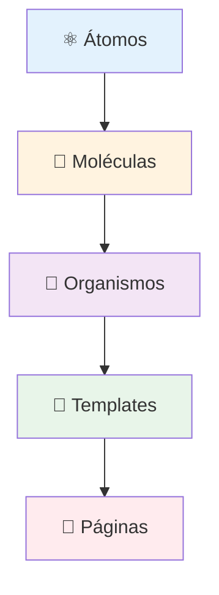

Com base nos links fornecidos (Jota DS e seu Storybook), refiz o artefato **STORY-M1-UX-001-design-system.md** seguindo a estrutura e boas práticas de documentação de um Design System open-source. O foco agora é em **componentes práticos, exemplos de código e uma estrutura que facilite a implementação pelos desenvolvedores**.

---

## 📄 STORY-M1-UX-001-design-system.md (Versão Revisada)

```markdown
# Design System - Cony Interiores

**Épico:** EPIC-M1-UX-001 - Interface e Jornada do Usuário  
**Story:** STORY-M1-UX-001 - Layout Base e Design System  
**Data de Criação:** 30/06/2026  
**Versão:** 2.0  
**Responsável:** @anandamatos

---

## 🎯 Objetivo deste Artefato

Este documento define o **Design System** do sistema da Cony Interiores, inspirado no **Jota DS** da Meiuca e documentado com boas práticas de componentes reutilizáveis. O objetivo é fornecer uma "única fonte da verdade" para designers e desenvolvedores, garantindo consistência, eficiência e escalabilidade em toda a interface do sistema .

---

## 📚 Fundamentação e Referências

### Design System como Produto

> *"O Design System é um produto que serve a outros produtos, permitindo que equipes criem experiências consistentes e de alta qualidade em escala."* — Alla Kholmatova, *Design Systems* .

### Atomic Design (Brad Frost, 2016)

A metodologia **Atomic Design** organiza a interface em cinco estágios hierárquicos, garantindo modularidade e reutilização:



### Referências de Design System

| Referência | Descrição |
|------------|-----------|
| **Jota DS (Meiuca)** | Design System open-source que serviu como referência para estrutura e componentes |
| **Material Design (Google)** | Diretrizes de cores, tipografia e componentes |
| **Nielsen Norman Group** | Heurísticas de usabilidade e acessibilidade |
| **Storybook** | Ferramenta de documentação de componentes |

---

## 🧬 Componentes do Design System

A seguir, a documentação dos componentes do Design System da Cony Interiores, organizados por tipo e com exemplos práticos de uso.

---

### 1. Átomos (Elementos Básicos)

#### 1.1. Tipografia (Typography)

**Uso:** Define a hierarquia tipográfica do sistema.

| Propriedade | Tipo | Obrigatório | Descrição |
|-------------|------|-------------|-----------|
| `component` | `heading`, `subtitle`, `paragraph`, `caption` | Sim | Define o tipo de elemento tipográfico |
| `variant` | `h1`, `h2`, `h3`, `h4`, `h5`, `h6` | Para `heading` | Define o nível do heading |
| `size` | `small`, `medium`, `large`, `x-large`, `display` | Não | Tamanho do texto |
| `onColor` | `true`, `false` | Não | Se `true`, ajusta a cor para fundos escuros |

**Exemplo de Uso:**
```jsx
import { Typography } from '@cony-ds/react';

<Typography component="heading" variant="h1" size="large">
  Bem-vinda à Cony Interiores
</Typography>

<Typography component="paragraph" size="medium">
  Gerencie sua produção de forma simples e eficiente.
</Typography>
```

---

#### 1.2. Cores (Tokens)

**Uso:** Define a paleta de cores do sistema, garantindo consistência visual.

| Token | Hex | Uso |
|-------|-----|-----|
| `primary` | `#2E7D32` | Botões principais, cabeçalhos, links |
| `primary-light` | `#4CAF50` | Hover de botões, destaques |
| `primary-dark` | `#1B5E20` | Textos em fundos claros |
| `secondary` | `#F57C00` | Destaques, alertas |
| `background` | `#FAFAFA` | Fundo das telas |
| `surface` | `#FFFFFF` | Cards, modais |
| `text-primary` | `#212121` | Textos principais |
| `text-secondary` | `#757575` | Textos secundários |
| `success` | `#4CAF50` | Confirmações |
| `warning` | `#FFC107` | Alertas |
| `error` | `#F44336` | Erros |

---

#### 1.3. Ícones (Icon)

**Uso:** Exibe ícones vetoriais do sistema.

**Biblioteca:** Lucide Icons (alternativa open-source)

| Propriedade | Tipo | Obrigatório | Descrição |
|-------------|------|-------------|-----------|
| `icon` | `string` | Sim | Nome do ícone (ex: `'clipboard'`, `'user'`) |
| `size` | `small`, `medium`, `large` | Não | Tamanho do ícone |

**Exemplo de Uso:**
```jsx
import { Icon } from '@cony-ds/react';

<Icon icon="clipboard" size="medium" />
<Icon icon="search" size="large" />
```

---

#### 1.4. Botão (Button)

**Uso:** Componente de ação principal do sistema.

| Propriedade | Tipo | Obrigatório | Descrição |
|-------------|------|-------------|-----------|
| `label` | `string` | Sim | Texto do botão |
| `type` | `primary`, `secondary`, `danger` | Sim | Estilo do botão |
| `icon` | `true`, `false` | Não | Se `true`, exibe ícone |
| `iconType` | `string` | Não | Nome do ícone (se `icon` for `true`) |
| `onColor` | `true`, `false` | Não | Se `true`, ajusta para fundos escuros |
| `disabled` | `true`, `false` | Não | Se `true`, desabilita o botão |
| `handleClick` | `function` | Não | Função executada ao clicar |

**Exemplo de Uso:**
```jsx
import { Button } from '@cony-ds/react';

<Button label="Cadastrar Serviço" type="primary" handleClick={() => {}} />
<Button label="Cancelar" type="secondary" />
<Button label="Excluir" type="danger" disabled />
<Button label="Buscar" type="primary" icon iconType="search" />
```

---

### 2. Moléculas (Combinações de Átomos)

#### 2.1. Grupo de Botões (ButtonGroup)

**Uso:** Agrupa dois botões (ação principal e cancelamento).

| Propriedade | Tipo | Obrigatório | Descrição |
|-------------|------|-------------|-----------|
| `primaryLabel` | `string` | Sim | Texto do botão principal |
| `tertiaryLabel` | `string` | Sim | Texto do botão secundário |
| `primaryDisabled` | `true`, `false` | Não | Desabilita o botão principal |
| `tertiaryDisabled` | `true`, `false` | Não | Desabilita o botão secundário |
| `onColor` | `true`, `false` | Não | Ajusta para fundos escuros |
| `handleCancel` | `function` | Não | Função para cancelar |
| `handleConfirm` | `function` | Não | Função para confirmar |

**Exemplo de Uso:**
```jsx
import { ButtonGroup } from '@cony-ds/react';

<ButtonGroup
  primaryLabel="Confirmar"
  tertiaryLabel="Cancelar"
  handleConfirm={() => {}}
  handleCancel={() => {}}
/>
```

---

#### 2.2. Campo de Busca (InputSearch)

**Uso:** Campo de busca com ícone de lupa.

| Propriedade | Tipo | Obrigatório | Descrição |
|-------------|------|-------------|-----------|
| `formID` | `string` | Sim | ID do formulário |
| `inputID` | `string` | Sim | ID do input |
| `placeholder` | `string` | Sim | Placeholder do campo |
| `ariaLabel` | `string` | Não | Label acessível |
| `onColor` | `true`, `false` | Não | Ajusta para fundos escuros |
| `disabled` | `true`, `false` | Não | Desabilita o campo |
| `handleSubmit` | `function` | Não | Função ao submeter |
| `handleInputChange` | `function` | Não | Função ao digitar |

**Exemplo de Uso:**
```jsx
import { InputSearch } from '@cony-ds/react';

<InputSearch
  formID="search-form"
  inputID="search-input"
  placeholder="Buscar serviços..."
  handleSubmit={(e) => {}}
/>
```

---

#### 2.3. Switch

**Uso:** Alternância entre dois estados.

| Propriedade | Tipo | Obrigatório | Descrição |
|-------------|------|-------------|-----------|
| `label` | `string` | Sim | Texto do switch |
| `checked` | `true`, `false` | Sim | Estado atual |
| `handleChange` | `function` | Sim | Função ao alterar |
| `disabled` | `true`, `false` | Não | Desabilita o switch |
| `onColor` | `true`, `false` | Não | Ajusta para fundos escuros |

**Exemplo de Uso:**
```jsx
import { Switch } from '@cony-ds/react';

<Switch
  label="Ativar notificações"
  checked={true}
  handleChange={() => {}}
/>
```

---

### 3. Organismos (Componentes Complexos)

#### 3.1. Header

**Uso:** Cabeçalho principal do sistema com navegação.

| Propriedade | Tipo | Obrigatório | Descrição |
|-------------|------|-------------|-----------|
| `logoSource` | `string` | Sim | Caminho da imagem do logo |
| `linkList` | `array` | Sim | Lista de links de navegação |
| `isLoggedIn` | `true`, `false` | Não | Se `true`, exibe avatar do usuário |
| `avatar` | `object` | Não | Dados do avatar (se `isLoggedIn` for `true`) |

**Exemplo de Uso:**
```jsx
import { Header } from '@cony-ds/react';

<Header
  logoSource="/logo.svg"
  linkList={[
    { label: 'Serviços', href: '/servicos' },
    { label: 'Costureiras', href: '/costureiras' },
    { label: 'Financeiro', href: '/financeiro' },
  ]}
  isLoggedIn={true}
  avatar={{
    name: 'Ana Silva',
    imgUrl: '/avatar.jpg',
    hasNotification: true
  }}
/>
```

---

#### 3.2. Card de Serviço

**Uso:** Exibe informações resumidas de um serviço.

| Propriedade | Tipo | Obrigatório | Descrição |
|-------------|------|-------------|-----------|
| `cliente` | `string` | Sim | Nome do cliente |
| `produto` | `string` | Sim | Tipo de produto |
| `prazo` | `string` | Sim | Data de entrega |
| `status` | `string` | Sim | Status do serviço |
| `costureira` | `string` | Sim | Nome da costureira |
| `onClick` | `function` | Não | Função ao clicar no card |

**Exemplo de Uso:**
```jsx
import { CardService } from '@cony-ds/react';

<CardService
  cliente="João Silva"
  produto="Cortina Ilhós"
  prazo="30/06/2026"
  status="Em produção"
  costureira="Sirlene"
/>
```

---

#### 3.3. Modal

**Uso:** Janela de diálogo para ações críticas.

| Propriedade | Tipo | Obrigatório | Descrição |
|-------------|------|-------------|-----------|
| `isOpen` | `true`, `false` | Sim | Controla a abertura do modal |
| `isDoubleAction` | `true`, `false` | Sim | Se `true`, exibe dois botões |
| `firstActionLabel` | `string` | Sim | Texto do primeiro botão |
| `secondActionLabel` | `string` | Sim | Texto do segundo botão |
| `handleConfirm` | `function` | Sim | Função de confirmação |
| `handleClose` | `function` | Sim | Função de fechamento |

**Exemplo de Uso:**
```jsx
import { Modal } from '@cony-ds/react';

<Modal
  isOpen={true}
  isDoubleAction={true}
  firstActionLabel="Sim, excluir"
  secondActionLabel="Cancelar"
  handleConfirm={() => {}}
  handleClose={() => {}}
>
  <h3>Excluir Serviço</h3>
  <p>Tem certeza que deseja excluir este serviço?</p>
</Modal>
```

---

#### 3.4. Tabela (Table)

**Uso:** Exibe dados em formato tabular.

| Propriedade | Tipo | Obrigatório | Descrição |
|-------------|------|-------------|-----------|
| `headers` | `array` | Sim | Lista de cabeçalhos |
| `data` | `array` | Sim | Lista de dados |
| `actions` | `array` | Não | Ações por linha (editar, excluir) |

**Exemplo de Uso:**
```jsx
import { Table } from '@cony-ds/react';

<Table
  headers={['Cliente', 'Produto', 'Status', 'Prazo']}
  data={[
    ['João Silva', 'Cortina Ilhós', 'Em produção', '30/06'],
    ['Maria Souza', 'Forro', 'Aguardando', '02/07'],
  ]}
/>
```

---

### 4. Templates e Páginas

Os templates e páginas são construídos a partir da composição dos organismos e moléculas. Exemplos principais:

#### 4.1. Template da Dashboard

```jsx
import { Header, CardService, Table } from '@cony-ds/react';

<Header {...headerProps} />
<DashboardSummary />
<WorkloadCards />
<AlertsTable />
```

#### 4.2. Template de Lista

```jsx
import { Header, InputSearch, Button, Table } from '@cony-ds/react';

<Header {...headerProps} />
<ActionBar>
  <InputSearch {...searchProps} />
  <Button label="Novo Serviço" type="primary" />
</ActionBar>
<Table {...tableProps} />
```

---

## 🔧 Ferramentas e Recursos

| Ferramenta | Uso |
|------------|-----|
| **Figma** | Design e prototipação dos componentes |
| **Storybook** | Documentação interativa dos componentes |
| **React** | Implementação dos componentes |
| **Lucide Icons** | Biblioteca de ícones |

---

## ✅ Próximos Passos

| Ordem | Atividade | Responsável | Data |
|-------|-----------|-------------|------|
| 1 | Validar Design System com o cliente e squads | @anandamatos | 30/06 |
| 2 | Refinar com base no feedback | @anandamatos | 01/07 |
| 3 | Criar componentes no Figma | @anandamatos | 02/07 |
| 4 | Implementar componentes em React | Time de Dev | 03/07 |
| 5 | Documentar no Storybook | @anandamatos | 04/07 |

---

## 📎 Referências e Links Úteis

| Referência | Descrição |
|------------|-----------|
| **Jota DS (Meiuca)** | Design System open-source de referência |
| **Storybook do Jota DS** | Exemplo de documentação interativa de componentes |
| **Material Design (Google)** | Diretrizes de design e componentes |
| **Atomic Design (Brad Frost)** | Metodologia de construção de interfaces |
| **Lucide Icons** | Biblioteca de ícones open-source |

---

**Status:** Aguardando validação com o cliente e squads  
**Próxima Reunião:** 30/06/2026 - 14h

---

Este artefato está pronto para ser validado e servirá como a base técnica para a implementação de todas as interfaces do sistema, garantindo consistência e eficiência no desenvolvimento! 🚀