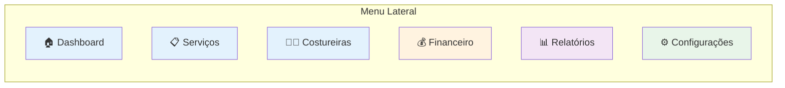
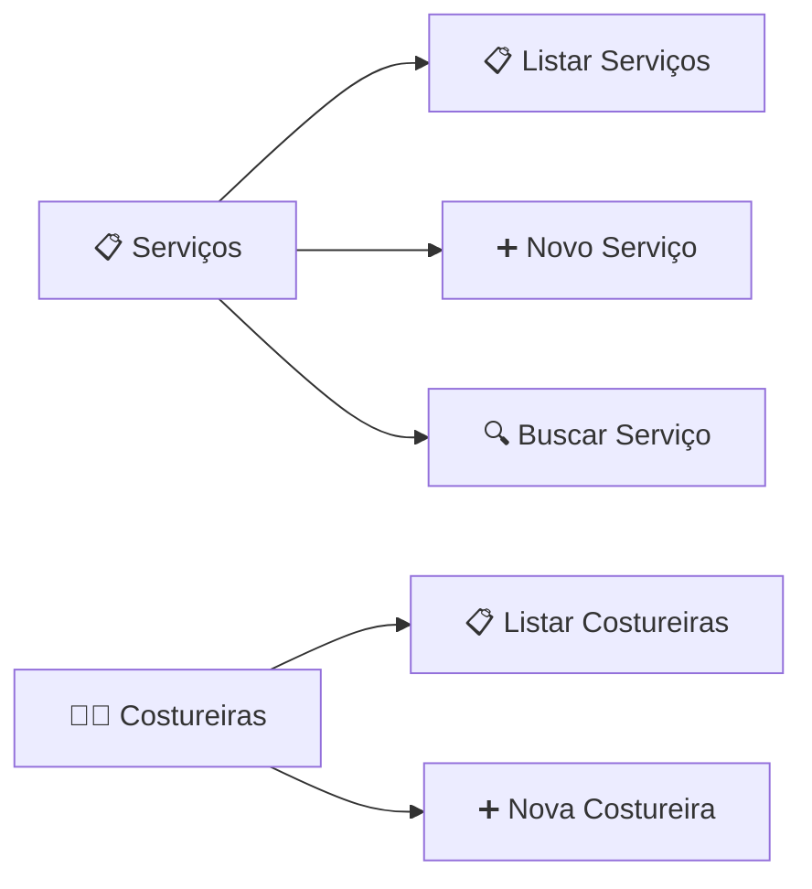
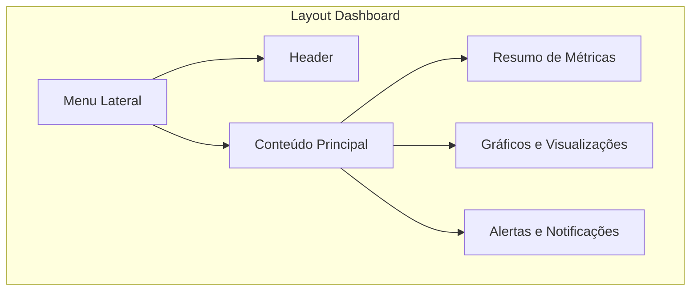
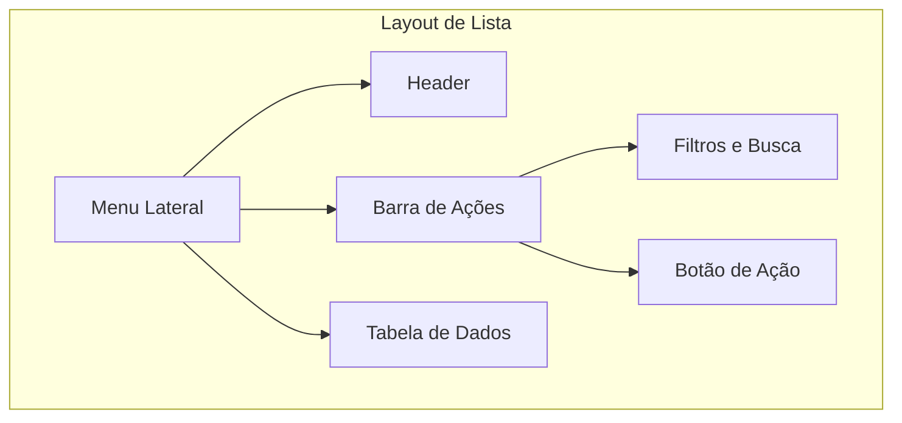
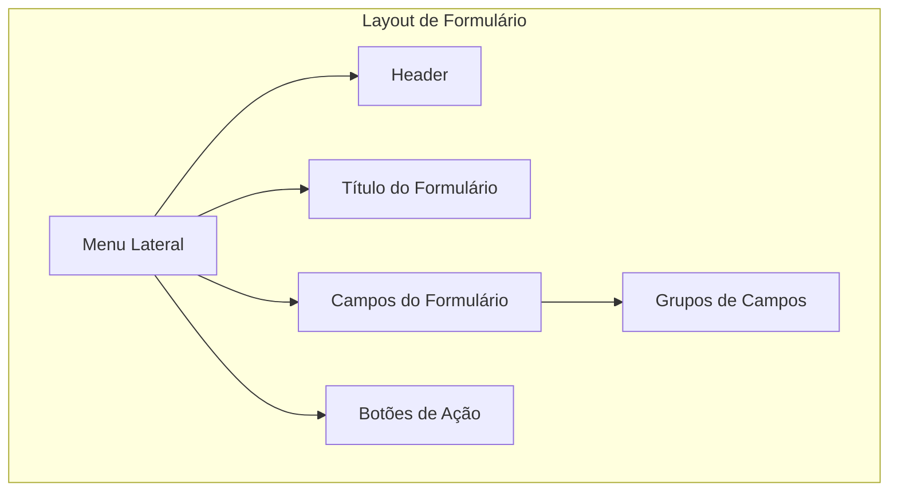

Perfeito! Sua observação está corretíssima. Para um sistema de gestão com dashboards, a navegação por **menu lateral** é a abordagem mais adequada e moderna, seguindo o padrão de ferramentas como Gemini, Discord, Notion, e sistemas de gestão empresarial.

Vou refazer o artefato **STORY-M1-UX-001-padroes-design.md** com essa premissa.

---

## 📄 STORY-M1-UX-001-padroes-design.md (Revisado - Menu Lateral)

```markdown
# Padrões de Design - Cony Interiores

**Épico:** EPIC-M1-UX-001 - Interface e Jornada do Usuário  
**Story:** STORY-M1-UX-001 - Layout Base e Design System  
**Data de Criação:** 30/06/2026  
**Versão:** 2.0  
**Responsável:** @anandamatos

---

## 🎯 Objetivo deste Artefato

Este documento define os **Padrões de Design** do sistema da Cony Interiores, com foco em uma navegação por **menu lateral**, inspirada em ferramentas modernas de gestão como Gemini, Discord, Notion e sistemas de gestão empresarial. O objetivo é garantir uma experiência consistente, eficiente e alinhada com as expectativas das usuárias.

---

## 📚 Fundamentação Teórica

### Por que Menu Lateral?

| Benefício | Descrição | Referência |
|-----------|-----------|------------|
| **Eficiência** | Acesso rápido a todas as seções sem necessidade de navegação hierárquica | Nielsen Norman Group  |
| **Visibilidade Constante** | O menu está sempre visível, reduzindo a carga cognitiva | Lei de Miller (7 ± 2 itens) |
| **Escalabilidade** | Fácil adicionar novas seções sem redesenhar o layout | Padrão de sistemas empresariais |
| **Foco no Conteúdo** | O conteúdo principal ocupa a maior parte da tela | Estética e Design Minimalista  |
| **Padrão do Mercado** | Usuários já estão familiarizados com este padrão | Lei de Jakob  |

### Heurísticas de Nielsen Aplicadas

Este documento aplica as seguintes heurísticas de Nielsen :

1. **Visibilidade do Status do Sistema** - Indicadores visuais no menu mostram a seção atual
2. **Correspondência entre o Sistema e o Mundo Real** - Ícones e labels familiares
3. **Controle e Liberdade do Usuário** - Navegação clara para voltar ou avançar
4. **Consistência e Padrões** - Uso de padrões de mercado
5. **Prevenção de Erros** - Navegação previsível reduz erros
6. **Reconhecimento em vez de Memorização** - Menu visível com todas as opções
7. **Flexibilidade e Eficiência de Uso** - Atalhos no menu para ações frequentes
8. **Estética e Design Minimalista** - Menu limpo e organizado

---

## 🧭 Padrões de Navegação

### 1. Menu Lateral (Sidebar Navigation)

#### Estrutura do Menu



#### Layout do Menu (Exemplo)

```
+------------------------------------------+--------------------------------------------+
|  🏠 CONY INTERIORES                       |  📊 DASHBOARD                              |
|  ---------------------------------------- |  +------------+  +------------+           |
|  🏠 Dashboard                              |  | 📋 Serviços |  | 👩‍🔧 Costureiras|           |
|  📋 Serviços                               |  | Ativos: 12  |  | Ativas: 4  |           |
|  👩‍🔧 Costureiras                            |  +------------+  +------------+           |
|  💰 Financeiro                             |                                            |
|  📊 Relatórios                             |  👩‍🔧 CARGA DE TRABALHO                     |
|  ⚙️ Configurações                          |  +----------+  +----------+               |
|                                            |  | Sirlene  |  | Maria    |               |
|  👤 Ana Silva                              |  +----------+  +----------+               |
|  [ Logout ]                                |                                            |
+------------------------------------------+--------------------------------------------+
```

#### Especificações do Menu Lateral

| Elemento | Especificação | Justificativa |
|----------|---------------|---------------|
| **Largura** | 240px (expandido) / 60px (recolhido) | Espaço suficiente para labels, compacto quando necessário |
| **Posição** | Fixo à esquerda | Padrão de sistemas de gestão |
| **Ícones** | Todos os itens com ícones + labels | Reconhecimento visual rápido |
| **Item Ativo** | Destaque com cor primária | Visibilidade do status do sistema |
| **Agrupamento** | Seções separadas por divisores | Organização lógica |
| **Cabeçalho** | Logo do sistema no topo | Identidade visual |
| **Rodapé** | Perfil do usuário + Logout | Ações do usuário |

#### Comportamento do Menu

| Estado | Comportamento |
|--------|---------------|
| **Expandido** | Mostra ícone + label |
| **Recolhido** | Mostra apenas ícone (tooltip no hover) |
| **Hover** | Destaque visual (background mais claro) |
| **Ativo** | Destaque com cor primária (barra lateral) |

#### Justificativa

- **Heurística de Nielsen 4 (Consistência e Padrões):** Este é o padrão adotado por ferramentas como Gemini, Discord, Notion, e sistemas de gestão como Salesforce e SAP .
- **Lei de Jakob:** Usuários já conhecem este padrão, reduzindo a curva de aprendizado .
- **Lei de Fitts:** Os itens do menu são grandes o suficiente para interação confiável, especialmente em dispositivos touch .

---

### 2. Subnavegação (Submenus)

#### Estrutura de Submenu



#### Exemplo de Submenu

```
📋 Serviços
   ├── 📋 Listar Serviços
   ├── ➕ Novo Serviço
   └── 🔍 Buscar Serviço

👩‍🔧 Costureiras
   ├── 📋 Listar Costureiras
   └── ➕ Nova Costureira
```

#### Comportamento do Submenu

| Ação | Comportamento |
|------|---------------|
| **Clique no item pai** | Expande/recolhe o submenu |
| **Item ativo** | Destaque com cor primária |
| **Hover** | Destaque visual |

#### Justificativa

- **Heurística de Nielsen 6 (Reconhecimento em vez de Memorização):** As opções estão visíveis, não precisam ser lembradas .
- **Lei de Hick:** A navegação é organizada hierarquicamente, reduzindo a sobrecarga cognitiva .

---

### 3. Navegação Auxiliar

#### Breadcrumbs (Trilha de Navegação)

**Uso:** Mostrar a localização do usuário dentro do sistema, especialmente em páginas profundas.

**Exemplo:** `🏠 Home / 📋 Serviços / #123 - Cortina Ilhós`

**Posição:** Abaixo do header, antes do conteúdo principal.

**Justificativa:**
- **Heurística de Nielsen 3 (Controle e Liberdade do Usuário):** Permite que o usuário volte rapidamente para níveis superiores de navegação .
- **Lei de Miller:** Ajuda o usuário a manter o contexto, reduzindo a carga na memória de trabalho .

---

## 🎨 Padrões de Layout com Menu Lateral

### 1. Layout Dashboard (Visão Geral)



### 2. Layout de Lista



### 3. Layout de Formulário



---

## 📊 Padrões de Interação com Menu Lateral

### 1. Responsividade

| Breakpoint | Comportamento do Menu |
|------------|----------------------|
| **Desktop (>1024px)** | Menu sempre expandido |
| **Tablet (768-1024px)** | Menu recolhido por padrão, expande via ícone de hambúrguer |
| **Mobile (<768px)** | Menu como overlay (sobreposto ao conteúdo) |

### 2. Atalhos do Teclado

| Atalho | Ação |
|--------|------|
| `Ctrl + K` | Abrir busca global |
| `Ctrl + 1-9` | Navegar para seções principais (ex: 1=Dashboard, 2=Serviços) |
| `Esc` | Fechar menu recolhido (mobile) |

### 3. Indicadores Visuais

| Indicador | Uso |
|-----------|-----|
| **Destaque do Item Ativo** | Barra lateral colorida + texto em negrito |
| **Contador de Notificações** | Badge no ícone do menu |
| **Tooltip** | Ao passar o mouse em ícone sem label (menu recolhido) |

---

## 📋 Matriz de Rastreabilidade (Padrão ↔ Story)

| Padrão | Story Relacionada | Heurística de Nielsen Aplicada |
|--------|-------------------|-------------------------------|
| **Menu Lateral** | STORY-M1-UX-001 | Consistência e Padrões |
| **Submenus** | STORY-M1-UX-001 | Reconhecimento em vez de Memorização |
| **Breadcrumbs** | STORY-M1-UX-001 | Controle e Liberdade do Usuário |
| **Layout Dashboard** | STORY-M1-UX-001 | Visibilidade do Status do Sistema |
| **Layout de Lista** | STORY-M1-UX-002 | Estética e Design Minimalista |
| **Layout de Formulário** | STORY-M1-UX-002 | Prevenção de Erros |
| **Responsividade** | STORY-M1-UX-001 | Flexibilidade e Eficiência de Uso |

---

## 🔧 Ferramentas e Recursos

| Ferramenta | Uso |
|------------|-----|
| **Figma** | Design e prototipação do menu lateral |
| **Storybook** | Documentação dos componentes de navegação |
| **Lucide Icons** | Biblioteca de ícones para o menu |

---

## ✅ Próximos Passos

| Ordem | Atividade | Responsável | Data |
|-------|-----------|-------------|------|
| 1 | Validar Padrões de Navegação com o cliente e squads | @anandamatos | 30/06 |
| 2 | Refinar com base no feedback | @anandamatos | 01/07 |
| 3 | Implementar no Figma | @anandamatos | 02/07 |
| 4 | Documentar no Storybook | @anandamatos | 03/07 |

---

## 📎 Referências Bibliográficas

| Referência | Descrição |
|------------|-----------|
| NIELSEN, Jakob. **10 Usability Heuristics for User Interface Design**. Nielsen Norman Group, 1994 . |
| **Jakob's Law of Internet User Experience**. Nielsen Norman Group, 2000 . |
| **Fitts's Law**. Nielsen Norman Group. |
| **Hick's Law**. Nielsen Norman Group. |
| **Miller's Law**. Nielsen Norman Group. |
| **Padrões e Princípios do Design de Interação**. Alura. |
| NORMAN, Donald. **The Design of Everyday Things**, 1988. |

---

**Status:** Aguardando validação com o cliente e squads  
**Próxima Reunião:** 30/06/2026 - 14h

---

Este artefato está pronto para ser validado e servirá como a base para a implementação da navegação do sistema, garantindo uma experiência alinhada com as melhores práticas de mercado! 🚀