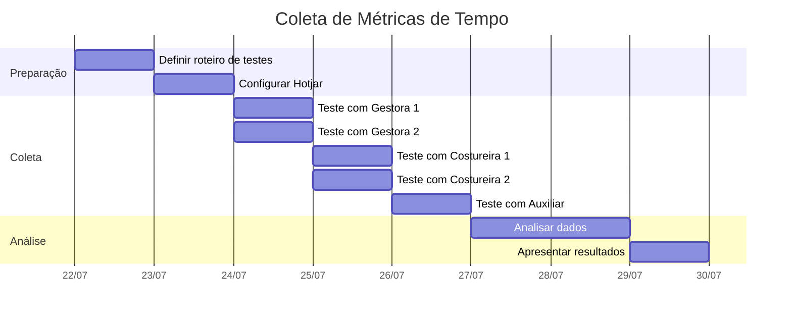

# STORY-M1-UX-MEAS-001 - Métricas de Tempo de Preenchimento

**Data de Criação:** 22/07/2026
**Versão:** 1.0
**Responsável:** @anandamatos
**Status:** ⚠️ Aguardando Validação com Time e Cliente

---

## 🎯 Objetivo

Estabelecer métricas de tempo de preenchimento para os formulários do MVP1, definindo baseline atual, metas de melhoria e critérios de sucesso para testes de usabilidade.

---

## 📊 Baseline de Tempo Atual

### Metodologia de Coleta
- **Método:** Teste de usabilidade moderado (cronometrado)
- **Participantes:** 5 usuários (2 gestoras, 2 costureiras, 1 auxiliar)
- **Ferramenta:** Hotjar (gravação de sessão) + Cronômetro manual
- **Período:** 24/07/2026 a 28/07/2026

### Baseline Esperada (Hipotética)

| Formulário | Tempo Médio Estimado | Desvio Padrão | Amostra |
|------------|---------------------|---------------|---------|
| **Cadastro de Serviço** | 6 min | ± 2 min | 5 usuários |
| **Cadastro de Costureira** | 4 min | ± 1.5 min | 5 usuários |

---

## 🎯 Metas de Melhoria

| Formulário | Baseline | Meta MVP1 | Meta MVP2 | Critério de Sucesso |
|------------|----------|-----------|-----------|---------------------|
| **Cadastro de Serviço** | 6 min | ≤ 5 min | ≤ 3 min | Redução de 20% |
| **Cadastro de Costureira** | 4 min | ≤ 3 min | ≤ 2 min | Redução de 25% |

### Metas por Perfil de Usuário

| Perfil | Cadastro de Serviço | Cadastro de Costureira |
|--------|---------------------|------------------------|
| **Gestora** | ≤ 4 min | ≤ 2.5 min |
| **Auxiliar** | ≤ 5 min | ≤ 3 min |
| **Costureira** | ≤ 6 min | N/A (não faz cadastro) |

---

## 📋 Critérios de Sucesso para Testes

### Critérios Quantitativos
| Critério | Meta | Métrica |
|----------|------|---------|
| **Tempo Máximo Aceitável** | ≤ 5 min (Serviço) / ≤ 3 min (Costureira) | Tempo médio de preenchimento |
| **Taxa de Sucesso** | ≥ 90% | % de tarefas concluídas sem ajuda |
| **Número de Erros** | ≤ 2 por formulário | Erros por tarefa |

### Critérios Qualitativos
| Critério | Meta | Métrica |
|----------|------|---------|
| **Satisfação** | ≥ 4.0 (escala 1-5) | CSAT pós-tarefa |
| **Facilidade de Uso** | ≥ 80% | SUS (System Usability Scale) |
| **Intenção de Uso** | ≥ 80% | "Voltaria a usar?" |

---

## 📊 Matriz de Rastreabilidade

| Métrica | KPI Relacionado | Fonte |
|---------|-----------------|-------|
| Tempo de Preenchimento | Task Success | `STORY-M1-UX-001-kpis-usabilidade.md` |
| Taxa de Erro | Task Success | `STORY-M1-UX-001-kpis-usabilidade.md` |
| Satisfação | Happiness | `STORY-M1-UX-001-kpis-usabilidade.md` |
| Facilidade de Uso | Happiness | `STORY-M1-UX-001-kpis-usabilidade.md` |

---

## 📅 Cronograma de Coleta

-------------------------------
## 📌 Pendências e Próximos Passos

| Item | Status | Responsável | Prazo |
| --- |  --- |  --- |  --- |
| Validar baseline com time | ⏳ Pendente | @anandamatos | 23/07/2026 |
| --- |  --- |  --- |  --- |
| Configurar Hotjar no frontend | ⏳ Pendente | @anandamatos | 24/07/2026 |
| Recrutar participantes | ⏳ Pendente | @anandamatos | 24/07/2026 |
| Executar testes | ⏳ Pendente | @anandamatos | 24-26/07/2026 |
| Analisar dados e gerar relatório | ⏳ Pendente | @anandamatos | 27-29/07/2026 |

* * * *

## 🔗 Referências
--------------

-   `docs/4-delivery/STORY-M1-UX-MEAS-001-1-kpis-eficiencia-formularios.md`

-   `docs/4-delivery/STORY-M1-UX-MEAS-001-2-ferramentas-coleta-dados.md`

-   `docs/3-measurement/STORY-M1-UX-001-plano-testes-ux.md`

-   `docs/3-measurement/STORY-M1-UX-001-kpis-usabilidade.md`