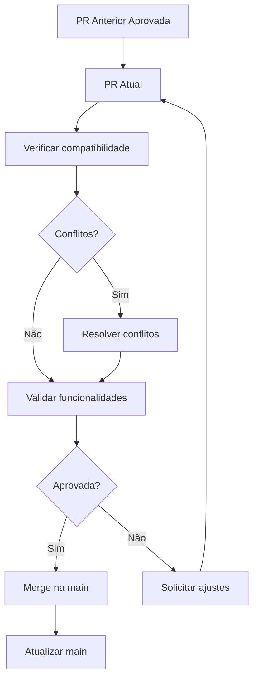

# 📚 Documento 2: Guia de Revisão de Pull Request (PR Review)

**Título:** `GUIDE-how-to-review-pr.md`

**Localização:** `docs/5-decisions/GUIDE-how-to-review-pr.md`

---

# Guia: Como Revisar um Pull Request (PR Review)

**Versão:** 1.0  
**Data:** 09/07/2026  
**Responsável:** @anandamatos

---

## 🎯 Objetivo

Este guia estabelece os procedimentos para revisão de Pull Requests (PRs), garantindo que todas as PRs aprovadas anteriormente sejam consideradas na validação das PRs mais recentes, evitando problemas de integração na `main`.

---

## 📋 Princípios da Revisão

### 1. Integração Contínua

> **Toda PR nova deve considerar e validar as PRs aprovadas anteriormente.**

### 2. Rastreabilidade

> **Todas as PRs devem ser rastreáveis e documentadas.**

### 3. Qualidade

> **Código revisado deve atender aos padrões de qualidade e boas práticas.**

---

## 🔍 O que Verificar em uma PR

### Checklist de Revisão

| Categoria | Item | Status |
|-----------|------|--------|
| **Estrutura** | Nome da branch segue o padrão | ⬜ |
| **Estrutura** | Commits seguem o padrão | ⬜ |
| **Estrutura** | PR tem título descritivo | ⬜ |
| **Estrutura** | PR tem descrição completa | ⬜ |
| **Código** | Código está limpo e organizado | ⬜ |
| **Código** | Sem código duplicado | ⬜ |
| **Código** | Sem código comentado/desnecessário | ⬜ |
| **Testes** | Testes automatizados estão passando | ⬜ |
| **Testes** | Novas funcionalidades têm testes | ⬜ |
| **Documentação** | Documentação atualizada | ⬜ |
| **Integração** | Não conflita com PRs anteriores | ⬜ |
| **Segurança** | Sem vulnerabilidades conhecidas | ⬜ |
| **Performance** | Sem regressões de performance | ⬜ |

---

## 🔄 Fluxo de Revisão

### 1. Verificar Conflitos com PRs Anteriores

**Antes de revisar, valide a integração:**

```bash
# 1. Atualizar a main
git checkout main
git pull origin main

# 2. Entrar na branch da PR
git checkout feat@[squad]/STORY-MX-[SQUAD]-NNN

# 3. Fazer rebase com a main
git rebase main

# 4. Verificar conflitos
git status
```

### 2. Validar Commits Anteriores

**Verificar se a PR considera commits anteriores:**

```bash
# Ver commits já aprovados na main
git log main --oneline -10

# Ver commits da PR
git log feat@[squad]/STORY-MX-[SQUAD]-NNN --oneline
```

### 3. Testar Localmente

**Sempre testar a PR localmente:**

```bash
# 1. Atualizar dependências
cd frontend && npm install && cd ..
cd backend && pip install -r requirements.txt && cd ..

# 2. Rodar os servidores
cd frontend && npm run dev &
cd backend && python manage.py runserver &

# 3. Testar as funcionalidades
# 4. Verificar logs de erro
```

---

## 📊 Matriz de Validação de Integração

### Como Validar PRs Sequenciais



### Exemplo Prático

```text
PR #196 (UX-001, UX-002, UX-003)  ← Aprovada e mergeada
    ↓
PR #197 (FND-003)  ← ATUAL
    ↓
Deve validar:
1. Código da PR #196 está funcionando
2. PR #197 não quebra funcionalidades da #196
3. Integração entre as PRs está OK
```

---

## 📋 Tipos de Comentários em Revisão

| Tipo | Uso | Exemplo |
|------|-----|---------|
| **Sugestão** | Melhoria opcional | "Sugiro extrair essa lógica para um hook." |
| **Obrigatório** | Deve ser corrigido | "Este código não funciona sem a dependência X." |
| **Dúvida** | Esclarecimento | "Por que usou essa abordagem aqui?" |
| **Elogio** | Reconhecimento | "Ótima solução para esse problema!" |
| **Bloqueio** | Impede o merge | "Faltam testes para essa funcionalidade." |

---

## 🔧 Comandos Úteis para Revisão

```bash
# Ver diferença entre a PR e a main
git diff main..feat@[squad]/STORY-MX-[SQUAD]-NNN

# Ver arquivos modificados
git diff --name-only main..feat@[squad]/STORY-MX-[SQUAD]-NNN

# Ver commits da PR
git log main..feat@[squad]/STORY-MX-[SQUAD]-NNN --oneline

# Ver estatísticas
git diff --stat main..feat@[squad]/STORY-MX-[SQUAD]-NNN
```

---

## ✅ Critérios para Aprovação

| Critério | Descrição | Peso |
|----------|-----------|------|
| **Código funcional** | A funcionalidade funciona como esperado | 🔴 Obrigatório |
| **Testes passando** | Todos os testes automatizados passam | 🔴 Obrigatório |
| **Sem conflitos** | Não há conflitos com a main | 🔴 Obrigatório |
| **Documentação** | Documentação foi atualizada | 🟡 Recomendado |
| **Boas práticas** | Código segue boas práticas | 🟡 Recomendado |
| **Performance** | Sem regressões de performance | 🟡 Recomendado |

---

## 🚫 Motivos para Rejeitar uma PR

| Motivo | Descrição |
|--------|-----------|
| **Conflitos** | PR tem conflitos com a main |
| **Testes falhando** | Testes automatizados estão falhando |
| **Código quebrado** | Funcionalidade não funciona |
| **Segurança** | Vulnerabilidade de segurança identificada |
| **Regressão** | PR quebra funcionalidade existente |
| **Sem testes** | Funcionalidade sem testes |

---

## 📝 Template de Revisão

### Comentário de Aprovação

```text
## ✅ PR Aprovada

**Reviewer:** @[seu-usuario]
**Data:** [DD/MM/YYYY]

### O que foi verificado:
- [x] Código funcional
- [x] Testes passando
- [x] Sem conflitos com main
- [x] Documentação atualizada

### Observações:
[Comentários adicionais]

### Próximos Passos:
- [ ] Merge na main
- [ ] Deploy
```

### Comentário com Solicitação de Ajustes

```text
## ⚠️ Ajustes Necessários

**Reviewer:** @[seu-usuario]
**Data:** [DD/MM/YYYY]

### Itens a corrigir:
- [ ] Item 1: Descrição do problema
- [ ] Item 2: Descrição do problema

### Sugestões:
- Sugestão 1
- Sugestão 2

### Após corrigir:
- [ ] Reabrir PR para nova revisão
```

---

## 📊 Checklist Pós-Revisão

| Item | Status |
|------|--------|
| [ ] PR foi testada localmente | ⬜ |
| [ ] Conflitos com a main resolvidos | ⬜ |
| [ ] PRs anteriores consideradas | ⬜ |
| [ ] Todos os comentários respondidos | ⬜ |
| [ ] PR aprovada por pelo menos 1 reviewer | ⬜ |
| [ ] PR pronta para merge | ⬜ |

---

**Dúvidas?** Consulte o time no canal do Discord.